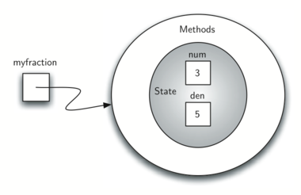

..  Copyright (C)  Brad Miller, David Ranum
    This work is licensed under the Creative Commons Attribution-NonCommercial-ShareAlike 4.0 International License. To view a copy of this license, visit http://creativecommons.org/licenses/by-nc-sa/4.0/.

..  Object-Oriented Programming in Python: Defining Classes

Programação Orientada a Objetos em Python: Definindo Classes
~~~~~~~~~~~~~~~~~~~~~~~~~~~~~~~~~~~~~~~~~~~~~~~~~~~~~~~~~~~~

..  We stated earlier that Python is an object-oriented programming
    language. So far, we have used a number of built-in classes to show
    examples of data and control structures. One of the most powerful
    features in an object-oriented programming language is the ability to
    allow a programmer (problem solver) to create new classes that model
    data that is needed to solve the problem.

Nós afirmamos anteriormente que o Python é uma linguagem de programação orientada a objetos.
Até agora, usamos várias classes nativas para mostrar 
exemplos de estruturas de dados e controle. Um dos recursos mais poderosos
em uma linguagem de programação orientada a objeto é a capacidade de
permitir que um programador (solucionador de problemas) crie novas classes que modelem
dados necessários para resolver o problema.

..  Remember that we use abstract data types to provide the logical
    description of what a data object looks like (its state) and what it can
    do (its methods). By building a class that implements an abstract data
    type, a programmer can take advantage of the abstraction process and at
    the same time provide the details necessary to actually use the
    abstraction in a program. Whenever we want to implement an abstract data
    type, we will do so with a new class.

Lembre-se que usamos tipos de dados abstratos como descrição lógica
de como um objeto de dados se parece (seu estado) e o que ele pode
fazer (seus métodos). Ao construir uma classe que implementa um tipo de dado 
abstrato, um programador pode tirar proveito do processo de abstração e 
ao mesmo tempo, fornecer os detalhes necessários para usar a
abstração em um programa. Sempre que desejarmos implementar um tipo de dados
abstrato, vamos fazer isso com uma nova classe.

..  A ``Fraction`` Class

Uma Classe ``Fraction``
^^^^^^^^^^^^^^^^^^^^^^^

..  A very common example to show the details of implementing a user-defined
    class is to construct a class to implement the abstract data type
    ``Fraction``. We have already seen that Python provides a number of
    numeric classes for our use. There are times, however, that it would be
    most appropriate to be able to create data objects that “look like”
    Fractions.

Um exemplo muito comum para mostrar os detalhes da implementação de uma
classe definida pelo usuário é construir uma classe para implementar o 
tipo de dados abstrato ``Fraction`` (fração). Nós já vimos que o Python fornece um número de
classes numéricas para nosso uso. Há momentos, no entanto, que seria
mais apropriado poder criar objetos de dados que se “pareçam” com
frações.

..  A Fraction such as :math:`\frac {3}{5}` consists of two parts. The top
    value, known as the numerator, can be any integer. The bottom value,
    called the denominator, can be any integer greater than 0 (negative
    Fractions have a negative numerator). Although it is possible to create
    a floating point approximation for any Fraction, in this case we would
    like to represent the Fraction as an exact value.

Uma fração como :math:`\frac {3}{5}` consiste de duas partes. 
O valor em cima, conhecido como numerador, pode ser qualquer inteiro. 
O valor embaixo, chamado denominador, pode ser qualquer número inteiro maior que 0 
(frações negativas têm um numerador negativo). Embora seja possível criar
uma aproximação em ponto flutuante para qualquer fração, neste caso nós
gostaríamos de representar uma fração como um valor exato.

..  The operations for the ``Fraction`` type will allow a ``Fraction`` data
    object to behave like any other numeric value. We need to be able to
    add, subtract, multiply, and divide Fractions. We also want to be able
    to show Fractions using the standard “slash” form, for example 3/5. In
    addition, all Fraction methods should return results in their lowest
    terms so that no matter what computation is performed, we always end up
    with the most common form.

As operações para o tipo ``Fraction`` permitirão que um objeto de dado ``Fraction``
se comporte como qualquer outro valor numérico. Precisamos ser capazes de
adicionar, subtrair, multiplicar e dividir frações. Nós também queremos ser capazes
de mostrar frações usando a forma padrão com "barra", por exemplo, 3/5. 
Além disso, todos os métodos de Fraction devem retornar resultados em seus menores
termos de modo que, não importa qual computação seja realizada, sempre acabamos
com a forma mais comum.

..  In Python, we define a new class by providing a name and a set of method
    definitions that are syntactically similar to function definitions. For
    this example,

Em Python, definimos uma nova classe fornecendo um nome e um conjunto de métodos 
que são sintaticamente semelhantes às definições de função. Para 
este exemplo,

::

    class Fraction:

       # Coloque os métodos aqui

..  provides the framework for us to define the methods. The first method
    that all classes should provide is the constructor. The constructor
    defines the way in which data objects are created. To create a
    ``Fraction`` object, we will need to provide two pieces of data, the
    numerator and the denominator. In Python, the constructor method is
    always called __init__ (two underscores before and after ``init``)
    and is shown in :ref:`Listing 2 <lst_pyconstructor>`.

fornece a estrutura para definirmos os métodos. O primeiro método
que todas as classes devem fornecer é o construtor. O construtor
define a maneira como os objetos de dados são criados. Para criar um
objeto ``Fraction``, precisaremos fornecer dois dados, o
numerador e denominador. Em Python, o método construtor é
sempre chamado __init__ (com dois *underscores* antes e depois de ``init``)
e é mostrado na :ref:`Listagem 2 <lst_pyconstructor>`.

.. _lst_pyconstructor:

**Listagem 2**

.. sourcecode:: python

    class Fraction:

        def __init__(self, cima, baixo):

            self.num = cima
            self.den = baixo

..  Notice that the formal parameter list contains three items (``self``,
    ``top``, ``bottom``). ``self`` is a special parameter that will always
    be used as a reference back to the object itself. It must always be the
    first formal parameter; however, it will never be given an actual
    parameter value upon invocation. As described earlier, Fractions require
    two pieces of state data, the numerator and the denominator. The
    notation ``self.num`` in the constructor defines the ``Fraction`` object
    to have an internal data object called ``num`` as part of its state.
    Likewise, ``self.den`` creates the denominator. The values of the two
    formal parameters are initially assigned to the state, allowing the new
    ``Fraction`` object to know its starting value.

Note que a lista formal de parâmetros contém três itens (``self``,
``cima``, ``baixo``). O ``self`` é um parâmetro especial que sempre
deve ser usado como uma referência ao próprio objeto. Deve ser sempre o
primeiro parâmetro formal; no entanto, esse parâmetro nunca receberá um  
valor na chamada. Como descrito anteriormente, as frações requerem
dois objetos de dados de estado, o numerador e o denominador. A
notação ``self.num`` no construtor define que um objeto ``Fraction``
tenha um objeto de dados interno chamado ``num`` como parte de seu estado.
Da mesma forma, ``self.den`` cria o denominador. Os valores dos dois
parâmetros formais são inicialmente atribuídos ao estado, permitindo que o novo
objeto ``Fraction`` receba o seu valor inicial.

..  To create an instance of the ``Fraction`` class, we must invoke the
    constructor. This happens by using the name of the class and passing
    actual values for the necessary state (note that we never directly
    ``invoke __init__``). For example,

Para criar uma instância da classe ``Fraction``, devemos invocar o
construtor. Isso acontece quando usamos o nome da classe e passamos
valores necessários para iniciar o estado (note que nunca invocamos 
``__init__`` diretamente). Por exemplo,

::

    myfraction = Fraction(3,5)

..  creates an object called ``umaFraction`` representing the Fraction
    :math:`\frac {3}{5}` (three-fifths). :ref:`Figure 5 <fig_Fraction1>` shows this
    object as it is now implemented.

cria um objeto chamado ``myfraction`` representando a fração
:math:`\frac {3}{5}` (três quintos). A :ref:`Figura 5 <fig_Fraction1>` mostra 
esse objeto como implementado até agora.

.. _fig_Fraction1:

   Figura 5: Uma Instância da Classe ``Fraction`` Referenciada por myfraction

..  The next thing we need to do is implement the behavior that the abstract
    data type requires. To begin, consider what happens when we try to print
    a ``Fraction`` object.

A próxima coisa que precisamos fazer é implementar o comportamento requerido pelo
tipo de dado abstrato. Para começar, considere o que acontece quando tentamos imprimir
um objeto ``Fraction``.

::

    >>> myfraction = Fraction(3,5)
    >>> print(myfraction)
    <__main__.Fraction instance at 0x409b1acc>

..  The ``Fraction`` object, ``myf``, does not know how to respond to this
    request to print. The ``print`` function requires that the object
    convert itself into a string so that the string can be written to the
    output. The only choice ``myf`` has is to show the actual reference that
    is stored in the variable (the address itself). This is not what we
    want.

O objeto ``Fraction``, ``myfraction``, não sabe como responder a esse
pedido para imprimir. A função ``print`` requer que o objeto se converta
em uma string (cadeia de caracteres) para que a string possa ser escrita 
na saída. A única escolha do ``myfraction`` é mostrar a referência real que
é armazenada na variável (o próprio endereço). Isto não é o que nós
queremos.

..  There are two ways we can solve this problem. One is to define a method
    called ``show`` that will allow the ``Fraction`` object to print itself
    as a string. We can implement this method as shown in
    :ref:`Listing 3 <lst_showmethod>`. If we create a ``Fraction`` object as before, we
    can ask it to show itself, in other words, print itself in the proper
    format. Unfortunately, this does not work in general. In order to make
    printing work properly, we need to tell the ``Fraction`` class how to
    convert itself into a string. This is what the ``print`` function needs
    in order to do its job.

Existem duas maneiras de resolver este problema. Uma é definindo um método
chamado ``show`` (mostrar) que permitirá que o objeto ``Fraction`` seja impresso
como uma string. Podemos implementar este método como mostrado na
:ref:`Listagem 3 <lst_showmethod>`. Se criarmos um objeto ``Fraction`` como antes, nós
podemos lhe pedir para se mostrar, ou em outras palavras, para imprimir seu valor no 
formato apropriado. Infelizmente, isso geralmente não funciona. Para que a impressão funcione
corretamente, precisamos dizer à classe ``Fraction`` como se
converter em uma string. Isto é o que a função ``print`` precisa
para fazer o trabalho dela.

.. _lst_showmethod:

**Listagem 3**

.. sourcecode:: python

       def show(self):
            print(self.num,"/",self.den)

::

    >>> myfraction = Fraction(3,5)
    >>> myfraction.show()
    3 / 5
    >>> print(myfraction)
    <__main__.Fraction instance at 0x40bce9ac>
    >>>

..  In Python, all classes have a set of standard methods that are provided
    but may not work properly. One of these, ``__str__``, is the method to
    convert an object into a string. The default implementation for this
    method is to return the instance address string as we have already seen.
    What we need to do is provide a “better” implementation for this method.
    We will say that this implementation **overrides** the previous one, or
    that it redefines the method’s behavior.

No Python, todas as classes têm um conjunto de métodos padrão que são fornecidos
mas podem não funcionar corretamente. Um desses, ``__str__``, é o método para
converter um objeto em uma string. A implementação default para este
método é retornar a string correspondente ao endereço da instância, como já vimos.
O que precisamos fazer é fornecer uma implementação "melhor" para esse método.
Dizemos que esta implementação **sobrescreve** a anterior, ou
que redefine o comportamento do método.

..  To do this, we simply define a method with the name ``__str__`` and
    give it a new implementation as shown in :ref:`Listing 4 <lst_str>`. This definition
    does not need any other information except the special parameter
    ``self``. In turn, the method will build a string representation by
    converting each piece of internal state data to a string and then
    placing a ``/`` character in between the strings using string
    concatenation. The resulting string will be returned any time a
    ``Fraction`` object is asked to convert itself to a string. Notice the
    various ways that this function is used.

Para fazer isso, nós simplesmente definimos um método com o nome ``__str__`` e fornecemos
uma nova implementação como mostrado na :ref:`Listagem 4 <lst_str>`. Esta definição
não precisa de nenhuma outra informação exceto o parâmetro especial
``self``. Por sua vez, o método irá construir uma  string
convertendo cada pedaço dos dados de estado interno em strings e depois
colocando um caractere ``/`` entre as strings por
concatenação. A string resultante será retornada sempre que um objeto ``Fraction``
for solicitado para se converter em string. 
Observe que há várias maneiras de se usar essa função.

.. _lst_str:

**Listagem 4**

.. sourcecode:: python

        def __str__(self):
            return str(self.num)+"/"+str(self.den)

::

    >>> myfraction = Fraction(3,5)
    >>> print(myfraction)
    3/5
    >>> print("Eu comi", myfraction, "da pizza")
    Eu comi 3/5 da pizza
    >>> myfraction.__str__()
    '3/5'
    >>> str(myfraction)
    '3/5'
    >>>

..  We can override many other methods for our new ``Fraction`` class. Some
    of the most important of these are the basic arithmetic operations. We
    would like to be able to create two ``Fraction`` objects and then add
    them together using the standard “+” notation. At this point, if we try
    to add two Fractions, we get the following:

Podemos sobrescrever muitos outros métodos para nossa nova classe ``Fraction``. Algumas
das mais importantes são as operações aritméticas básicas. Nós
gostaríamos de poder criar dois objetos do tipo ``Fraction`` e depois adicioná-los
usando a notação padrão “+”. Neste ponto, se tentarmos
adicionar duas Frações, obtemos o seguinte:

::

    >>> f1 = Fraction(1,4)
    >>> f2 = Fraction(1,2)
    >>> f1+f2

    Traceback (most recent call last):
      File "<pyshell#173>", line 1, in -toplevel-
        f1+f2
    TypeError: unsupported operand type(s) for +:
              'instance' and 'instance'
    >>>

..  If you look closely at the error, you see that the problem is that the
    “+” operator does not understand the ``Fraction`` operands.

A mensagem do interpretador Python *"unsupported operand type(s) for +"* 
(o tipo de operando não é suportado por +) informa que 
o problema é que o operador “+” não entende operandos ``Fraction``.

..  We can fix this by providing the ``Fraction`` class with a method that
    overrides the addition method. In Python, this method is called
    ``__add__`` and it requires two parameters. The first, ``self``, is
    always needed, and the second represents the other operand in the
    expression. For example,

Podemos consertar isso fornecendo à classe ``Fraction`` um método que
sobrescreve o método de adição. Em Python, esse método é chamado
``__add__`` e requer dois parâmetros. O primeiro, ``self``, é
sempre necessário, e o segundo representa o outro operando na
expressão. Por exemplo,

::

    f1.__add__(f2)

..  would ask the ``Fraction`` object ``f1`` to add the ``Fraction`` object
    ``f2`` to itself. This can be written in the standard notation,
    ``f1+f2``.

pediria ao objeto ``Fraction`` ``f1`` para adicionar o objeto ``Fraction``
``f2`` ao seu próprio valor. Isso pode ser escrito na notação padrão,
``f1 + f2``.

..  Two Fractions must have the same denominator to be added. The easiest
    way to make sure they have the same denominator is to simply use the
    product of the two denominators as a common denominator so that
    :math:`\frac {a}{b} + \frac {c}{d} = \frac {ad}{bd} + \frac {cb}{bd} = \frac{ad+cb}{bd}`
    The implementation is shown in :ref:`Listing 5 <lst_addmethod>`. The addition
    function returns a new ``Fraction`` object with the numerator and
    denominator of the sum. We can use this method by writing a standard
    arithmetic expression involving Fractions, assigning the result of the
    addition, and then printing our result.

Duas frações devem ter o mesmo denominador para serem adicionadas. A maneira
mais fácil de se certificar de que eles têm o mesmo denominador é simplesmente usar o
produto dos dois denominadores como um denominador comum para que
:math:`\frac {a}{b} + \frac {c}{d} = \frac {ad}{bd} + \frac {cb}{bd} = \frac{ad+cb}{bd}`.
A implementação é mostrada na :ref:`Listagem 5 <lst_addmethod>`. A função de adição
retorna um novo objeto ``Fraction`` com o numerador e o
denominador da soma. Podemos usar esse método escrevendo uma
expressão aritmética padrão envolvendo frações, atribuindo o resultado
da adição e depois imprimindo o nosso resultado.

.. _lst_addmethod:

**Listagem 5**

.. sourcecode:: python

       def __add__(self,other):

            novonum = self.num*other.den + self.den*other.num
            novoden = self.den * other.den

            return Fraction(novonum,novoden)

::

    >>> f1=Fraction(1,4)
    >>> f2=Fraction(1,2)
    >>> f3=f1+f2
    >>> print(f3)
    6/8
    >>>

..  The addition method works as we desire, but one thing could be better.
    Note that :math:`6/8` is the correct result
    (:math:`\frac {1}{4} + \frac {1}{2}`) but that it is not in the
    “lowest terms” representation. The best representation would be
    :math:`3/4`. In order to be sure that our results are always in the
    lowest terms, we need a helper function that knows how to reduce
    Fractions. This function will need to look for the greatest common
    divisor, or GCD. We can then divide the numerator and the denominator by
    the GCD and the result will be reduced to lowest terms.

O método de adição funciona como desejamos, mas uma coisa poderia ser melhor.
Note que :math:`6/8` é o resultado correto 
(:math:`\frac {1}{4} + \frac {1}{2}`) mas que não está na 
forma irredutível (representação usando os “termos mais baixos”). A melhor representação seria
:math:`3/4`. Para ter certeza de que nossos resultados estão sempre nos
termos mais baixos, precisamos de uma função auxiliar que saiba como reduzir
frações. Esta função precisará procurar o máximo divisor comum ou MDC. 
Podemos então dividir o numerador e o denominador pelo MDC
e o resultado será reduzido para os termos mais baixos.

..  The best-known algorithm for finding a greatest common divisor is
    Euclid’s Algorithm, which will be discussed in detail in Chapter 8.
    Euclid’s Algorithm states that the greatest common divisor of two
    integers :math:`m` and :math:`n` is :math:`n` if :math:`n`
    divides :math:`m` evenly. However, if :math:`n` does not divide
    :math:`m` evenly, then the answer is the greatest common divisor of
    :math:`n` and the remainder of :math:`m` divided by :math:`n`. We
    will simply provide an iterative implementation here (see
    :ref:`ActiveCode 1 <lst_gcd>`). Note that this implementation of the GCD algorithm only
    works when the denominator is positive. This is acceptable for our
    Fraction class because we have said that a negative Fraction will be
    represented by a negative numerator.

O algoritmo mais conhecido para encontrar o máximo divisor comum é o
Algoritmo de Euclides, que será discutido em detalhes no Capítulo 8.
O algoritmo de Euclides afirma que o máximo divisor comum de dois
inteiros :math:`m` e :math:`n` é :math:`n` se :math:`n` é um divisor
próprio de :math:`m`. No entanto, se :math:`n` não for um divisor próprio
de :math:`m`, então a resposta é o máximo divisor comum de
:math:`n` e o resto da divisão de :math:`m` por :math:`n`. Nós vamos
simplesmente fornecer uma implementação iterativa aqui (veja
:ref:`ActiveCode 1 <lst_gcd>`). Note que esta implementação do algoritmo 
de MDC funciona apenas quando o denominador é positivo. Isso é aceitável para
nossa Classe Fraction porque dissemos que uma fração negativa será
representada por um numerador negativo.

.. _lst_gcd:

.. activecode::  gcd_cl
    :caption: Função Máximo Diviso Comum

    def mdc(m, n):
        while m%n != 0:
            mvelho = m
            nvelho = n

            m = nvelho
            n = mvelho%nvelho
        return n

    print(mdc(20,10))

..  Now we can use this function to help reduce any Fraction. To put a
    Fraction in lowest terms, we will divide the numerator and the
    denominator by their greatest common divisor. So, for the Fraction
    :math:`6/8`, the greatest common divisor is 2. Dividing the top and
    the bottom by 2 creates a new Fraction, :math:`3/4` (see
    :ref:`Listing 6 <lst_newaddmethod>`).

Agora podemos usar essa função para ajudar a reduzir qualquer fração. 
Para colocar uma fração nos termos mais baixos, dividiremos o numerador e o
denominador pelo seu máximo divisor comum. Então, para a fração
:math:`6/8`, o maior divisor comum é 2. Dividindo o numerador e
o denominador por 2 criamos uma nova fração, :math:`3/4` (veja
a :ref:`Listagem 6 <lst_newaddmethod>`).

.. _lst_newaddmethod:

**Listagem 6**

.. sourcecode:: python

        def __add__(self, other):
            novonum = self.num*other.den + self.den*other.num
            novoden = self.den * other.den
            comum = mdc(novonum, novoden)
            return Fraction(novonum//comum, novoden//comun)
            
            
::

    >>> f1=Fraction(1, 4)
    >>> f2=Fraction(1, 2)
    >>> f3=f1+f2
    >>> print(f3)
    3/4
    >>>

.. _fig_Fraction2:

.. figure:: Figures/fraction2.png
   :align: center

   Figura 6: Uma Instância da Classe ``Fraction`` com Dois Métodos

..  Our ``Fraction`` object now has two very useful methods and looks
    like :ref:`Figure 6 <fig_Fraction2>`. An additional group of methods that we need to
    include in our example ``Fraction`` class will allow two Fractions to
    compare themselves to one another. Assume we have two ``Fraction``
    objects, ``f1`` and ``f2``. ``f1==f2`` will only be ``True`` if they are
    references to the same object. Two different objects with the same
    numerators and denominators would not be equal under this
    implementation. This is called **shallow equality** (see
    :ref:`Figure 7 <fig_Fraction3>`).

Nosso objeto ``Fraction`` agora tem dois métodos muito úteis e se parece
como mostrado na :ref:`Figura 6 <fig_Fraction2>`. 
Um grupo adicional de métodos que precisamos
incluir no nosso exemplo da classe ``Fraction`` permitirá que duas frações
se comparem uma com a outra. Suponha que temos dois objetos ``Fraction``
``f1`` e ``f2``. ``f1 == f2`` só será ``True`` se eles forem
referências ao mesmo objeto. Dois objetos diferentes com os mesmos
numeradores e denominadores não seriam iguais sob esta
implementação. Isso é chamado de **igualdade rasa** (*shallow equality*) como ilustrado na 
:ref:`Figura 7 <fig_Fraction3>`.    

.. _fig_Fraction3:

.. figure:: Figures/fraction3.png
   :align: center

   Figura 7: Igualdade Rasa Versus Igualdade Profunda

..   Figure 7: Shallow Equality Versus Deep Equality

..  We can create **deep equality** (see :ref:`Figure 7 <fig_Fraction3>`)–equality by the
    same value, not the same reference–by overriding the ``__eq__``
    method. The ``__eq__`` method is another standard method available in
    any class. The ``__eq__`` method compares two objects and returns
    ``True`` if their values are the same, ``False`` otherwise.

Podemos criar **igualdade profunda** (*deep equality* - veja a :ref:`Figura 7 <fig_Fraction3>`) – igualdade pelo
mesmo valor, não a mesma referência - sobrescrevendo o método ``__eq__``. 
O método ``__eq__`` é outro método padrão disponível em
qualquer classe. O método ``__eq__`` compara dois objetos e retorna
``True`` se seus valores forem os mesmos, ``False`` caso contrário.

..  In the ``Fraction`` class, we can implement the ``__eq__`` method by
    again putting the two Fractions in common terms and then comparing the
    numerators (see :ref:`Listing 7 <lst_cmpmethod>`). It is important to note that there
    are other relational operators that can be overridden. For example, the
    ``__le__`` method provides the less than or equal functionality.

Na classe ``Fraction``, podemos implementar o método ``__eq__`` 
colocando as duas frações novamente em termos comuns e depois comparando
os numeradores (veja a :ref:`Listagem 7 <lst_cmpmethod>`). É importante notar que há
outros operadores relacionais que podem ser sobrescritos. Por exemplo, o
O método ``__le__`` fornece a funcionalidade menor que ou igual.

.. _lst_cmpmethod:

**Listagem 7**

.. sourcecode:: python

        def __eq__(self, other):
            primeiro = self.num * other.den
            segundo  = other.num * self.den

            return primeiro == segundo

..  The complete ``Fraction`` class, up to this point, is shown in
    :ref:`ActiveCode 2 <lst_Fractioncode>`. We leave the remaining arithmetic and relational
    methods as exercises.

A classe ``Fraction`` completa, até este ponto, é mostrada no
:ref:`ActiveCode 2 <lst_Fractioncode>`. Deixamos os demais métodos
aritméticos e relacionais como exercícios.

.. _lst_Fractioncode:

.. activecode:: Fraction_class
   :caption: A Classe Fraction

   def mdc(m,n):
       while m%n != 0:
           oldm = m
           oldn = n

           m = oldn
           n = oldm%oldn
       return n

   class Fraction:
        def __init__(self,cima,baixo):
            self.num = cima
            self.den = baixo

        def __str__(self):
            return str(self.num)+"/"+str(self.den)

        def show(self):
            print(self.num,"/",self.den)

        def __add__(self, other):
            novonum = self.num*other.den + self.den*other.num
            novoden = self.den * other.den
            comum = mdc(novonum, novoden)
            return Fraction(novonum//comum, novoden//comun)

        def __eq__(self, other):
            primeiro = self.num * other.den
            segundo  = other.num * self.den

            return primeiro == segundo

   x = Fraction(1,2)
   y = Fraction(2,3)
   print(x+y)
   print(x == y)

.. admonition:: Auto Avaliação

    Para ter certeza que você entendeu como implementar operadores de classes em Python e como escrever métodos corretamente, escreva alguns métodos para implementar ``*``, ``/`` e ``-``. Também implemente os operadores relacionais > e < 

   .. actex:: self_check_4

.. video:: Fraction
   :controls:
   :thumb: ../_static/videothumb.png

   http://media.interactivepython.org/pythondsVideos/Fraction.mov
   http://media.interactivepython.org/pythondsVideos/Fraction.webm

..  Inheritance: Logic Gates and Circuits

Herança: Circuitos e Portas Lógicas
^^^^^^^^^^^^^^^^^^^^^^^^^^^^^^^^^^^

..  Our final section will introduce another important aspect of
    object-oriented programming. **Inheritance** is the ability for one
    class to be related to another class in much the same way that people
    can be related to one another. Children inherit characteristics from
    their parents. Similarly, Python child classes can inherit
    characteristic data and behavior from a parent class. These classes are
    often referred to as **subclasses** and **superclasses**.

Nossa seção final apresentará outro aspecto importante da
programação orientada a objetos. **Herança** é a capacidade de uma
classe de ser relacionada a outra classe de maneira muito semelhante 
à forma que as pessoas podem ser relacionadas umas às outras. 
Assim como crianças herdam características de seus pais,
classes filhas podem herdar dados e comportamentos característicos 
de uma classe pai. Essas classes são
muitas vezes chamadas de **subclasses** e **superclasses**.

..  :ref:`Figure 8 <fig_inherit1>` shows the built-in Python collections and their
    relationships to one another. We call a relationship structure such as
    this an **inheritance hierarchy**. For example, the list is a child of
    the sequential collection. In this case, we call the list the child and
    the sequence the parent (or subclass list and superclass sequence). This
    is often referred to as an ``IS-A Relationship`` (the list **IS-A**
    sequential collection). This implies that lists inherit important
    characteristics from sequences, namely the ordering of the underlying
    data and operations such as concatenation, repetition, and indexing.

A :ref:`Figura 8 <fig_inherit1>` mostra as coleções nativas do Python e suas
relações entre si. Nós chamamos uma estrutura relacional como esta de
**hierarquia de herança** (*inheritance hierarchy*). Por exemplo, o tipo lista (list) é filho da
coleção sequencial (*sequential collection*). Neste caso, chamamos o tipo lista de filho e
a sequência de pai (ou lista de subclasse e sequência de superclasse). 
Isso  é frequentemente referido como uma ``relação É-UM`` (*IS-A Relationship*) 
(a lista **É-UMA** coleção sequencial). Isso implica que as listas herdam importantes
características das sequências, como a ordenação do
dados e operações como concatenação, repetição e indexação.

.. _fig_inherit1:

.. figure::  Figures/inheritance1.png
   :align: center

   Figura 8: Uma Hierarquia de Herança para Coleções do Python
   
..  An Inheritance Hierarchy for Python Collections

..  Lists, tuples, and strings are all types of sequential collections. They
    all inherit common data organization and operations. However, each of
    them is distinct based on whether the data is homogeneous and whether
    the collection is immutable. The children all gain from their parents
    but distinguish themselves by adding additional characteristics.

Listas, tuplas e strings são todos tipos de coleções sequenciais. Todos eles
herdam a organização e as operações comuns de dados. No entanto, cada um
deles é distinto dependendo se os dados são homogêneos ou se a coleção é imutável.
Os filhos ganham tudo dos pais mas se diferenciam deles com características 
adicionais.

..  By organizing classes in this hierarchical fashion, object-oriented
    programming languages allow previously written code to be extended to
    meet the needs of a new situation. In addition, by organizing data in
    this hierarchical manner, we can better understand the relationships
    that exist. We can be more efficient in building our abstract
    representations.

Organizando classes dessa maneira hierárquica, 
as linguagens de programação orientadas a objetos permitem que 
códigos escritos previamente sejam estendidos para 
satisfazer as necessidades de uma nova situação. Além disso, organizando dados
desta forma hierárquica, podemos entender melhor as relações existentes. 
Podemos ser mais eficientes na construção de nossas
representações abstratas.

..  To explore this idea further, we will construct a **simulation**, an
    application to simulate digital circuits. The basic building block for
    this simulation will be the logic gate. These electronic switches
    represent boolean algebra relationships between their input and their
    output. In general, gates have a single output line. The value of the
    output is dependent on the values given on the input lines.

Para explorar mais essa ideia, construiremos uma **simulação**, uma
aplicação para simular circuitos digitais. O bloco de construção básico para
esta simulação será a porta lógica (*logic gate*). Essas chaves eletrônicas
representam relações de álgebra booleana entre sua entrada e sua
saída. Em geral, as portas têm uma única linha de saída. O valor da 
saída depende dos valores dados nas linhas de entrada.

..  AND gates have two input lines, each of which can be either 0 or 1
    (representing ``False`` or ``True``, repectively). If both of the input
    lines have the value 1, the resulting output is 1. However, if either or
    both of the input lines is 0, the result is 0. OR gates also have two
    input lines and produce a 1 if one or both of the input values is a 1.
    In the case where both input lines are 0, the result is 0.

As portas AND têm duas linhas de entrada, cada uma das quais pode ser 0 ou 1
(representando ``False`` ou ``True``, respectivamente). Se ambas as linhas
de entrada têm valor 1, a saída resultante é 1. No entanto, se
ambas as linhas de entrada forem 0, o resultado é 0. 
As portas OR também possuem duas linhas de entrada e a saída é 1 
se um ou ambos os valores de entrada forem 1.
No caso em que ambas as linhas de entrada são 0, o resultado é 0.

..  NOT gates differ from the other two gates in that they only have a
    single input line. The output value is simply the opposite of the input
    value. If 0 appears on the input, 1 is produced on the output.
    Similarly, 1 produces 0. :ref:`Figure 9 <fig_truthtable>` shows how each of these
    gates is typically represented. Each gate also has a **truth table** of
    values showing the input-to-output mapping that is performed by the
    gate.

As portas NOT diferem das outras duas portas pois têm uma única
linha de entrada. O valor de saída é simplesmente o oposto do valor de entrada.
Se 0 aparecer na entrada, 1 será produzido na saída.
Similarmente, 1 produz 0. A :ref:`Figura 9 <fig_truthtable>` mostra como cada uma dessas
portas é tipicamente representada. Cada porta também tem uma **tabela de verdade** (*truth table*) de
valores que mostram o mapeamento da entrada para a saída executado pela
porta.

.. _fig_truthtable:

.. figure:: Figures/truthtable.png
   :align: center

   Figura 9: Três tipos de Portas Lógicas
   
.. Three Types of Logic Gates

..  By combining these gates in various patterns and then applying a set of
    input values, we can build circuits that have logical functions.
    :ref:`Figure 10 <fig_circuit1>` shows a circuit consisting of two AND gates, one OR
    gate, and a single NOT gate. The output lines from the two AND gates
    feed directly into the OR gate, and the resulting output from the OR
    gate is given to the NOT gate. If we apply a set of input values to the
    four input lines (two for each AND gate), the values are processed and a
    result appears at the output of the NOT gate. :ref:`Figure 10 <fig_circuit1>` also
    shows an example with values.

Combinando essas portas em vários padrões e, em seguida, aplicando um conjunto de
valores de entrada, podemos construir circuitos que possuem funções lógicas.
A :ref:`Figura 10 <fig_circuit1>` mostra um circuito que consiste em duas portas 
AND, uma porta OR e uma única porta NOT. As linhas de saída das duas portas AND
alimentam diretamente a porta OR e a saída resultante da porta OR
é dada à porta NOT. Se aplicarmos um conjunto de valores de entrada às
quatro linhas de entrada (duas para cada porta AND), os valores são processados e
o resultado aparece na saída da porta NOT. A :ref:`Figura 10 <fig_circuit1>` também
mostra um exemplo com valores.

.. _fig_circuit1:

.. figure:: Figures/circuit1.png
   :align: center

   Figura 10: Circuito

..  In order to implement a circuit, we will first build a representation
    for logic gates. Logic gates are easily organized into a class
    inheritance hierarchy as shown in :ref:`Figure 11 <fig_gates>`. At the top of the
    hierarchy, the ``LogicGate`` class represents the most general
    characteristics of logic gates: namely, a label for the gate and an
    output line. The next level of subclasses breaks the logic gates into
    two families, those that have one input line and those that have two.
    Below that, the specific logic functions of each appear.

Para implementar um circuito, vamos primeiro construir uma representação
para portas lógicas. Portas lógicas são facilmente organizadas em uma 
hierarquia de herança de classes como mostrado na :ref:`Figura 11 <fig_gates>`. No topo da
hierarquia, a classe ``LogicGate`` representa as características mais gerais
das portas lógicas, ou seja, um rótulo para a porta e uma
linha de saída. O próximo nível de subclasses divide as portas lógicas em
duas famílias, aquelas que possuem uma linha de entrada (*unary gate*) e aquelas que possuem duas (*binary gate*).
Abaixo disso aparecem as funções lógicas específicas de cada uma.

.. _fig_gates:

.. figure:: Figures/gates.png
   :align: center

   Figura 11: Uma Hierarquia de Heranças para Portas Lógicas
   
..  An Inheritance Hierarchy for Logic Gates

..  We can now start to implement the classes by starting with the most
    general, ``LogicGate``. As noted earlier, each gate has a label for
    identification and a single output line. In addition, we need methods to
    allow a user of a gate to ask the gate for its label.

Agora podemos começar a implementar as classes iniciando com a mais
geral, ``LogicGate``. Como observado anteriormente, cada porta tem um rótulo (*label*) para
identificação e uma única linha de saída (*output*). Além disso, precisamos de métodos para
permitir que um usuário de uma porta pergunte pelo seu rótulo (*getLabel*).

..  The other behavior that every logic gate needs is the ability to know
    its output value. This will require that the gate perform the
    appropriate logic based on the current input. In order to produce
    output, the gate needs to know specifically what that logic is. This
    means calling a method to perform the logic computation. The complete
    class is shown in :ref:`Listing 8 <lst_logicgateclass>`.

O outro comportamento que toda porta lógica precisa é a capacidade de saber
seu valor de saída (*getOutput*). Isso exigirá que a porta realize a
lógica apropriada baseada na entrada atual. Para produzir a
saída, a porta precisa saber especificamente qual é essa lógica.
Isso significa chamar um método para executar a computação lógica (*performGateLogic*). 
A definição completa da classe é mostrada na :ref:`Listagem 8 <lst_logicgateclass>`.

.. _lst_logicgateclass:

**Listagem 8**

.. sourcecode:: python

    class LogicGate:

        def __init__(self,n):
            self.label = n
            self.output = None

        def getLabel(self):
            return self.label

        def getOutput(self):
            self.output = self.performGateLogic()
            return self.output

..  At this point, we will not implement the ``performGateLogic`` function.
    The reason for this is that we do not know how each gate will perform
    its own logic operation. Those details will be included by each
    individual gate that is added to the hierarchy. This is a very powerful
    idea in object-oriented programming. We are writing a method that will
    use code that does not exist yet. The parameter ``self`` is a reference
    to the actual gate object invoking the method. Any new logic gate that
    gets added to the hierarchy will simply need to implement the
    ``performGateLogic`` function and it will be used at the appropriate
    time. Once done, the gate can provide its output value. This ability to
    extend a hierarchy that currently exists and provide the specific
    functions that the hierarchy needs to use the new class is extremely
    important for reusing existing code.

Neste ponto, não iremos implementar a função ``performGateLogic``.
A razão disso é que não sabemos como cada porta irá executar
sua própria operação lógica. Esses detalhes serão incluídos em cada
porta que for adicionada à hierarquia. Esse é um conceito muito poderoso
da programação orientada a objetos. Estamos escrevendo um método que irá
usar um código que ainda não existe. O parâmetro ``self`` é uma referência
para o objeto real do tipo porta que chama o método. Qualquer nova porta lógica que
for adicionada à hierarquia simplesmente precisará implementar o
método ``performGateLogic`` e será usado na hora certa.
Uma vez feito isso, a porta pode fornecer seu valor de saída. 
Essa capacidade de estender uma hierarquia que existe atualmente e fornecer as
funções específicas  que a hierarquia precisa para usar a nova classe é extremamente
importante para reutilizar códigos existentes.

..  We categorized the logic gates based on the number of input lines. The
    AND gate has two input lines. The OR gate also has two input lines. NOT
    gates have one input line. The ``BinaryGate`` class will be a subclass
    of ``LogicGate`` and will add two input lines. The ``UnaryGate`` class
    will also subclass ``LogicGate`` but will have only a single input line.
    In computer circuit design, these lines are sometimes called “pins” so
    we will use that terminology in our implementation.

Categorizamos as portas lógicas com base no número de linhas de entrada.
A porta AND possui duas linhas de entrada. A porta OR também possui duas linhas de entrada.
A porta NOT têm uma única linha de entrada. A classe ``BinaryGate`` (porta binária) será uma subclasse
de ``LogicGate`` (porta lógica) e adicionará duas linhas de entrada. A classe ``UnaryGate`` (porta unária)
também será uma subclasse de ``LogicGate`` mas terá apenas uma única linha de entrada.
No design de circuitos de computadores, essas linhas são às vezes chamadas de “pinos” (do inglês *pin*)
de forma que vamos usar essa terminologia em nossa implementação.

.. _lst_binarygateclass:

**Listagem 9**

.. sourcecode:: python

    class BinaryGate(LogicGate):

        def __init__(self,n):
            LogicGate.__init__(self,n)

            self.pinA = None
            self.pinB = None

        def getPinA(self):
            return int(input("Digite a entrada do Pino A para a porta "+ self.getLabel()+"-->"))

        def getPinB(self):
            return int(input("Digite a entrada do Pino B para a porta "+ self.getLabel()+"-->"))

.. _lst_unarygateclass:

**Listagem 10**

.. sourcecode:: python

    class UnaryGate(LogicGate):

        def __init__(self,n):
            LogicGate.__init__(self,n)

            self.pin = None

        def getPin(self):
            return int(input("Digite a entrada do Pino para a porta "+ self.getLabel()+"-->"))
            
            

..  :ref:`Listing 9 <lst_logicgateclass>` and :ref:`Listing 10 <lst_logicgateclass>` implement these two
    classes. The constructors in both of these classes start with an
    explicit call to the constructor of the parent class using the parent's ``__init__``
    method. When creating an instance of the ``BinaryGate`` class, we
    first want to initialize any data items that are inherited from
    ``LogicGate``. In this case, that means the label for the gate. The
    constructor then goes on to add the two input lines (``pinA`` and
    ``pinB``). This is a very common pattern that you should always use when
    building class hierarchies. Child class constructors need to call parent
    class constructors and then move on to their own distinguishing data.

A :ref:`Listagem 9 <lst_logicgateclass>` e a :ref:`Listagem 10 <lst_logicgateclass>` 
implementam essas duas classes. Os construtores em ambas as classes começam com uma
chamada explícita ao construtor da classe pai usando o método ``__init__`` do pai.
Ao criar uma instância da classe ``BinaryGate``, nós
primeiro desejamos inicializar todos os itens de dados que são herdados de
``LogicGate``. Nesse caso, isso corresponde ao rótulo da porta. O
construtor, em seguida, adiciona as duas linhas de entrada (``pinA`` e
``pinB``). Este é um padrão muito comum que você deve sempre usar quando for construir
hierarquias de classes. Um construtor de uma classe filho precisa chamar o
construtor da classe pai para, em seguida, tratar dos seus próprios dados distintos.

..  Python
    also has a function called ``super`` which can be used in place of explicitly
    naming the parent class.  This is a more general mechanism, and is widely
    used, especially when a class has more than one parent.  But, this is not something
    we are going to discuss in this introduction.  For example in our example above
    ``LogicGate.__init__(self,n)`` could be replaced with ``super(UnaryGate,self).__init__(n)``.

O Python
também tem uma função chamada ``super`` que pode ser usada ao invés de 
nomear explicitamente a classe pai. Este é um mecanismo mais geral e é amplamente
usado, especialmente quando uma classe tem mais de um pai. Mas isso não é algo
que iremos discutir nesta introdução. Por exemplo, no nosso exemplo acima
``LogicGate.__init__(self, n)`` poderia ser substituído por ``super(UnaryGate,self).__init__(n)``.

..  The only behavior that the ``BinaryGate`` class adds is the ability to
    get the values from the two input lines. Since these values come from
    some external place, we will simply ask the user via an input statement
    to provide them. The same implementation occurs for the ``UnaryGate``
    class except that there is only one input line.

O único comportamento que a classe ``BinaryGate`` adiciona é a capacidade de
obter os valores das duas linhas de entrada. Como esses valores vêm de
algum lugar externo, nós simplesmente perguntaremos ao usuário por meio de
um comando input. A mesma implementação é usada para a classe ``UnaryGate``
exceto que há apenas uma linha de entrada.

..  Now that we have a general class for gates depending on the number of
    input lines, we can build specific gates that have unique behavior. For
    example, the ``AndGate`` class will be a subclass of ``BinaryGate``
    since AND gates have two input lines. As before, the first line of the
    constructor calls upon the parent class constructor (``BinaryGate``),
    which in turn calls its parent class constructor (``LogicGate``). Note
    that the ``AndGate`` class does not provide any new data since it
    inherits two input lines, one output line, and a label.

Agora que temos uma classe geral para portas, dependendo do número de
linhas de entrada, podemos construir portais específicas que possuem um comportamento exclusivo.
Por exemplo, a classe ``AndGate`` (porta AND) será uma subclasse de ``BinaryGate``
desde que as portas AND possuam duas linhas de entrada. Como anteriormente, a primeira linha do
construtor chama o construtor da classe pai (``BinaryGate``),
que por sua vez chama o construtor de sua classe pai (``LogicGate``). Note
que a classe ``AndGate`` não fornece novos dados, uma vez que
herda duas linhas de entrada, uma linha de saída e um rótulo.

.. _lst_andgateclass:

**Listagem 11**

.. sourcecode:: python

    class AndGate(BinaryGate):

        def __init__(self,n):
            BinaryGate.__init__(self,n)

        def performGateLogic(self):

            a = self.getPinA()
            b = self.getPinB()
            if a==1 and b==1:
                return 1
            else:
                return 0

..  The only thing ``AndGate`` needs to add is the specific behavior that
    performs the boolean operation that was described earlier. This is the
    place where we can provide the ``performGateLogic`` method. For an AND
    gate, this method first must get the two input values and then only
    return 1 if both input values are 1. The complete class is shown in
    :ref:`Listing 11 <lst_andgateclass>`.

A única coisa que a classe ``AndGate`` precisa adicionar é o comportamento específico que
executa a operação booleana descrita anteriormente. Este é o
lugar onde podemos fornecer o método ``performGateLogic``. Para uma porta AND, 
este método primeiro deve obter os dois valores de entrada e, em seguida,
retornará 1 apenas se os dois valores de entrada forem 1. A classe completa é mostrada 
na :ref:`Listagem 11 <lst_andgateclass>`.

..  We can show the ``AndGate`` class in action by creating an instance and
    asking it to compute its output. The following session shows an
    ``AndGate`` object, ``g1``, that has an internal label ``"G1"``. When we
    invoke the ``getOutput`` method, the object must first call its
    ``performGateLogic`` method which in turn queries the two input lines.
    Once the values are provided, the correct output is shown.

Podemos mostrar a classe ``AndGate`` em ação criando uma instância e
pedindo para calcular sua saída. O fragmento a seguir mostra um
objeto ``AndGate``, ``g1``, que possui um rótulo interno ``"G1"``. Quando nós
chamamos o método ``getOutput``, o objeto deve primeiro chamar seu
método ``performGateLogic`` que por sua vez consulta as duas linhas de entrada.
Quando os valores são fornecidos, a saída correta é mostrada.

::

   >>> g1 = AndGate("G1")
   >>> g1.getOutput()
   Digite a entrada do Pino A para a porta G1-->1
   Digite a entrada do Pino B para a porta G1-->0
   0

..  The same development can be done for OR gates and NOT gates. The
    ``OrGate`` class will also be a subclass of ``BinaryGate`` and the
    ``NotGate`` class will extend the ``UnaryGate`` class. Both of these
    classes will need to provide their own ``performGateLogic`` functions,
    as this is their specific behavior.

O mesmo processo pode ser feito para as portas OR e NOT. 
A classe ``OrGate`` também será uma subclasse de ``BinaryGate`` e 
a classe ``NotGate`` estenderá a classe ``UnaryGate``. Ambas estas
classes precisarão fornecer suas próprias funções ``performGateLogic``,
por esta definir o comportamento específico de cada porta.

..  We can use a single gate by first constructing an instance of one of the
    gate classes and then asking the gate for its output (which will in turn
    need inputs to be provided). For example:

Podemos usar uma única porta construindo primeiro uma instância de uma das
classes de porta e, em seguida, pedir à porta pela sua saída (que por sua vez
precisa de entradas para ser fornecida). Por exemplo:

::

    >>> g2 = OrGate("G2")
    >>> g2.getOutput()
    Digite a entrada do Pino A para a porta G2-->1
    Digite a entrada do Pino B para a porta G2-->1
    1
    >>> g2.getOutput()
    Digite a entrada do Pino A para a porta G2-->0
    Digite a entrada do Pino B para a porta G2-->0
    0
    >>> g3 = NotGate("G3")
    >>> g3.getOutput()
    Digite a entrada do Pino para a porta G3-->0
    1

..  Now that we have the basic gates working, we can turn our attention to
    building circuits. In order to create a circuit, we need to connect
    gates together, the output of one flowing into the input of another. To
    do this, we will implement a new class called ``Connector``.

Agora que temos as portas básicas funcionando, podemos voltar nossa atenção para
a construção de circuitos. Para criar um circuito, precisamos conectar
portas, a saída de uma deve fluir para a entrada de outra. Para fazer isso, 
vamos implementar uma nova classe chamada ``Connector``.

..  The ``Connector`` class will not reside in the gate hierarchy. It will,
    however, use the gate hierarchy in that each connector will have two
    gates, one on either end (see :ref:`Figure 12 <fig_connector>`). This relationship is
    very important in object-oriented programming. It is called the **HAS-A
    Relationship**. Recall earlier that we used the phrase “IS-A
    Relationship” to say that a child class is related to a parent class,
    for example ``UnaryGate`` IS-A ``LogicGate``.

A classe ``Connector`` não irá residir na hierarquia de portas. Ela irá,
no entanto, usar a hierarquia de portas para que cada conector tenha duas portas, 
uma em cada extremidade (veja a :ref:`Figura 12 <fig_connector>`). Essa relação é
muito importante na programação orientada a objetos. Ela é chamada de 
relação **TEM-UM** (*HAS-A*). Lembre-se de que usamos a frase “relação É-UM”
para dizer que uma classe filha está relacionada a uma classe pai,
por exemplo, ``UnaryGate`` É-UM ``LogicGate``.

.. _fig_connector:

.. figure:: Figures/connector.png
   :align: center

   Figura 12: Um Conector Conecta a Saída de Uma Porta à Entrada de Outra
   
..  A Connector Connects the Output of One Gate to the Input of Another

..  Now, with the ``Connector`` class, we say that a ``Connector`` HAS-A
    ``LogicGate`` meaning that connectors will have instances of the
    ``LogicGate`` class within them but are not part of the hierarchy. When
    designing classes, it is very important to distinguish between those
    that have the IS-A relationship (which requires inheritance) and those
    that have HAS-A relationships (with no inheritance).

Agora, com a classe ``Connector``, dizemos que um ``Connector`` TEM-UM
``LogicGate``, o que significa que os conectores terão instâncias da
classe ``LogicGate`` dentro deles, mas não fazem parte da hierarquia. 
Ao projetar classes, é muito importante distinguir entre classes
que têm o relacionamento É-UM (que requer herança) daquelas
que têm relações TEM-UM (sem herança).

..  :ref:`Listing 12 <lst_Connectorclass>` shows the ``Connector`` class. The two gate
    instances within each connector object will be referred to as the
    ``fromgate`` and the ``togate``, recognizing that data values will
    “flow” from the output of one gate into an input line of the next. The
    call to ``setNextPin`` is very important for making connections (see
    :ref:`Listing 13 <lst_setpin>`). We need to add this method to our gate classes so
    that each ``togate`` can choose the proper input line for the
    connection.

A :ref:`Listagem 12 <lst_Connectorclass>` mostra a classe ``Connector``. 
As duas instâncias de portas dentro de cada objeto conector serão chamadas de
``fromgate`` (porta origem) e ``togate`` (porta destino), indicando que valores de dados
“fluem” da saída de uma porta para uma linha de entrada da porta seguinte. A
chamada para ``setNextPin`` é muito importante para fazer conexões (veja a
:ref:`Listagem 13 <lst_setpin>`). Nós precisamos adicionar este método às nossas classes
para que cada ``togate`` possa escolher a linha de entrada apropriada para a
conexão.

.. _lst_Connectorclass:

**Listagem 12** 

.. sourcecode:: python

    class Connector:

        def __init__(self, fgate, tgate):
            self.fromgate = fgate
            self.togate = tgate

            tgate.setNextPin(self)

        def getFrom(self):
            return self.fromgate

        def getTo(self):
            return self.togate

..  In the ``BinaryGate`` class, for gates with two possible input lines,
    the connector must be connected to only one line. If both of them are
    available, we will choose ``pinA`` by default. If ``pinA`` is already
    connected, then we will choose ``pinB``. It is not possible to connect
    to a gate with no available input lines.

Na classe ``BinaryGate``, para portas com duas linhas possíveis de entrada,
o conector deve ser conectado a apenas uma linha. Se ambas estiverem
disponíveis, escolheremos ``pinA`` por default. Se ``pinA`` já estiver
conectado, então vamos escolher ``pinB``. Não é possível conectar
com um porta sem linhas de entrada disponíveis.

.. _lst_setpin:

**Listagem 13**

.. sourcecode:: python

        def setNextPin(self,source):
            if self.pinA == None:
                self.pinA = source
            else:
                if self.pinB == None:
                    self.pinB = source
                else:
                   raise RuntimeError("Erro: NÃO HÁ PINO LIVRE")

..  Now it is possible to get input from two places: externally, as before,
    and from the output of a gate that is connected to that input line. This
    requires a change to the ``getPinA`` and ``getPinB`` methods (see
    :ref:`Listing 14 <lst_newgetpin>`). If the input line is not connected to anything
    (``None``), then ask the user externally as before. However, if there is
    a connection, the connection is accessed and ``fromgate``’s output value
    is retrieved. This in turn causes that gate to process its logic. This
    continues until all input is available and the final output value
    becomes the required input for the gate in question. In a sense, the
    circuit works backwards to find the input necessary to finally produce
    output.

Agora é possível obter informações de dois lugares: externamente, como antes,
e da saída de um gate conectado a essa linha de entrada. Isso 
requer uma mudança nos métodos ``getPinA`` e ``getPinB`` (veja a
:ref:`Listagem 14 <lst_newgetpin>`). Se a linha de entrada não estiver conectada a nada
(``None``), então pergunte ao usuário externamente como antes. No entanto, se houver
uma conexão, a conexão é acessada e o valor de saída do ``fromgate``
é recuperado. Isso, por sua vez, faz com que essa porta processe sua lógica.
Isso continua até que todas as entradas estejam disponíveis e o valor final de saída
torna-se a entrada necessária para a porta em questão. Em certo sentido, o
circuito funciona voltando para trás até encontrar a entrada necessária para finalmente produzir
a saída.

.. _lst_newgetpin:

**Listagem 14**

.. sourcecode:: python

        def getPinA(self):
            if self.pinA == None:
                return input("Digite a entrada do Pino A para a porta " + self.getName()+"-->")
            else:
                return self.pinA.getFrom().getOutput()

..  The following fragment constructs the circuit shown earlier in the section:

O seguinte fragmento constrói o circuito mostrado anteriormente:

::

    >>> g1 = AndGate("G1")
    >>> g2 = AndGate("G2")
    >>> g3 = OrGate("G3")
    >>> g4 = NotGate("G4")
    >>> c1 = Connector(g1,g3)
    >>> c2 = Connector(g2,g3)
    >>> c3 = Connector(g3,g4)

..  The outputs from the two AND gates (``g1`` and ``g2``) are connected to
    the OR gate (``g3``) and that output is connected to the NOT gate
    (``g4``). The output from the NOT gate is the output of the entire
    circuit. For example:

As saídas das duas portas AND (``g1`` e ``g2``) são conectadas 
à porta OR (``g3``) e essa saída está conectada à porta  NOT
(``g4``). A saída da porta NOT é a saída de todo o
o circuito. Por exemplo:

::

    >>> g4.getOutput()
    Digite a entrada do Pino A para a porta G1-->0
    Digite a entrada do Pino B para a porta G1-->1
    Digite a entrada do Pino A para a porta G2-->1
    Digite a entrada do Pino B para a porta G2-->1
    0

..  Try it yourself using ActiveCode 4.

Experimente você mesmo usando o ActiveCode 4.

.. activecode:: complete_cuircuit
    :caption: Programa Completo para Circuito

    class LogicGate:

        def __init__(self,n):
            self.name = n
            self.output = None

        def getName(self):
            return self.name

        def getOutput(self):
            self.output = self.performGateLogic()
            return self.output

    class BinaryGate(LogicGate):

        def __init__(self,n):
            LogicGate.__init__(self,n)

            self.pinA = None
            self.pinB = None

        def getPinA(self):
            if self.pinA == None:
                return int(input("Digite a entrada do Pino A para a porta "+self.getName()+"-->"))
            else:
                return self.pinA.getFrom().getOutput()

        def getPinB(self):
            if self.pinB == None:
                return int(input("Digite a entrada do Pino B para a porta "+self.getName()+"-->"))
            else:
                return self.pinB.getFrom().getOutput()

        def setNextPin(self,source):
            if self.pinA == None:
                self.pinA = source
            else:
                if self.pinB == None:
                    self.pinB = source
                else:
                    print("Erro: NÃO HÁ PINO LIVRE")

    class AndGate(BinaryGate):

        def __init__(self,n):
            BinaryGate.__init__(self,n)

        def performGateLogic(self):

            a = self.getPinA()
            b = self.getPinB()
            if a==1 and b==1:
                return 1
            else:
                return 0

    class OrGate(BinaryGate):

        def __init__(self,n):
            BinaryGate.__init__(self,n)

        def performGateLogic(self):

            a = self.getPinA()
            b = self.getPinB()
            if a ==1 or b==1:
                return 1
            else:
                return 0

    class UnaryGate(LogicGate):

        def __init__(self,n):
            LogicGate.__init__(self,n)

            self.pin = None

        def getPin(self):
            if self.pin == None:
                return int(input("Digite a entrada do Pino para a porta "+self.getName()+"-->"))
            else:
                return self.pin.getFrom().getOutput()

        def setNextPin(self,source):
            if self.pin == None:
                self.pin = source
            else:
                print("Erro: NÃO HÁ PINO LIVRE")

    class NotGate(UnaryGate):

        def __init__(self,n):
            UnaryGate.__init__(self,n)

        def performGateLogic(self):
            if self.getPin():
                return 0
            else:
                return 1

    class Connector:

        def __init__(self, fgate, tgate):
            self.fromgate = fgate
            self.togate = tgate

            tgate.setNextPin(self)

        def getFrom(self):
            return self.fromgate

        def getTo(self):
            return self.togate

    def main():
       g1 = AndGate("G1")
       g2 = AndGate("G2")
       g3 = OrGate("G3")
       g4 = NotGate("G4")
       c1 = Connector(g1,g3)
       c2 = Connector(g2,g3)
       c3 = Connector(g3,g4)
       print(g4.getOutput())

    main()

.. admonition:: Auto Avaliação

    Crie duas novas classes de porta, uma chamada ``NorGate`` e a outra chamada ``NandGate``. As NandGates funcionam como AndGates que possuem uma Not ligada à saída. NorGates funcionam como OrGates com uma Not ligada à saída.
    
    Crie uma série de portas que provam que a seguinte igualdade ``NOT ((A and B) or (C and D))`` é a mesma que  ``NOT (A and B) and NOT (C and D)``. Certifique-se de usar algumas de suas novas portas na simulação.

   .. actex:: self_check_5

      class LogicGate:

          def __init__(self,n):
              self.name = n
              self.output = None

          def getName(self):
              return self.name

          def getOutput(self):
              self.output = self.performGateLogic()
              return self.output

      class BinaryGate(LogicGate):

          def __init__(self,n):
              LogicGate.__init__(self,n)

              self.pinA = None
              self.pinB = None

          def getPinA(self):
              if self.pinA == None:
                  return int(input("Digite a entrada do Pino A para a porta "+self.getName()+"-->"))
              else:
                  return self.pinA.getFrom().getOutput()

          def getPinB(self):
              if self.pinB == None:
                  return int(input("Digite a entrada do Pino B para a porta "+self.getName()+"-->"))
              else:
                  return self.pinB.getFrom().getOutput()

          def setNextPin(self,source):
              if self.pinA == None:
                  self.pinA = source
              else:
                  if self.pinB == None:
                      self.pinB = source
                  else:
                      print("Erro: NÃO HÁ PINO LIVRE")

      class AndGate(BinaryGate):

          def __init__(self,n):
              BinaryGate.__init__(self,n)

          def performGateLogic(self):

              a = self.getPinA()
              b = self.getPinB()
              if a==1 and b==1:
                  return 1
              else:
                  return 0

      class OrGate(BinaryGate):

          def __init__(self,n):
              BinaryGate.__init__(self,n)

          def performGateLogic(self):

              a = self.getPinA()
              b = self.getPinB()
              if a ==1 or b==1:
                  return 1
              else:
                  return 0

      class UnaryGate(LogicGate):

          def __init__(self,n):
              LogicGate.__init__(self,n)

              self.pin = None

          def getPin(self):
              if self.pin == None:
                  return int(input("Digite a entrada do Pino para a porta "+self.getName()+"-->"))
              else:
                  return self.pin.getFrom().getOutput()

          def setNextPin(self,source):
              if self.pin == None:
                  self.pin = source
              else:
                  print("Erro: NÃO HÁ PINO LIVRE")

      class NotGate(UnaryGate):

          def __init__(self,n):
              UnaryGate.__init__(self,n)

          def performGateLogic(self):
              if self.getPin():
                  return 0
              else:
                  return 1

      class Connector:

          def __init__(self, fgate, tgate):
              self.fromgate = fgate
              self.togate = tgate

              tgate.setNextPin(self)

          def getFrom(self):
              return self.fromgate

          def getTo(self):
              return self.togate

      def main():
         g1 = AndGate("G1")

         print(g1.getOutput())

      main()

.. video:: logicgates
   :controls:
   :thumb: ../_static/videothumb.png

   http://media.interactivepython.org/pythondsVideos/logicgates.mov
   http://media.interactivepython.org/pythondsVideos/logicgates.webm

.. .. admonition:: Self  Check Challenge

..    One of the fundamental building blocks of a computer is something called a flip flop.  It's not something that computer science professors wear on their feet, but rather a kind of circuit that is stable and stores the last piece of data that was put on it.  A simple flip-flop can be made from two NOR gates that are tied together as in the following diagram.

..    .. image:: Figures/flipflop.png

..    This is a challenge problem because the entire
..    Note if the initial inputs to Reset and Set are both 0 then the output of the flip-flop is 0.  But if the Set input is toggled to 1 then the output becomes 1.  The great thing is that when the set input goes to 0 the output stays 1, until the reset input is toggled to 1 which resets the output of the circuit back to zero.

