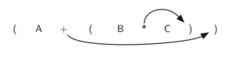
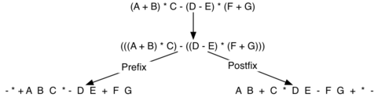
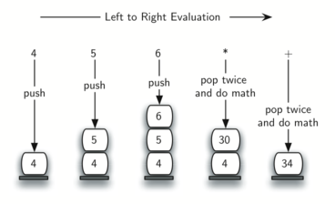

..  Copyright (C)  Brad Miller, David Ranum
    This work is licensed under the Creative Commons Attribution-NonCommercial-ShareAlike 4.0 International License. To view a copy of this license, visit http://creativecommons.org/licenses/by-nc-sa/4.0/.

Expressões Infixas, Prefixas and Posfixas
~~~~~~~~~~~~~~~~~~~~~~~~~~~~~~~~~~~~~~~~~

Quando você escreve uma expressão aritmética como B \* C, a forma do
expressão fornece informações para que você possa interpretá-la
corretamente. Neste caso, sabemos que a variável B está sendo multiplicada
pela variável C já que o operador de multiplicação \* aparece entre
elas na expressão. Este tipo de notação é chamada de
**infixa** já que o operador é \* aparece entre os dois operandos sobre os
quais está atuando.

Considere outro exemplo de notação infixa, A + B \* C.
Os operadores + e \* ainda aparecem entre os operandos, mas há um problema.
Sobre quais operando eles estão atuando?
Primeiro aplicamos o + sobre A e B ou o \* sobre B e C?
A expressão parece ambígua.

De fato, você tem lido e escrito esses tipos de expressões
por um longo tempo e elas não lhe causam nenhum problema.
A razão para isto é que você sabe algo sobre os operadores + e \*.
Cada operador tem seu nível de **precedência**.
Operadores de maior precedência são aplicados antes de operadores de menor precedência.
A única coisa que pode mudar essa ordem é a presença de parênteses.
A ordem de precedência para operadores aritméticos coloca multiplicação e divisão antes
adição e subtração. Se dois operadores de precedência igual aparecem um após outro
é utilizada uma ordenação ou associatividade da *esquerda para a direita*.

Vamos interpretar a expressão problemática A + B \* C usando a suas
precedências. B e C são multiplicados primeiro, em seguida,
A é então adicionado ao resultado.
(A + B) \* C forçaria a adição de A e B ser feita
primeiro, antes da multiplicação.
Na expressão A + B + C, pela assiciatividade da precedência,
o + à esquerda + seria feito primeiro; adicionamos A a B e em seguida o resultado a C.

Embora tudo isso possa ser óbvio para você, lembre-se de que os computadores precisam
saber exatamente quais operadores executar e em que ordem.
Uma maneira de escrever uma expressão que garanta que não haverá confusão alguma
com respeito a ordem em que as operações são executadas é criar uma expressão
**totalmente parentizada**.
Este tipo de expressão usa um par de parênteses para cada operador.
Os parênteses ditam a ordem em que as operações são executadas; não há ambiguidade.
Também não há necessidade de lembrar de regras de precedência.

A expressão A + B \* C + D pode ser reescrita como ((A + (B \* C)) + D)
para mostrar que a multiplicação acontece primeiro,
seguida da adição mais à esquerda.
A + B + C + D pode ser escrito como (((A + B) + C) + D) já que
operações de adição são associadas da esquerda para a direita.

Existem dois outros formatos de expressão muito importantes que podem não parecer
óbvios para você no começo.
Considere a expressão infixa A + B.
O que acontecer se movemos o operador para antes dos dois operandos?
O resultado expressão seria + A B.
Da mesma forma, poderíamos mover o operador para o fim.
Nós obteríamos A B +.
Estas expressões parecem um pouco estranhos.

Estas mudanças na posição do operador em relação ao
operandos criam dois novos formatos de expressão, **prefixa** e **posfixa**.
A notação prefixa requer que todos os operadores precedam os dois operandos sobre os quais atuam.
A notação posfixa, por outro lado, requer que seus operadores venham depois dos
operandos correspondentes. Mais alguns exemplos
deve ajudar a tornar isso um pouco mais claro
(veja :ref:`Tabela 2 <tbl_example1>`).

A + B \* C seria escrito como + A \* B C no prefixo.
O operador multiplicação vem imediatamente antes dos operandos B e C,
denotando que \* tem precedência sobre +.
O operador de adição aparece então antes do e o resultado da multiplicação.

A expressão postfixa seria A B C \* +. Mais uma vez, a ordem de
operações são preservadas desde que o \* aparece imediatamente após o B e
o C, denotando que \* tem precedência, com + vindo depois.
Apesar os operadores terem sido movidos para  antes ou depois dos respectivos
operandos, a ordem dos operandos permaneceu exatamente igual.

.. _tbl_example1:

.. table:: **Tabela 2: Examplos de Infixa, Prefixa, and Posfixa**

    ============================ ======================= ========================
            **Expressão Infixa**   **Expressão Prefixa**    **Expressão Posfixa**
    ============================ ======================= ========================
                           A + B                  \+ A B                    A B +
                      A + B \* C             \+ A \* B C               A B C \* +
    ============================ ======================= ========================

Agora considere a expressão infixa (A + B) \* C. Lembre-se que neste
caso, a expressão infixa requer os parênteses para forçar a realização da
adição antes da multiplicação. No entanto, quando A + B foi escrito em
prefixo, o operador de adição foi simplesmente movido antes dos operandos,
+ A B. O resultado desta operação torna-se o primeiro operando para o
multiplicação. O operador de multiplicação é movido para frente de
toda a expressão, resultando em \* + A B C. Da mesma forma, no posfixa
A B + obriga a adição a ser realizada primeiro. A multiplicação pode ser aplicada a
esse resultado e o operando C. A expressão posfixa correspondente
é então A B + C \*.

Considere estas três expressões novamente (veja :ref:`Tabela 3 <tbl_parexample>`).
Algo muito importante aconteceu. Para onde os parênteses foram?
Por quê  não precisamos deles na prefixa e na posfixa?
A resposta é que não há mais ambiguidade sobre quais operandos os operadores atuam.
Somente a notação infixa requer os símbolos adicionais.
A ordem das operações em de expressões prefixas e posfixas é completamente
determinado pela posição do operador e nada mais.
De várias maneiras, isso faz infixa a notação menos desejável.

.. _tbl_parexample:

.. table:: **Tabela 3: Uma Expressão com Parênteses**

    ============================ ======================= ========================
            **Expressão Infixa**   **Expressão Prefixa**    **Expressão Posfixa**
    ============================ ======================= ========================
                    (A + B) \* C              \* + A B C               A B + C \*
    ============================ ======================= ========================

:ref:`Table 4 <tbl_example3>`
mostra alguns exemplos adicionais de expressões infixas e
as expressões prefixas e posfixas equivalentes. Certifique-se de que você
entende como elas são equivalentes em termos da ordem das
operações sendo executadas.

.. _tbl_example3:

.. table:: **Tabela 4: Mais Exemplos de Infixa, Prefixa e Posfixa**

    ============================ ======================= ========================
            **Expressão Infixa**   **Expressão Prefixa**    **Expressão Posfixa**
    ============================ ======================= ========================
                  A + B \* C + D        \+ \+ A \* B C D           A B C \* + D +
              (A + B) \* (C + D)          \* + A B + C D           A B + C D + \*
                 A \* B + C \* D        \+ \* A B \* C D          A B \* C D \* +
                   A + B + C + D          \+ + + A B C D            A B + C + D +
    ============================ ======================= ========================

Conversão de Expressões Infixas para Prefixas e Posfixas
^^^^^^^^^^^^^^^^^^^^^^^^^^^^^^^^^^^^^^^^^^^^^^^^^^^^^^^^

Até agora, usamos métodos *ad hoc* para converter expressões infixas
para expressões prefixas e posfixas equivalentes. Como você pode
imaginar, existem maneiras algorítmicas que permitem
convertermos qualquer expressão de qualquer complexidade para uma expressão equivalente.

A primeira técnica que vamos considerar usa a noção de um
expressão entre parênteses que foi discutida anteriormente.
Lembre-se que A + B \* C pode ser escrita como (A + (B \* C)) para mostrar
explicitamente que a multiplicação tem precedência sobre a adição.
Em uma observação mais cuidadosa, no entanto, você pode
ver que cada par de parênteses também determina o
início e o fim de um par de operandos com o operador correspondente
no meio.

Observe o parêntese direito na subexpressão (B \* C) acima.
Se movermos o símbolo de multiplicação para a posição do parêntese a direita e removermos o
parêntese da esquerda, obtendo B C \*, teremos, de fato,
convertido a subexpressão para a notação posfixa.
Se o operador adição também for movido para a posição correspondente ao parêntese à direita
e o parêntese esquerdo correspondente foi removido, teremos a expressão posfixa completa
(veja :ref:`Figura 6 <fig_moveright>`).

.. _fig_moveright:

   Figure 6: Movendo Operadores para a Direita para a Expressão Posfixa

Se fizermos a mesma coisa, mas em vez de mover o símbolo para a posição
do parêntese direito, nós o movemos para a esquerda, obtemos a notação prefixa
(veja :ref:`Figura 7 <fig_moveleft>`). A posição do par parênteses é
na verdade, uma pista para a posição final do operador entre parênteses.

.. _fig_moveleft:

.. figure:: Figures/moveleft.png
   :align: center

   Figure 7: Movendo Operadores para a Esquerda para a Expressão Prefixa

Então, para converter uma expressão, não importa o quão complexa,
para a
notação de prefixa ou posfixa, considere a expressão totalmente parentizada equivalente.
Em seguida, mova o operador envolto pelos parênteses para a posição do
parêntese esquerdo ou direito, dependendo se você quer notação de prefixa ou posfixa.

Aqui está uma expressão mais complexa: (A + B) \* C - (D - E) \* (F + G).
:ref:`Figure 8 <fig_complexmove>` mostra a conversão para a notação posfixa e prefixa.

.. _fig_complexmove:

   Figure 8: Convertendo uma Expressão Complexa para as Notações Prefixa and Posfixa

Conversão Genérica de Infixa para Posfixa
^^^^^^^^^^^^^^^^^^^^^^^^^^^^^^^^^^^^^^^^^

Precisamos desenvolver um algoritmo para converter qualquer expressão infixa para uma
expressão posfixa equivalente.
Para fazer isso, vamos olhar mais de perto o processo de conversão.

Considere mais uma vez a expressão A + B \* C. Como mostrado acima,
A B C \* + é a posfixa equivalente. Já observamos que o
os operandos A, B e C permanecem em suas posições relativas.
São apenas o operadores que mudam de posição.
Vamos olhar novamente para os operadores na expressão infixada.
O primeiro operador que aparece da esquerda para a direita é +.
No entanto, na expressão posfixa, + está no final ja que o próximo
operador, \*, tem precedência sobre a adição.
A ordem dos operadores na expressão original é invertida na expressão posfixa resultante.

Enquanto processamos a expressão, os operadores precisam ser salvos em algum lugar
já que seus operandos correspondentes ainda não foram vistos.
Também a ordem desses operadores salvos pode precisar ser revertida devido à precedência.
Este é o caso da adição e da multiplicação do exemplo.
Como o operador de adição vem antes do operador de multiplicação e tem menor precedência,
ele precisa aparecer depois que o operador de multiplicação ser aplicado.
Devido a essa reversão de ordem, faz sentido considerar o uso de uma pilha para
manter os operadores até que sejam necessários.

E quanto a (A + B) \* C?
Lembre-se de que A B + C \* é a posfixa equivalente.
Novamente, examinando essa expressão infixada da esquerda para a direita,
nós vemos + primeiro.
Neste caso, quando vemos \*, + já foi colocado na expressão resultante porque tem
precedência sobre \* em virtude dos parênteses.
Agora podemos começar a ver como o algoritmo de conversão vai funcionar.
Quando vemos um parêntese à esquerda, vamos salvá-lo para denotar
que outro operador de alta precedência estará chegando.
Aquele operador terá que esperar até que o parêntese direito correspondente apareça
indicando sua posição (lembre-se da técnica para expressões totalmente parentizadas).
Quando o parêntese direito é aparece, o operador pode ser removido da pilha.

Enquanto examinamos a expressão infixa da esquerda para a direita,
usaremos uma pilha para manter os operadores.
Isso fornecerá a reversão que observamos no primeiro exemplo.
O topo da pilha terá sempre o operador mais recentemente salvo.
Sempre que vemos um novo operador, precisaremos
considerar como a precedência desse operador se compara com a precedência dos operadores
na pilha, caso haja algum.

Suponha que a expressão infixa é uma string de itens (*tokens*) delimitados por espaços.
Os itens operadores são \*, /, + e -. Temos ainda os itens abre e fecha parênteses, ( e ).
Os itens que representam os operandos são os caracteres A, B, C e assim por diante.
Os passos seguintes irão produzir um
string que representa a expressão posfixa equivalente.

#. Crie uma pilha vazia chamada ``opstack`` para manter os operadores.
   Cria uma lista vazia para a saída.

#. Converta a string infixa input para uma lista usando o método ``split()``.

#. Examine os itens da lista da esquerda para a direita.

   -  Se o item é um operador, coloque-o no final da lista da saída.

   -  Se o item é um abre parêntese, insira-o (``push()``) na pilha ``opstack``.

   -  Se o item é um fecha parênteses, remova ( ``pop()``) os itens de ``opstack`` até que
      o abre parêntese correspondente seja removido.
      Coloque cada operador removido no final da lista da saída.

   -  Se i item é um operador, \*, /, +, or -, insira-o na pilha 
      ``opstack``. Entretanto, remova antes os operadores que estão na pilha que têm
      precedência maior ou igual ao operador encontrado e coloque-os na final da lista da saída.

#. Quando a expressão tiver sido completamente examinada, verifique 
   ``opstack``. Qualquer operador que ainda está na pilha deve ser removido e
   colocado na lista da saída.

:ref:`Figure 9 <fig_intopost>`
mostra o algoritmo de conversão trabalhando sobre a expressão A \* B + C \* D.
Note que o primeiro \* é removido assim que o operador + é encontrado.
Também, + permanece na pilha quando o segundo \* ocorre, já que multiplicação tem precedência sobre adição. Ao final da expressão infixa removemos da pilha ambos operadores + colocando-os como
últimos opredaores da expressão posfixa.

.. _fig_intopost:

.. figure:: Figures/intopost.png
   :align: center

   Figure 9: Convertendo A \* B + C \* D para Notação Postfixa

Para implementar o algoritmo em Python, usaremos um dicionário
chamado ``prec`` para manter os valores de precedência dos operadores.
Este dicionário associará a cada operador um número inteiro que pode ser comparado
com a precedência de outros operadores (arbitrariamente usamos os inteiros 3, 2 e 1).
O parêntese esquerdo receberá o menor valor possível.
Desta forma, qualquer operador que é comparado com ele
terá maior precedência e será colocado em sobre ele na pilha.
A linha 15 define os operandos como qualquer letra maiúsculo ou dígito .
A função de conversão completa é mostrado em :ref:`ActiveCode 1 <lst_intopost>`.

.. _lst_intopost:

.. activecode:: intopost
   :caption: Converting Infix Expressions to Postfix Expressions
   :nocodelens:

   from pythonds.basic.stack import Stack

   def infixToPostfix(infixexpr):
       prec = {}
       prec["*"] = 3
       prec["/"] = 3
       prec["+"] = 2
       prec["-"] = 2
       prec["("] = 1
       opStack = Stack()
       postfixList = []
       tokenList = infixexpr.split()

       for token in tokenList:
           if token in "ABCDEFGHIJKLMNOPQRSTUVWXYZ" or token in "0123456789":
               postfixList.append(token)
           elif token == '(':
               opStack.push(token)
           elif token == ')':
               topToken = opStack.pop()
               while topToken != '(':
                   postfixList.append(topToken)
                   topToken = opStack.pop()
           else:
               while (not opStack.isEmpty()) and \
                  (prec[opStack.peek()] >= prec[token]):
                     postfixList.append(opStack.pop())
               opStack.push(token)

       while not opStack.isEmpty():
           postfixList.append(opStack.pop())
       return " ".join(postfixList)

   print(infixToPostfix("A * B + C * D"))
   print(infixToPostfix("( A + B ) * C - ( D - E ) * ( F + G )"))

--------------

Mais alguns exemplos de conversão no Python shell estão logo abaixo.

::

    >>> infixtopostfix("( A + B ) * ( C + D )")
    'A B + C D + *'
    >>> infixtopostfix("( A + B ) * C")
    'A B + C *'
    >>> infixtopostfix("A + B * C")
    'A B C * +'
    >>>

Avaliação Posfixa
^^^^^^^^^^^^^^^^^^

Como um exemplo de final do uso de pilhas, vamos considerar a avaliação de um
expressão que já está em notação posfixa.
Neste caso, uma pilha é novamente a estrutura de dados de escolha.
No entanto, enquanto você examina a expressão posfixa, são os operandos
que devem esperar, não os operadores como no algoritmo de conversão acima.
Outra maneira de pensar sobre a solução 
é que sempre que um operador é visto na entrada, os dois 
operandos mais recentes serão utilizados na avaliação.

Para ver isso em mais detalhes, considere a expressão postfix
``4 5 6 * +``. Ao examinar a expressão da esquerda para a direita, você primeiro
encontrar os operandos 4 e 5. Neste ponto, você ainda não tem certeza do que
fazer com eles até ver o próximo símbolo. Colocando cada em uma pilha
garante que eles estejam disponíveis se um operador vier em seguida.

Nesse caso, o próximo símbolo é outro operando. Então, como antes, insira (``push()``)
o operando na pilha e verifique o próximo símbolo. Agora vemos um operador, \*.
Isso significa que os dois operandos mais recentes precisam ser multiplicados.
Removendo (``pop()``) dois itens da pilha, podemos obter os
operandos apropriados e então realizar a multiplicação (nesse caso, obtendo o
resultado 30).

Agora podemos lidar com esse resultado colocando-o na pilha para que ele
possa ser usado como um operando dos operadores posteriores na expressão.
Quando o operador final é processado, haverá apenas um valor restante
na pilha. Remova-o e devolva-o como resultado da expressão.
:ref:`Figura 10 <fig_evalpost1>` mostra o conteúdo da pilha como essa
expressão está sendo processada.

.. _fig_evalpost1:

   Figure 10: Conteúdo da Pilha Durante a Avaliação

:ref:`Figura 11 <fig_evalpost2>` mostra um exemplo um pouco mais complexo,
7 8 + 3 2 + /.
Há duas coisas a serem observadas neste exemplo.
Primeiro, o tamanho da pilha cresce, encolhe e cresce novamente à medida que as subexpressões
são avaliadas.
Em segundo lugar, a operação de divisão precisa ser tratada com cuidado.
Lembre-se de que os operandos na expressão posfixa estão em sua 
ordem original, na expressão posfixa mudamos apenas a colocação de operadores.
Quando o operandos para a divisão são retirados da pilha, eles estão invertidos.
Como a divisão *não é* um operador comutativo, em outras palavras
:math:`15/5` não é o mesmo que :math:`5/15`, devemos ter certeza que
a ordem dos operandos não é alterada.

.. _fig_evalpost2:

.. figure:: Figures/evalpostfix2.png
   :align: center

   Figura 11: Um Exemplo Mais Complexo de Avaliação

Suponha que a expressão posfixa seja uma string de itens (*tokens*) delimitados por espaços.
Os operadores são \*, /, + e - e supomos que os operandos são valores inteiros de um dígito.
A saída será um resultado inteiro.

#. Crie uma pilha vazia chamada ``operandStack``.

#. Converta a string para uma lista usando o método string ``split()``.

#. Digitalize a lista de itens da esquerda para a direita.

   - Se o item for um operando, converta-o de uma string para um inteiro
      e insira-o em ``operandStack``.

   - Se o item for um operador, \*, /, + ou -, serão necessários dois
     operandos. Faça duas remoções de ``operandStack``. O primeiro valor removido é o
     segundo operando e o segundo valor removido é o primeiro operando. Execute
     a operação aritmética. Insira o resultado em ``operandStack``.

#. Quando a expressão de entrada foi completamente processada, o resultado
   está na pilha. Remova de ``operandStack`` o valor e retorne-o.

A função completa para a avaliação de expressões posfixa é mostrada
em :ref:`ActiveCode 2 <lst_postfixeval>`. Para ajudar com a aritmética,
usamos uma função auxiliar ``doMath()`` que recebe dois operandos e um
operador e, em seguida, executa e retorna o resultado da operação sobre os operandos.

.. _lst_postfixeval:

.. activecode:: postfixeval
   :caption: Postfix Evaluation
   :nocodelens:

   from pythonds.basic.stack import Stack

   def postfixEval(postfixExpr):
       operandStack = Stack()
       tokenList = postfixExpr.split()

       for token in tokenList:
           if token in "0123456789":
               operandStack.push(int(token))
           else:
               operand2 = operandStack.pop()
               operand1 = operandStack.pop()
               result = doMath(token,operand1,operand2)
               operandStack.push(result)
       return operandStack.pop()

   def doMath(op, op1, op2):
       if op == "*":
           return op1 * op2
       elif op == "/":
           return op1 / op2
       elif op == "+":
           return op1 + op2
       else:
           return op1 - op2

   print(postfixEval('7 8 + 3 2 + /'))

É importante notar que tanto na conversão para posfixa quanto no
programa de avaliação da expressão posfixa supomos que não havia erros no
expressão de entrada. Usando esses programas como ponto de partida, você pode
ver facilmente como a detecção e o relatório de erros podem ser incluídos.
Nós deixamos isso como um exercício no final do capítulo.

..                       
      -  :\\b10\\s+3\\s+5\\s*\*\\s*16\\s+4\\s*-\\s*\/\\s*\+: Correto
         :.*10.*3.*5.*16.*4.*: Os números estão na ordem correta, verifique os operadores
         :'.*': Lembre que os números aparecem na mesma ordem que a expressão original
                
.. admonition:: Self Check

   .. fillintheblank:: postfix1

      Sem utilizar executar a ``infixToPostfix()``, converta a expressão ``10 + 3 * 5 / (16 - 4)`` para a notação posfixa.

                       
      -  :10 3 5 \* 16 4 \- \/ \+: Correto
         :.*10.*3.*5.*16.*4.*: Os números estão na ordem correta, verifique os operadores, eles não devem estar juntos
         :'.*': Lembre que os números aparecem na mesma ordem que a expressão original              
   .. fillintheblank:: postfix2

      Qual é o valor da expressão ``17 10 + 3 * 9 /``?

      - :9: Correto
        :'.*': Lembre de empilhar os valores dos resultados intermediários
      

   .. fillintheblank:: postfix3

      Modifique a função ``infixToPosfix()`` de tal maneira que converta a expressão: ``5 * 3 ^ (4 - 2)``   Cole aqui a expressão posfixa resultante.

      - :5 3 4 2 \- \^ \*: correto
        :'.*': Você precisa apenas adicionar a função uma linha! Deixe um espaço entre os operadores.

.. video:: video_Stack3
    :controls:
    :thumb: ../_static/activecodethumb.png

    http://media.interactivepython.org/pythondsVideos/Stack3.mov
    http://media.interactivepython.org/pythondsVideos/Stack3.webm
