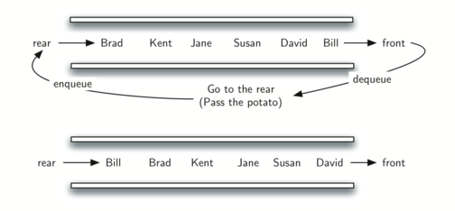

..  Copyright (C)  Brad Miller, David Ranum
    This work is licensed under the Creative Commons Attribution-NonCommercial-ShareAlike 4.0 International License. To view a copy of this license, visit http://creativecommons.org/licenses/by-nc-sa/4.0/.

Simulação: Batata Quente
~~~~~~~~~~~~~~~~~~~~~~~~

Uma das aplicações típicas para mostrar uma fila em ação é
simular uma situação real que requer que os dados sejam gerenciados em de um maneira FIFO.
Para começar, vamos considerar o jogo infantil Batata Quente (*Hot Potato*).
Nesse jogo (ver :ref:`Figura 2 <fig_quhotpotato>`) crianças se alinham em um círculo e
passam um item (a batata quente) de vizinho para vizinho o mais rápido que puderem.
A um certo ponto no jogo, a ação é interrompida e a criança que tem o item
(a batata) é removida do círculo.
O jogo continua até que resta apenas um criança.

.. _fig_quhotpotato:

.. figure:: Figures/hotpotato.png
   :align: center

   Figura 2: Um jogo de batata quente com seis pessoas

Este jogo é um equivalente moderno do famoso problema de Josephus.
Baseado em uma lenda sobre o famoso historiador do século I, Flavius
Josephus. A história diz que na revolta judaica contra Roma,
Josephus e 39 de seus companheiros resistiram aos romanos em uma caverna.
Com a derrota iminente, eles decidiram que prefeririam morrer a serem
escravos dos romanos. Eles se organizaram em um círculo. Um homem foi
designado como número um, e percorrendo o círculo no setindo e contando eles matavam
todo o sétimo homem. Josephus, de acordo com a lenda, era entre outras coisas
um matemático realizado. Ele instantaneamente descobriu onde deveria
sentar-se para ser o último a ser executado. Quando chegou a hora, em vez de
matar-se, ele se juntou ao lado romano. Você pode encontrar muitos versão diferentes
desta história. Algumas versões matam cada terceiro homem e outras permitem
que o último homem fuja em um cavalo.
Em qualquer caso, a ideia é a mesma.

Vamos implementar uma **simulação** geral de Batata Quente. Nosso programa
irá utilizar uma lista de nomes e uma constante "num" utilizada para a contagem.
Ele retornará o nome da última pessoa restante depois
contagem repetitiva por ``num``. O que acontece nesse momento é com você.

Para simular o círculo, usaremos uma fila (veja:ref:`Figura 3 <fig_qupotatoqueue>`).
Suponha que a criança segurando a batata esta no início da fila.
Ao passar a batata, a simulação vai simplesmente remover 
essa criança da fila (``dequeue()``) e em seguida inseri-la  no final da fila (``enqueue()``).
Ela então esperará até que todos os outros tenham passado pelo início antes que seja sua vez novamente.
Depois de ``num`` operações de remoção/inserção, a criança no início será removida
permanentemente e outro ciclo começará. Este processo continuará
até que apenas um nome permaneça (o tamanho da fila seja 1).

.. _fig_qupotatoqueue:

   Figura 3: Uma Implementação de Batata Quente

O programa é mostrado em :ref:`ActiveCode 1 <lst_josephussim>`. Uma chamada de
``hotPotato()`` usando 7 como a constante para a contagem returna ``Susan``.

.. _lst_josephussim:

.. activecode:: qujosephussim
   :caption: Simulação de Batata Quente
   :nocodelens:

   from pythonds.basic.queue import Queue
   
   def hotPotato(namelist, num):
       simqueue = Queue()
       for name in namelist:
           simqueue.enqueue(name)

       while simqueue.size() > 1:
           for i in range(num):
               simqueue.enqueue(simqueue.dequeue())

           simqueue.dequeue()

       return simqueue.dequeue()

   print(hotPotato(["Bill","David","Susan","Jane","Kent","Brad"],7))

Note que neste exemplo o valor da constante de contagem é maior
do que o número de nomes na lista. Isto não é um problema já que o
fila age como um círculo e a contagem continua no início
até que o valor seja atingido. Além disso, observe que a lista representa 
a fila de tal forma que o primeiro nome da lista será o do início da
a fila. ``Bill`` neste caso é o primeiro item da lista e
portanto, se move para o início fila. Uma variação dessa
implementação, descrita nos exercícios, permite um contador aleatório.
