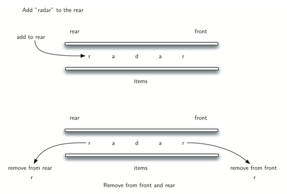

..  Copyright (C)  Brad Miller, David Ranum
    This work is licensed under the Creative Commons Attribution-NonCommercial-ShareAlike 4.0 International License. To view a copy of this license, visit http://creativecommons.org/licenses/by-nc-sa/4.0/.

Verificado de Palíndromos
~~~~~~~~~~~~~~~~~~~~~~~~~

Um problema interessante que pode ser facilmente resolvido usando a estrutura de dados deque (*fila dupla*)
é o problema clássico do palíndromo. Um **palíndromo** é uma
string que é lida da mesma forma do início para o fim e do fim para o início, por exemplo, *radar*,
*toot* e *madam* são palídromos. Gostaríamos de construir um algoritmo para inserir se uma string
é um palíndromo.

A solução para este problema usará um deque para armazenar os caracteres da string.
Vamos processar a string da esquerda para a direita e inserir cada caractere no fim do deque.
Neste ponto, o deque estará atuando agindo de maneira muito parecida com uma fila normal.
No entanto, agora podemos fazer uso da a dupla funcionalidade do deque.
O início da deque amazenará o primeiro caractere da string e o fim da deque manterá
o último caractere (veja :ref:`Figura 2 <fig_palindrome>`).

.. _fig_palindrome:

   Figure 2: Uma Deque

Como podemos remover os ambos diretamente, podemos compará-los e
continuar apenas se esses caracteres forem iguais.
Se pudermos manter a correspondência entre os itens do início e do fim,
ao final ficaremos sem caracteres na deque ou ficar com uma
deque de tamanho 1, dependendo se o comprimento da string original
era par ou ímpar. Em ambos os casos, a string deve ser um palíndromo. a
função completa para verificação de palíndromos pode ser vista em
:ref:`ActiveCode 1 <lst_palchecker>`.
       

.. _lst_palchecker:

.. activecode:: palchecker
   :caption: Um Verificador de Palíndrmos Usando uma Deque
   :nocodelens:

   from pythonds.basic.deque import Deque
   
   def palchecker(aString):
       chardeque = Deque()

       for ch in aString:
           chardeque.addRear(ch)

       stillEqual = True

       while chardeque.size() > 1 and stillEqual:
           first = chardeque.removeFront()
           last = chardeque.removeRear()
           if first != last:
               stillEqual = False

       return stillEqual

   print(palchecker("lsdkjfskf"))
   print(palchecker("radar"))
