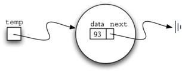
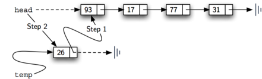
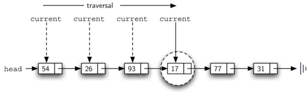

..  Copyright (C)  Brad Miller, David Ranum
    This work is licensed under the Creative Commons Attribution-NonCommercial-ShareAlike 4.0 International License. To view a copy of this license, visit http://creativecommons.org/licenses/by-nc-sa/4.0/.

Implementando uma Lista Desordenada: Listas Ligadas
~~~~~~~~~~~~~~~~~~~~~~~~~~~~~~~~~~~~~~~~~~~~~~~~~~~~

Para implementar uma lista desordenada, vamos construir o que é
comumente conhecido como **lista ligada**. Lembre-se de que precisamos ter certeza de que
podemos manter o posicionamento relativo dos itens. No entanto, não existe
exigência alguma de que mantemos esse posicionamento na memória.
Por exemplo, considere a coleção de itens mostrados em
:ref:`Figura 1 <fig_idea>`. Parece que esses valores foram colocados
aleatoriamente. Se pudermos manter algumas informações explícitas em cada item,
ou seja, a localização do próximo item (ver :ref:`Figura 2 <fig_idea2>`), então o
posição relativa de cada item pode ser expressa simplesmente seguindo o
link/ligaçcão de um item para o outro.

.. _fig_idea:

.. figure:: Figures/idea.png
   :align: center

   Figure 1: Itens dispostos de maneira não restrita

.. _fig_idea2:

.. figure:: Figures/idea2.png
   :align: center

   Figure 2: Posição Relativa Mantida por Links Explícitos

É importante observar que a localização do primeiro item da lista
deve ser explicitamente especificada. Uma vez que sabemos onde está o primeiro item, 
o primeiro item pode nos dizer onde está o segundo e assim por diante. A referência externa é 
geralmente chamada de **cabeça** (*head*) da lista. Similarmente,
o último item precisa saber que não há próximo item.

A classe ``Node``
^^^^^^^^^^^^^^^^^

O bloco básico para a construção da implementação da lista ligada é o
**nó** (``Node``). Cada objeto nó deve conter pelo menos duas informações.
Primeiro, o nó deve conter um item da lista. Vamos chamar isso de
**campo de dados** (*data field*) do nó. Além disso, cada nó deve conter uma referência
para o próximo nó. :ref:`Listagem 1 <lst_nodeclass>` mostra uma 
implementação em Python. Para construir um nó, você precisa fornecer os dados valores dos
dados iniciais para o nó. Executar a declaração de atribuição abaixo produzirá
um objeto de nó (``Node``) contendo o valor 93 (veja :ref:`Figura 3 <fig_node>`).
Você deve notar que normalmente representamos um objeto nó como mostrado
:ref:`Figura 4 <fig_node2>`. A classe ``Node`` também inclui os métodos usuais
para acessar e modificar os dados e a próxima referência.

.. _lst_nodeclass:

**Listagem 1**

.. sourcecode:: python

   class Node:
       def __init__(self,initdata):
           self.data = initdata
           self.next = None

       def getData(self):
           return self.data

       def getNext(self):
           return self.next

       def setData(self,newdata):
           self.data = newdata

       def setNext(self,newnext):
           self.next = newnext
           
Criamos um objeto ``Node`` da maneira usual.

::

        >>> temp = Node(93)
        >>> temp.getData()
        93

O valor de referência especial do Python, ``None``, terá um papel importante
na classe ``Node`` e depois na própria lista ligada. Uma referência
para ``None`` denota o fato de que não há próximo nó. Observe no
construtor que um nó é inicialmente criado com o ``next`` configurado para
``None``. Como isso às vezes é chamado de “aterramento do nó” (*grounding the node*)
vamos usar o símbolo padrão de terra (como em eletricidade) para denotar uma referência para ``None``.
É sempre uma boa ideia atribuir explicitamente ``None`` para seus valores de referência iniciais.

.. _fig_node:

   Figura 3: Um objeto ``Node`` Contém um Item e uma Referência para o Próximo ``Node``

.. _fig_node2:

.. figure:: Figures/node2.png
   :align: center

   Figura 4: Uma Representação Típica de um ``Node``

A Classe ``UnordenedList``
^^^^^^^^^^^^^^^^^^^^^^^^^^^^^^^

Como sugerimos acima, a lista desordenada será construída a partir de um
coleção de nós, cada um ligado ao próximo por referências explícitas. Como
desde que saibamos onde encontrar o primeiro nó (contendo o primeiro
item), cada item depois disso pode ser encontrado seguindo sucessivamente
os próximos links. Com isto em mente, a classe ``UnorderedList`` deve manter
uma referência ao primeiro nó. :ref:`Listagem 2 <lst_listclass>` mostra o
construtor. Observe que cada objeto da lista manterá uma única referência
para a cabeça da lista.

.. _lst_listclass:

**Listagem 2**

.. sourcecode:: python

    class UnorderedList:
    
        def __init__(self):
            self.head = None

Inicialmente, quando construímos uma lista, não há itens na lista.
O comnado de atribuição

::

    >>> mylist = UnorderedList()

cria a representação da lista encadeada mostrada em
:ref:`Figura 5 <fig_initlinkedlist>`. Como discutimos na classe ``Node``, o
valor especial ``None`` será novamente usada para indicar que a cabeça da
a lista não se refere a nada. Eventualmente, a lista de exemplos dada
anteriormente será representada por uma lista ligada, conforme
:ref:`Figura 6 <fig_linkedlist>`. A cabeça da lista refere-se ao primeiro nó
que contém o primeiro item da lista. Por sua vez, esse nó detém um
referência ao próximo nó (o próximo item) e assim por diante. É muito
importante observar que a classe da lista em si não contém nenhum objeto ``Node``.
Em vez disso, contém uma única referência para apenas o primeiro nó
na estrutura ligada.

.. _fig_initlinkedlist:

.. figure:: Figures/initlinkedlist.png
   :align: center

   Figura 5: Uma Lista Vazia

.. _fig_linkedlist:

.. figure:: Figures/linkedlist.png
   :align: center

   Figura 6: Uma Lista de Inteiros

O método ``isEmpty()``, mostrado em :ref:`Listagem 3 <lst_isempty>`, simplesmente verifica se
a cabeça da lista é uma referência a ``None``. O resultado da expressão booleana ``self.head == None``
só será verdadeira se não há nós na lista ligada. Como uma nova lista está vazia, o
construtor e a verificação de vazio devem ser consistentes uns com os outros.
Isto mostra a vantagem de usar a referência ``None`` para indicar o
"Fim" da estrutura ligada. Em Python, ``None`` pode ser comparado a
qualquer referência. Duas referências são iguais se ambas se referirem ao mesmo
objeto. Nós vamos usar isso com freqüência em nossos métodos restantes.

.. _lst_isempty:

**Listagem 3**

::

    def isEmpty(self):
        return self.head == None

    
Então, como inserimos itens em nossa lista? Precisamos implementar o método
``add``. No entanto, antes de podermos fazer isso, precisamos abordar a questão
importante de onde a lista ligada deve colocar o novo item. Como essa
lista é desordenada, a localização específica do novo item em relação a
os outros itens já na lista não são importantes. O novo item pode
ser colocado em qualquer lugar. Com isso em mente, faz sentido colocar o novo item em
a localização mais fácil possível de ser acessada.

Lembre-se de que a estrutura da lista ligada nos fornece apenas um ponto de entrada, a cabeça da lista.
Todos os outros nós só podem ser alcançados
acessando o primeiro nó e depois seguindo os links ``next``. Isto
significa que o lugar mais fácil para inserir o novo nó é como cabeça,
ou início da lista. Em outras palavras, vamos fazer o novo item ser o
primeiro item da lista e os itens existentes precisarão ser ligados a
este novo primeiro item.

A lista encadeada mostrada em: ref:`Figura 6 <fig_linkedlist>` foi construída chamando
o método ``add()`` várias vezes.

::

    >>> mylist.add(31)
    >>> mylist.add(77)
    >>> mylist.add(17)
    >>> mylist.add(93)
    >>> mylist.add(26)
    >>> mylist.add(54)

Observe que, como 31 é o primeiro item adicionado à lista, ele será
eventualmente, o último nó na lista ligada como qualquer outro item é
inserido à frente dele. Além disso, como 54 é o último item inserido, ele se tornará
o valor no primeiro nó da lista ligada.

O método ``add()`` é mostrado em :ref:`Listagem 4 <lst_add>`.
Cada item da lista deve residir em um objeto ``Node``.
A linha 2 cria um novo nó e coloca o item como seus dados.
Agora devemos concluir o processo ligando o novo
nó na estrutura existente. Isso requer dois passos, conforme mostrado
:ref:`Figura 7 <fig_addtohead>`. O passo 1 (linha 3) muda a referência ``next``
do novo nó para se referir ao antigo primeiro nó da lista. Agora que o
resto da lista foi devidamente ligado ao novo nó, podemos
modificar a cabeçã da lista para se referir ao novo nó.
A atribuição na linha 4 define a cabeça da lista.

A ordem dos dois passos descritos acima é muito importante. O que
acontece se a ordem das linhas 3 e 4 for invertida? Se o
modificação da cabeça da lista acontece em primeiro lugar, o resultado pode ser
visto em :ref:`Figura 8 <fig_wrongorder>`. Já que a cabeça era a única referência externa
aos nós da lista, todos os nós originais são perdidos e podem não mais ser acessado.

.. _lst_add:

**Listagem 4**

::

    def add(self,item):
        temp = Node(item)
        temp.setNext(self.head)
        self.head = temp

.. _fig_addtohead:

   Figura 7: Inserido um Novo Nó Atraves de Dois Passos

.. _fig_wrongorder:

.. figure:: Figures/wrongorder.png
   :align: center

   Figura 8: Resultado da Inversão dos Dois Passos

Os próximos métodos que vamos implementar  – ``size()``, ``search()`` e
``remove()`` – são todos baseados em uma técnica conhecida como **varredura de lista ligada**
Varredura de refere-se ao processo de visitar sistemática cada nó.
Para fazer isso, usamos uma referência externa que começa no
primeiro nó da lista. Ao visitarmos cada nó, movemos a referência para
o próximo nó "percorrendo" a próxima referência.

Para implementar o método ``size()``, precisamos percorrer a lista ligada
e manter uma contagem do número de nós que ocorreram.
:ref:`Listagem 5 <lst_length>` mostra o código Python para contar o número de
nós na lista. A referência externa é chamada ``current`` e é
inicializada com a cabeça da lista na linha 2. No início do
processo não vimos nenhum nó, então a contagem está definida como :math:`0`.
As linhas 4 a 6 realmente implementam o percurso. Enquanto a a
referência  ``current`` não chegar ao final da lista (``None``), nos movemos ``current``
para o próximo nó através da atribuição na linha 6. Mais uma vez,
a capacidade de comparar uma referência a ``None`` é muito útil.
Cada vez que nos movemos para um novo nó, adicionamos: math:`1` a ``count``.
Finalmente, ``count`` é retornado após a iteração parar.
:ref:`Figura 9 <fig_traversal>` mostra este processo à medida que varremos a lista.

.. _lst_length:

**Listagem 5**

.. highlight:: python
  :linenothreshold: 5

::

    def size(self):
        current = self.head
        count = 0
        while current != None:
            count = count + 1
            current = current.getNext()

        return count
        

.. _fig_traversal:

.. figure:: Figures/traversal.png
   :align: center

   Figura 9: Varredura de uma lista ligada da Cabeça (``Head``) até o fim

Pesquisando por um valor em uma implementação de lista ligada desordenado
também usa a técnica de travessia. À medida que visitamos cada nó na
lista ligada, vamos perguntar se os dados armazenados lá correspondem ao item
que estamos procurando. Neste caso, no entanto, podemos não ter que atravessar
todo o caminho até o final da lista. Na verdade, se chegarmos ao fim da
lista, isso significa que o item que estamos procurando não está
presente. Além disso, se encontrarmos o item, não há necessidade de continuar.

:ref:`Listagem 6 <lst_search>` mostra a implementação do método ``search()``.
Como no método ``size()``, a varredura é iniciada na cabeça
da lista (linha 2). Nós também usamos uma variável booleana chamada
``found`` para lembrar se localizamos o item que estamos procurando
para. Como no início da travessia aina não encontramos o item,
``found`` pode ser definido como ``False`` (linha 3). A iteração na linha 4
leva em conta ambas as condições discutidas acima. Enquanto houver
mais nós para visitar e não encontramos o item que estamos procurando,
prosseguimos com verificar dos próximos nós. A comparação na linha 5 pergunta se
o item está no nó ``currente``. Se assim for, ``found`` pode ser
definido como ``True``.

.. _lst_search:

**Listagem 6**

::

    def search(self,item):
        current = self.head
        found = False
        while current != None and not found:
            if current.getData() == item:
                found = True
            else:
                current = current.getNext()

        return found

Como exemplo, considere a invocação de ``search(17)``.

::

    >>> mylist.search(17)
    True

Como 17 está na lista, o percurso precisa se mover apenas até o
nó contendo 17. Nesse ponto, a variável ``found`` é definida como
``True`` e a condição ``while`` falhará, levando ao retorno
valor visto acima. Este processo pode ser visto em :ref:`Figura 10 <fig_searchpic>`.

.. _fig_searchpic:

   Figura 10: Busca Bem Sucedida do Valor 17

O método ``remove()`` requer dois passos lógicos. Primeiro, precisamos
percorrer a lista procurando o item que queremos remover. Uma vez encontrado
o item (lembre-se que supomos que o item está na lista), devemos removê-lo. 
O primeiro passo é muito parecido com ``search()``. Começando com uma 
referência externa definida para a cabeça da lista, percorremos os links até que
encontrar o item que estamos procurando. Como supomos que o item está na lista,
sabemos que a iteração irá parar antes de ``current`` chegar a ``None``.
Isso significa que podemos simplesmente usar o booleano ``found`` na
condição.

Quando ``found`` se tornar ``True``, ``current`` será uma referência para o
nó contendo o item a ser removido. Mas como podemos removê-lo? Uma
possibilidade seria substituir o valor do item com algum marcador.
Isso sugere que o item não está mais presente. O problema com essa
abordagem é o número de nós já não corresponderá ao número de items.
Seria muito melhor remover o item removendo todo o nó.

Para remover o nó que contém o item, precisamos modificar o
link do nó anterior para que ele se refira ao nó que vem depois de
``current``. Infelizmente, não há como voltar atrás no lista
ligada. Já que ``current`` se refere ao nó à frente do nó onde nós
gostaria de fazer a mudança, é tarde demais para fazer a modificação
necessária.

A solução para este dilema é usar duas referências externas à medida que
percorremos a lista encadeada. ``current`` vai se comportar como fez
antes, marcando a localização atual da travessia. A nova referência,
que vamos chamar ``previous``, sempre viajará um nó atrás
``current``. Dessa forma, quando ``current`` pára no nó a ser removido,
``previous`` será referente ao local apropriado na lista encadeada
para a modificação.

:ref:`Listagem 7 <lst_remove>` mostra o método ``remove()`` completo.
Linhas 2–3 atribuem valores iniciais às duas referências.
Note que ``current`` começa na cabeça da lista como nos outros exemplos de travessia.
``previous``, no entanto, é suposto estar sempre um nó atrás
``current``. Por esta razão, ``previous`` começa com um valor o ``None`` já que não há
nó antes da cabeça (veja :ref:`Figura 11 <fig_removeinit>`).
A variável booleana ``found`` será novamente
usada para controlar a iteração.

Nas linhas 6 a 7, perguntamos se o item armazenado no nó atual é o
item que desejamos remover. Se assim for, ``found`` pode ser definido como ``True``. Se nós
não encontramos o item, ``previous`` e ``current`` devem ser movidos
um nó à frente. Mais uma vez, a ordem dessas duas atribuições é crucial.
``previous`` deve primeiro ser movido um nó adiante para o local de
``current``. Nesse ponto, ``current`` pode ser movido. Este processo é
muitas vezes referido como "andar de lesma" ("*inch-worming*") como ``previous`` deve ir até
``current`` antes de ``current`` seguir em frente. :ref:`Figura 12 <fig_prevcurr>` mostra
o movimento de ``previous`` e ``current`` à medida que avançam pela
lista procurando o nó contendo o valor 17.

.. _lst_remove:

**Listagem 7**

::

    def remove(self,item):
        current = self.head
        previous = None
        found = False
        while not found:
            if current.getData() == item:
                found = True
            else:
                previous = current
                current = current.getNext()

        if previous == None:
            self.head = current.getNext()
        else:
            previous.setNext(current.getNext())

.. _fig_removeinit:

   Figura 11: Valores Iniciais de ``previous`` and ``current``

.. _fig_prevcurr:

.. figure:: Figures/prevcurr.png
   :align: center

   Figura 12: ``previous`` e ``current`` se Movendo na Lista

Uma vez que o passo de busca do ``remove()`` tenha sido completado, precisamos
remover o nó da lista ligada. :ref:`Figura 13 <fig_removepic1>` mostra o
link que deve ser modificado. No entanto, há um caso especial que precisa
se abordado. Se o item a ser removido for o primeiro item
na lista, então ``current`` fará referência ao primeiro nó na
lista ligada. Isto também significa que ``previous`` será ``None``. Nós dissemos
anteriormente que ``previous`` estaria se referindo ao nó cuja referência ``next``
precisa ser modificada para concluir a remoção. Nesse
caso, não é "previous", mas sim a cabeça da lista que precisa
a ser alterado (veja :ref:`Figura 14 <fig_removehead>`).

.. _fig_removepic1:

.. figure:: Figures/remove.png
   :align: center

   Figura 13: Removendo o Item de Meio da Lista

.. _fig_removehead:

.. figure:: Figures/remove2.png
   :align: center

   Figura 14: Removendo o Primeiro Nó da Lista

A linha 12 nos permite verificar se estamos lidando com o caso especial
descrito acima. Se ``previous`` não foi movido, ele ainda terá o
valor ``None`` quando o booleano ``found`` se torna ``True``. Nesse caso
(linha 13) a cebaça da lista é modificado para se referir ao nó após
o nó ``current``, na verdade, removendo o primeiro nó da lista ligada.
No entanto, se previous não é ``None``, o nó a ser removido está
em algum lugar mais adiante na estrutura da lista ligada. Neste caso, a 
referência ``previous`` está nos fornecendo o nó cuja referência ``next`` deve ser
modificada. A linha 15 usa o método ``setNext()`` de ``previous`` para
realizar a remoção. Note que em ambos os casos o destino do
a mudança de referência é ``current.getNext ()``. Uma pergunta que muitas vezes
surge é se os dois casos mostrados aqui também vão lidar com a
situação em que o item a ser removido está no último nó do lista
Ligada. Nós deixamos isso para você considerar.

Você pode experimentar a classe ``UnorderedList`` no ActiveCode 1.

.. activecode:: unorderedlistcomplete
   :caption: The Complete UnorderedList Class
   :hidecode:
   :nocodelens:
   
   class Node:
       def __init__(self,initdata):
           self.data = initdata
           self.next = None

       def getData(self):
           return self.data

       def getNext(self):
           return self.next

       def setData(self,newdata):
           self.data = newdata

       def setNext(self,newnext):
           self.next = newnext

   class UnorderedList:

       def __init__(self):
           self.head = None

       def isEmpty(self):
           return self.head == None

       def add(self,item):
           temp = Node(item)
           temp.setNext(self.head)
           self.head = temp

       def size(self):
           current = self.head
           count = 0
           while current != None:
               count = count + 1
               current = current.getNext()

           return count

       def search(self,item):
           current = self.head
           found = False
           while current != None and not found:
               if current.getData() == item:
                   found = True
               else:
                   current = current.getNext()

           return found

       def remove(self,item):
           current = self.head
           previous = None
           found = False
           while not found:
               if current.getData() == item:
                   found = True
               else:
                   previous = current
                   current = current.getNext()

           if previous == None:
               self.head = current.getNext()
           else:
               previous.setNext(current.getNext())

   mylist = UnorderedList()

   mylist.add(31)
   mylist.add(77)
   mylist.add(17)
   mylist.add(93)
   mylist.add(26)
   mylist.add(54)

   print(mylist.size())
   print(mylist.search(93))
   print(mylist.search(100))

   mylist.add(100)
   print(mylist.search(100))
   print(mylist.size())

   mylist.remove(54)
   print(mylist.size())
   mylist.remove(93)
   print(mylist.size())
   mylist.remove(31)
   print(mylist.size())
   print(mylist.search(93))

Os métodos restantes ``append()``, ``insert()``, ``index()`` e ``pop()`` são
deixados como exercícios. Lembre-se que cada um deles deve levar em conta
se a mudança está ocorrendo na cabeça da lista ou em algum outro lugar.
Além disso, ``insert()``, ``index()`` e ``pop()`` exigem que demos nomes às
posições da lista. Vamos supor que os nomes das posições sejam inteiros
começando com 0.

.. admonition:: Teste a sua compreensão
   
   Parte I:  Implemente o método ``append()`` para ``UnorderedList``.  Qual é o consumo de tempo do seu método?

   .. actex:: self_check_list1
       :nocodelens:
   
       class Node:
           def __init__(self,initdata):
               self.data = initdata
               self.next = None

           def getData(self):
               return self.data

           def getNext(self):
               return self.next

           def setData(self,newdata):
               self.data = newdata

           def setNext(self,newnext):
               self.next = newnext

       class UnorderedList:

           def __init__(self):
               self.head = None

           def isEmpty(self):
               return self.head == None

           def add(self,item):
               temp = Node(item)
               temp.setNext(self.head)
               self.head = temp

           def size(self):
               current = self.head
               count = 0
               while current != None:
                   count = count + 1
                   current = current.getNext()

               return count

           def search(self,item):
               current = self.head
               found = False
               while current != None and not found:
                   if current.getData() == item:
                       found = True
                   else:
                       current = current.getNext()

               return found

           def remove(self,item):
               current = self.head
               previous = None
               found = False
               while not found:
                   if current.getData() == item:
                       found = True
                   else:
                       previous = current
                       current = current.getNext()

               if previous == None:
                   self.head = current.getNext()
               else:
                   previous.setNext(current.getNext())

       mylist = UnorderedList()
   
   

   Parte II: No problema anterior, você provavelmente criou um método ``append()`` que consome tempo :math:`O(n)`. Se você adicionar uma variável de instância à classe ``UnorderedList``, você pode criar um método ``append()`` que consuma tempo :math:`O(1)`. Modifique seu método ``append()`` de tal forma que consuma tempo constante. Tenha cuidado! Para realmente fazer isso corretamente, você precisará considerar alguns casos especiais que podem exigir que você também modifique o método ``add()``.

   .. actex:: self_check_list2
       :nocodelens:
   
       class Node:
           def __init__(self,initdata):
               self.data = initdata
               self.next = None

           def getData(self):
               return self.data

           def getNext(self):
               return self.next

           def setData(self,newdata):
               self.data = newdata

           def setNext(self,newnext):
               self.next = newnext

       class UnorderedList:

           def __init__(self):
               self.head = None

           def isEmpty(self):
               return self.head == None

           def add(self,item):
               temp = Node(item)
               temp.setNext(self.head)
               self.head = temp

           def size(self):
               current = self.head
               count = 0
               while current != None:
                   count = count + 1
                   current = current.getNext()

               return count

           def search(self,item):
               current = self.head
               found = False
               while current != None and not found:
                   if current.getData() == item:
                       found = True
                   else:
                       current = current.getNext()

               return found

           def remove(self,item):
               current = self.head
               previous = None
               found = False
               while not found:
                   if current.getData() == item:
                       found = True
                   else:
                       previous = current
                       current = current.getNext()

               if previous == None:
                   self.head = current.getNext()
               else:
                   previous.setNext(current.getNext())

       mylist = UnorderedList()
   

