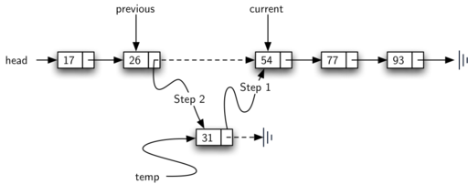

..  Copyright (C)  Brad Miller, David Ranum
    This work is licensed under the Creative Commons Attribution-NonCommercial-ShareAlike 4.0 International License. To view a copy of this license, visit http://creativecommons.org/licenses/by-nc-sa/4.0/.

Implementando uma Lista Ordenada
~~~~~~~~~~~~~~~~~~~~~~~~~~~~~~~~

Para implementar a lista ordenada, devemos lembrar que a
posições relativas dos itens são baseadas em algumas
característica. A lista ordenada de números inteiros dada acima (17, 26, 31,
54, 77 e 93) pode ser representada por uma estrutura ligada, como
:ref:`Figura 15 <fig_orderlinked>`. Novamente, o nó e a estrutura de links são ideais
por representar o posicionamento relativo dos itens.

.. _fig_orderlinked:

.. figure:: Figures/orderlinkedlist.png
   :align: center

   Figura 15: Uma Lista Ligada Ordenada

Para implementar a classe ``OrderedList``, vamos usar a mesma técnica
que visto anteriormente com listas desordenadas. Mais uma vez, uma lista vazia
será indicada por uma referência ``head`` a ``None`` (ver :ref:`Listagem 8 <lst_orderlist>`).

.. _lst_orderlist:

**Listagem 8**

::

    class OrderedList:
        def __init__(self):
            self.head = None

Ao considerarmos as operações da lista ordenada, devemos observar que
os métodos ``isEmpty()`` e ``size()`` podem ser implementados da mesma forma que
com listas não ordenadas, uma vez que lidam apenas com o número de nós em
uma lista sem levar em conta os valores dos itens. Da mesma forma,
O método ``remove()`` funcionará bem, pois ainda precisamos encontrar o
item e, em seguida, criar links em torno do nó para removê-lo.
Os dois métodos restantes, ``search()`` e ``add()``, requerem algumas modificações.

A busca de uma lista encadeada não ordenada exigiu que percorrêssemos
nós, um de cada vez, até encontrarmos o item que estamos procurando ou
ficar sem nós a ser examinados (``None``). Acontece que a mesma abordagem 
realmente funcionaria com a lista ordenada e, de fato, no caso em que
encontramos o item é exatamente o que precisamos fazer. No entanto, no caso em que o
item não está na lista, podemos aproveitar a ordenação para parar
a busca o mais breve possível.

Por exemplo, :ref:`Figura 16 <fig_stopearly>` mostra a lista ligada ordenada como uma
procura pelo valor 45. A medida que percorremos, começando na cabeça
da lista, primeiro comparamos com 17. Já que 17 não é o item que
estamos procurando, passamos para o próximo nó, neste caso 26. Novamente,
não é o que queremos, então passamos para 31 e depois para 54. Agora, neste
ponto, algo é diferente. Já que 54 não é o item que estamos procurando
nossa antiga estratégia seria avançar. No entanto, devido à
fato de que esta é uma lista ordenada, isso não será necessário. Uma vez o
valor no nó se torna maior que o item que estamos procurando,
a pesquisa pode parar e retornar ``False``. Não há mais possibilidade do item 
estar na lista.

.. _fig_stopearly:

.. figure:: Figures/orderedsearch.png
   :align: center

   Figura 16: Busca em Uma Lista Ordenada

:ref:`Listagem 9 <lst_ordersearch>` mostra o método ``search()`` completo.
É fácil incorporar a nova condição discutida acima, adicionando outra
variável booleana, ``stop``, e inicializando-a para ``False`` (linha 4).
Enquanto ``stop`` é ``False`` (não ``stop``) podemos continuar a procurar
na lista (linha 5). Se descobrirmos algum nó que
contém dados maiores que o item que estamos procurando, definimos
``stop`` como sendo ``True`` (linhas 9–10). As linhas restantes são idênticas às
a pesquisa de lista desordenada.

.. _lst_ordersearch:

**Listagem 9**

::

    def search(self,item):
        current = self.head
        found = False
        stop = False
        while current != None and not found and not stop:
            if current.getData() == item:
                found = True
            else:
                if current.getData() > item:
                    stop = True
                else:
                    current = current.getNext()

        return found

A modificação mais significativa ocorrerá no método ``add()``.
Lembre-se que para listas desordenadas, o método ``add()`` poderia simplesmente colocar um
novo nó no topo da lista. Foi o ponto de acesso mais fácil.
Infelizmente, isso não funcionará mais com listas ordenadas. Agora é
necessário que descobramos o local específico onde um novo item deve ser inserido 
na lista ordenada existente.

Suponha que temos a lista ordenada que consiste em 17, 26, 54, 77 e 93 e
queremos adicionar o valor 31. O método ``add()`` deve decidir que o novo
item deve ser inserido entre 26 e 54. :ref:`Figura 17 <fig_orderinsert>`
mostra a configuração que precisamos. Como explicamos anteriormente,
precisamos percorres a lista procurando o lugar onde o novo nó será inserido.
Nós sabemos descobrir aquele lugar quando ou ficamos sem nós (``current``
torna-se ``None``) ou o valor do nó atual torna-se maior que
o item que desejamos inserir. Em nosso exemplo, o valor 54 faz o método 
parar.

.. _fig_orderinsert:

   Figura 17: Inserindo um Item em Uma Lista Ordenada

Como vimos com listas desordenadas, é necessário ter uma referência adicional,
novamente chamada de ``previous``, já que ``current`` não fornecerá
acesso ao nó que deve ser modificado. :ref:`Listagem 10 <lst_orderadd>` mostra
o método ``add()`` completo. Linhas 2–3 configuram as duas referência externas
e linhas 9–10 permitem novamente ``previous`` seguir atrás de ``current``
através da iteração. A condição (linha 5) permite que a iteração
continue enquanto houver mais nós e o valor no nó atual não é maior que o item.
Em ambos os casos, quando a iteração falha, encontramos o local para o novo
nó.

O restante do método completa o processo de dois passos mostrado em
:ref:`Figura 17 <fig_orderinsert>`. Depois que um novo nó for criado para o item,
a única questão que resta é se o novo nó será inserido no
início da lista ligada ou algum lugar no meio. Novamente,
``previous == None`` (linha 13) pode ser usado para fornecer a resposta.

.. _lst_orderadd:

**Listagem 10**

::

    def add(self,item):
        current = self.head
        previous = None
        stop = False
        while current != None and not stop:
            if current.getData() > item:
                stop = True
            else:
                previous = current
                current = current.getNext()

        temp = Node(item)
        if previous == None:
            temp.setNext(self.head)
            self.head = temp
        else:
            temp.setNext(current)
            previous.setNext(temp)

A classe ``OrderedList`` com métodos discutidos até agora pode ser encontrada
no ActiveCode 1.
Deixamos os métodos restantes como exercícios. Você deve considerar cuidadosamente
se as implementações não ordenadas funcionarão, dado que o lista agora está ordenada.

.. activecode:: orderedlistclass
   :caption: Classe OrderedList até agora
   :hidecode:
   :nocodelens:
   
   class Node:
       def __init__(self,initdata):
           self.data = initdata
           self.next = None

       def getData(self):
           return self.data

       def getNext(self):
           return self.next

       def setData(self,newdata):
           self.data = newdata

       def setNext(self,newnext):
           self.next = newnext

   class OrderedList:
       def __init__(self):
           self.head = None

       def search(self,item):
           current = self.head
           found = False
           stop = False
           while current != None and not found and not stop:
               if current.getData() == item:
                   found = True
               else:
                   if current.getData() > item:
                       stop = True
                   else:
                       current = current.getNext()

           return found

       def add(self,item):
           current = self.head
           previous = None
           stop = False
           while current != None and not stop:
               if current.getData() > item:
                   stop = True
               else:
                   previous = current
                   current = current.getNext()

           temp = Node(item)
           if previous == None:
               temp.setNext(self.head)
               self.head = temp
           else:
               temp.setNext(current)
               previous.setNext(temp)       

       def isEmpty(self):
           return self.head == None

       def size(self):
           current = self.head
           count = 0
           while current != None:
               count = count + 1
               current = current.getNext()

           return count

   mylist = OrderedList()
   mylist.add(31)
   mylist.add(77)
   mylist.add(17)
   mylist.add(93)
   mylist.add(26)
   mylist.add(54)

   print(mylist.size())
   print(mylist.search(93))
   print(mylist.search(100))
   
   

Análise de Listas Ligadas   
^^^^^^^^^^^^^^^^^^^^^^^^^

Para analisar a consumo de tempo das operações sobre listas ligadas, precisamos
considere se eles exigem que sejam percorridas. Considere uma lista ligada que tenha
*n* nós. O método ``isEmpty()`` consome tempo : math: `O(1)` já que requer
apenas um passo para verificar se a referência da cabeça é para ``None``.
``size()``, por outro lado, sempre exigirá etapas *n*, pois não há como saber
quantos nós estão na lista ligada sem percorrê-la do início ao fim.
Portanto, ``length()`` consome tempo  :math:`O(n)`.
Inserir um item a um lista não ordenada consumirá sempre tempo :math:`O(1)`
uma vez que simplesmente o novo nó é inserido como cabeça 
da lista ligada. No entanto, ``search()`` e ``remove()``, bem
como ``add()`` para uma lista ordenada, todos requerem que a lista sejá percorrida.
Embora, em média, possam precisar atravessar apenas metade dos nós,
estes todos esses métodos consomem tempo :math:`O (n)` já que no pior dos casos devemos
processar todos os nós da lista.

Você também pode ter notado que o desempenho desta implementação
difere do desempenho real dado anteriormente para listas do Python.
Isto sugere que as listas ligadas não são a maneira como as listas do Python são implementadas.
A implementação real de uma lista do Python é baseada na noção de um vetor.
Discutimos isso com mais detalhes no Capítulo 8.
