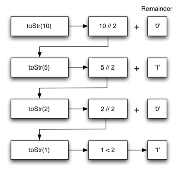

..  Copyright (C)  Brad Miller, David Ranum
    This work is licensed under the Creative Commons Attribution-NonCommercial-ShareAlike 4.0 International License. To view a copy of this license, visit http://creativecommons.org/licenses/by-nc-sa/4.0/.

..  Converting an Integer to a String in Any Base

Convertendo um Inteiro para String em Qualquer Base
~~~~~~~~~~~~~~~~~~~~~~~~~~~~~~~~~~~~~~~~~~~~~~~~~~~

..  Suppose you want to convert an integer to a string in some base between
    binary and hexadecimal. For example, convert the integer 10 to its
    string representation in decimal as ``"10"``, or to its string
    representation in binary as ``"1010"``. While there are many algorithms
    to solve this problem, including the algorithm discussed in the stack
    section, the recursive formulation of the problem is very
    elegant.

Suponha que você queira converter um inteiro para uma string em alguma base entre
binário e hexadecimal. Por exemplo, converta o inteiro 10 em uma string contendo
sua representação em decimal como ``"10"``, ou para sua 
representação em binário como ``"1010"``. Embora existam muitos algoritmos
para resolver este problema, incluindo o algoritmo discutido na seção
sobre pilha, a formulação recursiva do problema é muito elegante.

..  Let’s look at a concrete example using base 10 and the number 769.
    Suppose we have a sequence of characters corresponding to the first 10
    digits, like ``convString = "0123456789"``. It is easy to convert a
    number less than 10 to its string equivalent by looking it up in the
    sequence. For example, if the number is 9, then the string is
    ``convString[9]`` or ``"9"``. If we can arrange to break up the number
    769 into three single-digit numbers, 7, 6, and 9, then converting it to
    a string is simple. A number less than 10 sounds like a good base case.

Vejamos um exemplo concreto usando a base 10 e o número 769.
Suponha que tenhamos uma sequência de caracteres correspondente aos 10 primeiros
dígitos, como ``tabelaConv = "0123456789"``. É fácil converter um
número menor que 10 em uma string equivalente apenas olhando a
tabela. Por exemplo, se o número for 9, a string será
``tabelaConv[9]`` ou ``"9"``. Se conseguirmos uma forma de quebrar o número
769 em seus três dígitos, 7, 6 e 9, a conversão para uma string é simples. 
Um número menor que 10 parece um bom caso base.

..  Knowing what our base is suggests that the overall algorithm will involve three components:

Saber qual é o nosso caso base sugere que o algoritmo geral
envolve três componentes:

..  #. Reduce the original number to a series of single-digit numbers.
    #. Convert the single digit-number to a string using a lookup.
    #. Concatenate the single-digit strings together to form the final
    result.

#. Reduza o número original para uma série de números de um dígito.

#. Converta o dígito em uma string usando a tabelaConv.

#. Concatene as strings dos dígitos para formar o resultado final.

..  The next step is to figure out how to change state and make progress
    toward the base case. Since we are working with an integer, let’s
    consider what mathematical operations might reduce a number. The most
    likely candidates are division and subtraction. While subtraction might
    work, it is unclear what we should subtract from what. Integer division
    with remainders gives us a clear direction. Let’s look at what happens
    if we divide a number by the base we are trying to convert to.

O próximo passo é descobrir como mudar o estado e progredir
em direção ao caso base. Como estamos trabalhando com um inteiro, vamos
considerar quais operações matemáticas podem reduzir um número. Os candidatos
mais prováveis ​​são divisão e subtração. Embora a subtração possa servir, 
não é claro o que devemos subtrair do que. A divisão inteira
com resto nos dá uma direção clara. Vamos ver o que acontece
se dividirmos um número pela base que estamos tentando converter.

..  Using integer division to divide 769 by 10, we get 76 with a remainder
    of 9. This gives us two good results. First, the remainder is a number
    less than our base that can be converted to a string immediately by
    lookup. Second, we get a number that is smaller than our original and
    moves us toward the base case of having a single number less than our
    base. Now our job is to convert 76 to its string representation. Again
    we will use integer division plus remainder to get results of 7 and 6
    respectively. Finally, we have reduced the problem to converting 7,
    which we can do easily since it satisfies the base case condition of
    :math:`n < base`, where :math:`base = 10`. The series of operations
    we have just performed is illustrated in :ref:`Figure 3 <fig_tostr>`. Notice that
    the numbers we want to remember are in the remainder boxes along the
    right side of the diagram.

Usando divisão inteira para dividir 769 por 10, obtemos 76 com um resto
de 9. Isso nos dá dois bons resultados. Primeiro, o resto é um número
menor que a nossa base que pode ser convertida em uma string imediatamente
usando a tabela. Em segundo lugar, obtemos um número menor que o nosso original,
o que nos move em direção ao caso base de ter um único número menor que a nossa
base. Agora nosso trabalho é converter 76 em uma string. Novamente
vamos usar a divisão inteira mais o resto para obter os resultados 7 e 6
respectivamente. Finalmente, reduzimos o problema para converter 7,
o que podemos fazer facilmente, uma vez que satisfaz a condição do caso base
:math:`n < base`, onde :math:`base = 10`. A série de operações que
acabamos de realizar é ilustrada na :ref:`Figura 3 <fig_tostr>`. Note que
os números que queremos lembrar estão nas caixas com os restos ao
lado direito do diagrama.

.. _fig_tostr:

.. figure:: Figures/toStr.png
   :align: center
   :alt: image

   Figura 3: Convertendo um Inteiro em uma String na Base 10
   
:ref:`ActiveCode 1 <lst_rectostr>` mostra o código Python que implementa 
o algoritmo descrito acima para qualquer base entre 2 e 16.

.. activecode:: lst_rectostr
    :caption: Conversão Recursiva de Inteiro para String

    def toStr(n,base):
       convertString = "0123456789ABCDEF"
       if n < base:
          return convertString[n]
       else:
          return toStr(n//base,base) + convertString[n%base]

    print(toStr(1453,16))

..  Notice that in line 3 we check for the base case where ``n``
    is less than the base we are converting to. When we detect the base
    case, we stop recursing and simply return the string from the
    ``convertString`` sequence. In line 6 we satisfy both the
    second and third laws–by making the recursive call and by reducing the
    problem size–using division.

Note que na linha 3 verificamos o caso base onde ``n``
deve ser menor que a base para a qual estamos convertendo. Quando detectamos o 
caso base, terminamos a recursão e simplesmente retornamos a string na posição
correspondente de ``convertString``. Na linha 6, satisfazemos tanto a
segunda quanto a terceira leis fazendo a chamada recursiva e reduzindo o
tamanho do problema usando a divisão.

..  Let’s trace the algorithm again; this time we will convert the number 10
    to its base 2 string representation (``"1010"``).

Vamos simular o algoritmo novamente; desta vez vamos converter o número 10 para 
uma representação string na base 2 (``"1010"``).

.. _fig_tostr2:

   Figura 4: Convertendo o Número 10 Para uma Representação String na Base 2

..  :ref:`Figure 4 <fig_tostr2>` shows that we get the results we are looking for,
    but it looks like the digits are in the wrong order. The algorithm works
    correctly because we make the recursive call first on line
    6, then we add the string representation of the remainder.
    If we reversed returning the ``convertString`` lookup and returning the
    ``toStr`` call, the resulting string would be backward! But by delaying
    the concatenation operation until after the recursive call has returned,
    we get the result in the proper order. This should remind you of our
    discussion of stacks back in the previous chapter.

A :ref:`Figura 4 <fig_tostr2>` mostra que obtemos o resultado esperado,
mas parece que os dígitos estão na ordem errada. O algoritmo funciona
corretamente porque fazemos a primeira chamada recursiva na linha 
6 e então adicionamos a representação string do resto.
Se invertéssemos a ordem da concatenação na linha 6,  
a string resultante seria invertida! Mas atrasando
a concatenação até que a chamada recursiva tenha retornado,
obtemos o resultado na ordem correta. Isso deve lembrá-lo da nossa
discussão sobre pilhas no capítulo anterior.

.. admonition:: Auto Avaliação

   Escreva uma função que recebe uma string como parâmetro e retorna uma nova string que é o inverso da string de entrada.

   .. actex:: recursion_sc_1
      :nocodelens:

      from test import testEqual
      def reverse(s):
          return s
      
      testEqual(reverse("hello"),"olleh")
      testEqual(reverse("l"),"l")      
      testEqual(reverse("follow"),"wollof")
      testEqual(reverse(""),"")

   Escreva uma função que recebe uma string como parâmetro e retorna True se a string for um palíndromo. Caso contrário, deve retornar False. Lembre-se de que uma string é um palíndromo se, ao ser soletrada de trás para a frente, possui a mesma forma. Por exemplo, "radar" é um palíndromo. Para obter pontos de bônus, frases também podem ser palíndromos, mas você precisa remover os espaços e pontuação antes de verificar. Por exemplo: "madame i am adam" é um palíndromo. Outros palíndromos divertidos incluem:

   
   * kayak
   * aibohphobia
   * Live not on evil
   * Reviled did I live, said I, as evil I did deliver
   * Go hang a salami; I'm a lasagna hog.
   * Able was I ere I saw Elba
   * Kanakanak --  uma cidade no Alaska
   * Wassamassaw -- uma cidade em South Dakota

   .. actex:: recursion_sc_2
      :nocodelens:

      from test import testEqual
      def removeWhite(s):
          return s

      def isPal(s):
          return False
      
      testEqual(isPal(removeWhite("x")),True)            
      testEqual(isPal(removeWhite("radar")),True)
      testEqual(isPal(removeWhite("hello")),False)
      testEqual(isPal(removeWhite("")),True)                  
      testEqual(isPal(removeWhite("hannah")),True)      
      testEqual(isPal(removeWhite("madam i'm adam")),True)

