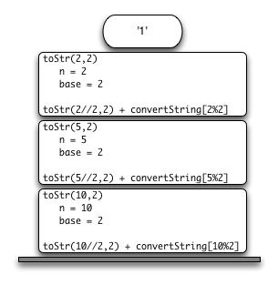

..  Copyright (C)  Brad Miller, David Ranum
    This work is licensed under the Creative Commons Attribution-NonCommercial-ShareAlike 4.0 International License. To view a copy of this license, visit http://creativecommons.org/licenses/by-nc-sa/4.0/.

..  Stack Frames: Implementing Recursion

Blocos de Pilha: Implementando Recursão
---------------------------------------

..  Suppose that instead of concatenating the result of the recursive call
    to ``toStr`` with the string from ``convertString``, we modified our
    algorithm to push the strings onto a stack prior to making the recursive
    call. The code for this modified algorithm is shown in
    :ref:`ActiveCode 1 <lst_recstack>`.

Suponha que, em vez de concatenar o resultado da chamada recursiva
para ``toStr`` com a string de ``convertString``, nós modificamos nosso
algoritmo para empilhar as strings antes de fazer a chamada recursiva.
O código para este algoritmo modificado é mostrado no
:ref:`ActiveCode 1 <lst_recstack>`.

.. activecode:: lst_recstack
    :caption: Convertendo um Inteiro em uma String Usando uma Pilha
    :nocodelens:

    from pythonds.basic.stack import Stack

    rStack = Stack()

    def toStr(n,base):
        convertString = "0123456789ABCDEF"
        while n > 0:
            if n < base:
                rStack.push(convertString[n])
            else:
                rStack.push(convertString[n % base])
            n = n // base
        res = ""
        while not rStack.isEmpty():
            res = res + str(rStack.pop())
        return res

    print(toStr(1453,16))

..  Each time we make a call to ``toStr``, we push a character on the stack.
    Returning to the previous example we can see that after the fourth call
    to ``toStr`` the stack would look like :ref:`Figure 5 <fig_recstack>`. Notice
    that now we can simply pop the characters off the stack and concatenate
    them into the final result, ``"1010"``.

Cada vez que chamamos a função ``toStr``, colocamos um caractere na pilha.
Voltando ao exemplo anterior, podemos ver que após a quarta chamada
para ``toStr`` a pilha ficaria como na :ref:`Figura 5 <fig_recstack>`. 
Note que agora podemos simplesmente desempilhar os caracteres e concatená-los
para formar o resultado final, ``"1010"``.

.. _fig_recstack:

.. figure:: Figures/recstack.png
   :align: center

   Figura 5: Strings Colocados na Pilha Durante a Conversão

..  The previous example gives us some insight into how Python implements a
    recursive function call. When a function is called in Python, a **stack
    frame** is allocated to handle the local variables of the function. When
    the function returns, the return value is left on top of the stack for
    the calling function to access. :ref:`Figure 6 <fig_callstack>` illustrates the
    call stack after the return statement on line 4.

O exemplo anterior nos dá uma ideia de como o Python implementa uma
chamada de função recursiva. Quando uma função é chamada em Python, 
um **bloco de pilha** (*stack frame*)
é alocado para cuidar das variáveis locais da função. Quando
a função retorna, o bloco é desempilhado e o valor de retorno é deixado no topo da pilha de 
chamadas (*call stack*) para ser acessada
pela função que fez a chamada. A :ref:`Figura 6 <fig_callstack>` ilustra a 
pilha de chamadas após o comando return na linha 4.

.. _fig_callstack:

   Figura 6: Pilha de Chamadas Gerada por ``toStr(10,2)``

..  Notice that the call to ``toStr(2//2,2)`` leaves a return value of
    ``"1"`` on the stack. This return value is then used in place of the
    function call (``toStr(1,2)``) in the expression ``"1" + convertString[2%2]``, which will leave the string ``"10"`` on the top of
    the stack. In this way, the Python call stack takes the place of the
    stack we used explicitly in :ref:`Listing 4 <lst_recstack>`. In our list summing
    example, you can think of the return value on the stack taking the place
    of an accumulator variable.

Note que a chamada ``toStr(2//2,2)`` deixa o valor de retorno
``"1"`` na pilha. Este valor de retorno é então usado no lugar da
chamada de função (``toStr(1,2)``) na expressão ``"1" + convertString[2%2]``, 
que irá deixar a string ``"10"`` no topo da pilha. 
Desta forma, a pilha de chamadas do Python toma o lugar da
pilha que usamos explicitamente na :ref:`Listagem 4 <lst_recstack>`. 
Em nosso exemplo de soma de números de uma lista,
você pode considerar que o valor de retorno na pilha substitui
a variável acumuladora.

..  The stack frames also provide a scope for the variables used by the
    function. Even though we are calling the same function over and over,
    each call creates a new scope for the variables that are local to the
    function.

O bloco de pilha também fornecem um escopo para as variáveis usadas pela
função. Mesmo que estejamos chamando a mesma função repetidamente,
cada chamada cria um novo escopo para as variáveis que são locais à
função.
