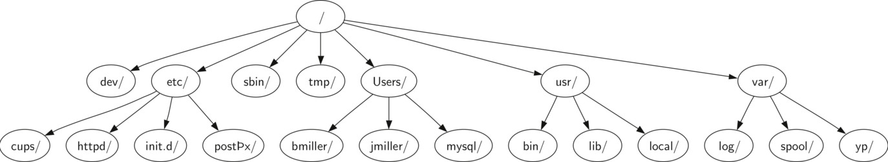
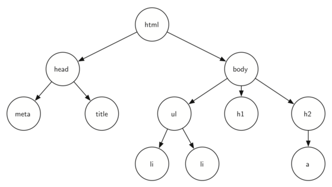

..  Copyright (C)  Brad Miller, David Ranum
    This work is licensed under the Creative Commons Attribution-NonCommercial-ShareAlike 4.0 International License. To view a copy of this license, visit http://creativecommons.org/licenses/by-nc-sa/4.0/.

Exemplos de Árvores
-------------------

Agora que já conhecemos estruturas de dados lineares, como pilhas e filas,
e também adquirimos alguma experiência com recursão, nós iremos estudar
uma estrutura de dados muito comum chamada **árvore**. Árvores são usadas
em várias áreas da ciência da computação, incluindo sistemas operacionais,
computação gráfica, bancos de dados e redes. Estruturas de dados de árvores
têm muita coisa em comum com suas primas do mundo botânico. Toda árvore,
como estrutura de dados, tem uma raiz, ramificações e folhas. A diferença
entre uma árvore na natureza e uma árvore na ciência da computação é que
estruturas de dados de árvores têm sua raiz no topo e as folhas na base.

Antes de começarmos a estudar estruturas de dados de árvores, vamos dar
uma olhada em alguns exemplos recorrentes. Nosso primeiro exemplo de
árvore é uma árvore taxonômica da biologia. A :ref:`Figura 1 < fig_biotree>`
mostra um exemplo de classificação biológica de alguns animais. A partir
desse exemplo simples, podemos aprender diversas propriedades das
árvores. A primeira que esse exemplo demonstra é que árvores são
estruturas hierárquicas. Com isso, queremos dizer que árvores são
estruturadas em níveis, com as coisas mais gerais próximas ao topo
e as mais específicas próximas da base. O topo da hierarquia é o Reino,
o próximo nível da árvore (os "filhos" do nível superior) é o Filo,
depois a Classe, e assim por diante. Contudo, não importa o quanto
descemos na árvore taxonômica: todos os organismos sempre são animais.

.. _fig_biotree:

   Figura 1: Taxonomia de Alguns Animais Comuns Mostrada como uma Árvore

Notice that you can start at the top of the tree and follow a path made
of circles and arrows all the way to the bottom. At each level of the
tree we might ask ourselves a question and then follow the path that
agrees with our answer. For example we might ask, “Is this animal a
Chordate or an Arthropod?” If the answer is “Chordate” then we follow
that path and ask, “Is this Chordate a Mammal?” If not, we are stuck
(but only in this simplified example). When we are at the Mammal level
we ask, “Is this Mammal a Primate or a Carnivore?” We can keep following
paths until we get to the very bottom of the tree where we have the
common name.

A second property of trees is that all of the children of one node are
independent of the children of another node. For example, the Genus
Felis has the children Domestica and Leo. The Genus Musca also has a
child named Domestica, but it is a different node and is independent of
the Domestica child of Felis. This means that we can change the node
that is the child of Musca without affecting the child of Felis.

A third property is that each leaf node is unique. We can specify a path
from the root of the tree to a leaf that uniquely identifies each
species in the animal kingdom; for example, Animalia
:math:`\rightarrow` Chordate :math:`\rightarrow` Mammal
:math:`\rightarrow` Carnivora :math:`\rightarrow` Felidae
:math:`\rightarrow` Felis :math:`\rightarrow` Domestica.

Another example of a tree structure that you probably use every day is a
file system. In a file system, directories, or folders, are structured
as a tree. :ref:`Figure 2 <fig_filetree>` illustrates a small part of a Unix file
system hierarchy.

.. _fig_filetree:

   Figure 2: A Small Part of the Unix File System Hierarchy

The file system tree has much in common with the biological
classification tree. You can follow a path from the root to any
directory. That path will uniquely identify that subdirectory (and all
the files in it). Another important property of trees, derived from
their hierarchical nature, is that you can move entire sections of a
tree (called a **subtree**) to a different position in the tree without
affecting the lower levels of the hierarchy. For example, we could take
the entire subtree staring with /etc/, detach etc/ from the root and
reattach it under usr/. This would change the unique pathname to httpd
from /etc/httpd to /usr/etc/httpd, but would not affect the contents or
any children of the httpd directory.

A final example of a tree is a web page. The following is an example of
a simple web page written using HTML. :ref:`Figure 3 <fig_html>` shows the tree
that corresponds to each of the HTML tags used to create the page.

::

    <html xmlns="http://www.w3.org/1999/xhtml" 
	  xml:lang="en" lang="en">
    <head>
	<meta http-equiv="Content-Type" 
	      content="text/html; charset=utf-8" />
	<title>simple</title>
    </head>
    <body>
    <h1>A simple web page</h1>
    <ul>
	<li>List item one</li>
	<li>List item two</li>
    </ul>
    <h2><a href="http://www.cs.luther.edu">Luther CS </a><h2>
    </body>
    </html>

.. _fig_html:

   Figure 3: A Tree Corresponding to the Markup Elements of a Web Page

The HTML source code and the tree accompanying the source illustrate
another hierarchy. Notice that each level of the tree corresponds to a
level of nesting inside the HTML tags. The first tag in the source is
``<html>`` and the last is ``</html>`` All the rest of the tags in the
page are inside the pair. If you check, you will see that this nesting
property is true at all levels of the tree.

