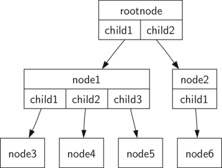

..  Copyright (C)  Brad Miller, David Ranum
    This work is licensed under the Creative Commons Attribution-NonCommercial-ShareAlike 4.0 International License. To view a copy of this license, visit http://creativecommons.org/licenses/by-nc-sa/4.0/.

Vocabulário e Definições
------------------------

Agora que demos uma olhada em alguns exemplos de árvores, nós iremos definir
formalmente o que é uma árvore e seus componentes.

Nó
    Um nó é uma parte fundamental de uma árvore. Ele pode ter um nome, algo
    que denominamos "chave". Um nó também pode conter informação adicional.
    Nós chamamos essa informação adicional de "carga". Embora a informação
    da carga não seja relevante para muitos algoritmos de árvores, ela
    costuma ser muito importante em aplicações que façam uso de árvores.

Aresta
    Uma aresta é outra parte fundamental de uma árvore. Uma aresta conecta
    dois nós para mostrar que há uma relação entre eles. Cada nó (exceto a raiz)
    recebe precisamente uma única aresta de entrada vinda de outro nó, mas
    cada nó pode ter várias arestas de saída.

Raiz
    A raiz de uma árvore é o único nó que não possui arestas de entrada.
    Na Figura :ref:`Figure 2 <fig_filetree>`, / é a raiz da árvore.

Caminho
    Um caminho é uma lista ordenada de nós que estão conectados por
    arestas. Por exemplo, 
    Mamífero :math:`\rightarrow` Carnivora :math:`\rightarrow` Felidae :math:`rightarrow` Felis :math:`\rightarrow` Domestica
    é um caminho.

Filhos
    Os nós de um conjunto :math:`c` que possuem arestas de entrada que vêm de
    um mesmo nó são ditos filhos desse nó. Na Figura :ref:`Figure 2 <fig_filetree>`,
    os nós log/, spool/ e yp/ são filhos do nó var/.

Pai
    Um nó é considerado pai de todos os nós com os quais se conecta por meio de suas
    arestas de saída. Na :ref:`Figure 2 <fig_filetree>`, o nó var/ é o pai dos nós
    log/, spool/ e yp/.

Irmão
    Nós de uma árvore que são filhos de um mesmo pai são chamados de irmãos. 
    Os nós etc/ e usr/ são irmãos na árvore do sistema de arquivos.

Subárvore
    Uma subárvore é um conjunto de nós e arestas formado por um nó pai e todos
    os descendentes desse pai.

Folha
    Uma folha é um nó que não possui filhos. Por exemplo, Homem e Chimpanzé
    são folhas na :ref:`Figura 1 <fig_biotree>`.

Nível
    O nível de um nó :math:`n` é o número de arestas no caminho da
    formado entre a raiz e o nó :math:`n`. Por exemplo, o nível do nó Felis
    na :ref:`Figura 1 <fig_biotree>` é cinco. Por definição, o nível da raiz 
    é sempre zero.

Altura
    A altura de uma árvore de uma árvore é igual ao nível máximo de qualquer nó
    na árvore. A altura da árvore na :ref:`Figura 2 <fig_filetree>` é igual a dois.

Com o vocabulário básico estabelecido, agora podemos ir para uma definição
formal de árvore. Na verdade, iremos fornecer duas definições. Uma delas
envolve nós e arestas. A outra, a qual se mostrará bastante útil, é
uma definição recursiva.

*Definição Um:* Uma árvore consiste de um conjunto de nós e um conjunto de
arestas que conectam pares de nós. Uma árvore tem as seguintes propriedades:

-  Um nó da árvore é designado como o nó raiz.

-  Todo nó :math:`n`, exceto o nó raiz, é conectado a uma aresta vinda de
   exatamente um outro nó :math:`p`, onde :math:`p` é denominado o pai
   de :math:`n`.

-  Há apenas um único caminho entre a raiz e qualquer outro nó.

-  Se cada nó em uma árvore possui, no máximo, dois filhos, dizemos que
   essa estrutura é uma **árvore binária**.

A :ref:`Figura 3 <fig_nodeedgetree>` mostra uma árvore que se encaixa na
Definição Um. As flechas nas arestas indicam o sentido da conexão.

.. _fig_nodeedgetree:

   Figura 3: Uma Árvore Constituída por um Conjunto de Nós e Arestas

*Definição Dois:* Uma árvore ou é vazia ou é formada por uma raiz com zero
ou mais subárvores (que também são uma árvore). A raiz de cada subárvore
está conectada à raiz da árvore pai por uma aresta.
A :ref:`Figura 4 <fig_recursivetree>` ilustra essa definição recursiva de árvore.
Usando tal definição, nós sabemos que a árvore na :ref:`Figura 4 <fig_recursivetree>`
tem pelo menos quatro nós, já que cada um dos triângulos representa uma
subárvore que necessariamente possui uma raiz. Ela pode ter muitos mais nós
do que esses, mas só conseguimos descobrir isso se olharmos para a árvore
em toda a sua profundidade.

.. _fig_recursivetree:

.. figure:: Figures/TreeDefRecursive.png
   :align: center
   :alt: image

   Figura 4: Uma Definição Recursiva de uma Árvore
