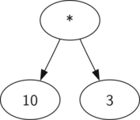
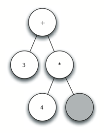

..  Copyright (C)  Brad Miller, David Ranum
    This work is licensed under the Creative Commons Attribution-NonCommercial-ShareAlike 4.0 International License. To view a copy of this license, visit http://creativecommons.org/licenses/by-nc-sa/4.0/.

Árvore Sintática
~~~~~~~~~~~~~~~~

Com a implementação da nossa estrutura de dados em árvore agora completa, iremos
olhar para um exemplo de como uma árvore pode ser usada para solucionar alguns
problemas reais. Nesta seção, iremos estudar as árvores sintáticas, que são
usadas para representar construções do mundo real, tais como frases ou 
expressões matemáticas.

.. _fig_nlparse:

.. figure:: Figures/nlParse.png
   :align: center
   :alt: image

   Figura 1: Uma Árvore Sintática para uma Sentença Simples

A :ref:`Figura 1 <fig_nlparse>` mostra a estrutura hierárquica de uma 
simples sentença. Representando uma sentença por meio da estrutura de uma
árvore nos permite trabalhar com partes individuais da sentença utilizando
subárvores.

.. _fig_meparse:

.. figure:: Figures/meParse.png
   :align: center
   :alt: image

   Figura 2: Uma Árvore Sintática para :math:`((7+3)*(5-2))`

Nós também podemos representar uma expressão matemática como 
:math:`((7 + 3) * (5 - 2))` por meio de uma árvore sintática,
como mostrado na :ref:`Figura 2 <fig_meparse>`. Nós já estudamos
expressões com múltiplos parênteses, então o que podemos dizer
sobre essa expressão? Nós sabemos que a multiplicação tem uma
precedência maior do que adição ou subtração. Por causa dos
parênteses, sabemos que antes de fazer a multiplicação temos que
obter o resultado das expressões com adição e subtração delimitadas
pelos parênteses. A hierarquia da árvore nos ajuda a entender a
ordem de avaliação para toda a expressão. Antes de avaliar a
multiplicação de mais alto nível, temos que avaliar a adição e
subtração das subárvores. A adição, que é a subárvore esquerda,
resulta em 10. A subtração, que é a subárvore direita, resulta em 3.
Usando a estrutura hierárquica da árvore, podemos simplesmente
substituir uma subárvore inteira com um nó uma vez que tenhamos
avaliado as expressões de nível mais baixo. Aplicando esse
procedimento de substituição, ficamos com uma árvore simplificada
mostrada em :ref:`Figura 3 <fig_mesimple>`.

.. _fig_mesimple:

   Figura 3: Uma Árvore Sintática Simplificada para :math:`((7+3)*(5-2))`

No resto desta seção iremos examinar árvores sintáticas mais
detalhadamente. Em particular, vamos ver:

- Como construir uma árvore sintática a partir de uma expressão
  matemática com parênteses.

- Como avaliar a expressão representada na árvore sintática.

- Como recuperar a expressão matemática original a partir da
  árvore sintática. 

O primeiro passo para construir uma árvore sintática é quebrar uma
sequência de caracteres em uma lista de tokens. Existem quatro diferentes
tipos de tokens que devemos considerar: parêntesis esquerdo,
parêntesis direito, operadores e operandos. Nós sabemos que quando
encontramos um parêntesis esquerdo, estamos no começo de uma nova
expressão e, portanto, devemos criar uma nova árvore que corresponda a
essa expressão. Da mesma forma, quando encontramos um parêntesis
direito, sabemos que a expressão chegou ao fim. Também sabemos que 
os operandos irão ser folhas e filhos de seus operadores. Finalmente,
sabemos que todo operador irá ter um filho esquerdo e direito.

Usando as informações acima, podemos definir as seguintes quatro regras:

#. Se o token atual é um ``'('``, adicione um novo nó como filho
   esquerdo do nó atual, e desça para o filho esquerdo.

#. Se o token atual estiver na lista ``['+','-','/','*']``, defina o
   valor do nó atual como o operador representado pelo nó atual.
   Adicione um novo nó como filho direito do nó direito e desça para
   o filho direito.

#. Se o nó atual for um número, defina o valor do nó atual como o número
   e retorne o nó pai.

#. Se o nó atual for um ``')'``, suba para o pai do nó atual.

Antes de irmos para o código em Python, vamos olhar alguns exemplos
das regras mostradas acima em ação. Usaremos a expressão
:math:`(3 + (4 * 5))`. Iremos realizar a varredura dessa expressão
para a seguinte lista de tokens de caracteres: ``['(', '3', '+',``
``'(', '4', '*', '5', ')', ')']``. Inicialmente, começaremos com
uma árvore sintática que consiste em um nó vazio. 
A :ref:`Figura 4 <fig_bldExpstep>` ilustra a estrutura e o conteúdo
dessa árvore sintática, assim que cada novo token é processado.

.. _fig_bldExpstep:

.. figure:: Figures/buildExp1.png
   :align: center
   :alt: image

.. figure:: Figures/buildExp2.png
   :align: center
   :alt: image

.. figure:: Figures/buildExp5.png
   :align: center
   :alt: image

.. figure:: Figures/buildExp6.png
   :align: center
   :alt: image

.. figure:: Figures/buildExp8.png
   :align: center
   :alt: image

   Figura 4: Rastreando a Construção de uma Árvore Sintática

Usando a :ref:`Figura 4 <fig_bldExpstep>` como referência, vamos analisar
o exemplo passo a passo:

a) Crie uma árvore vazia.

b) Leia '(' como o primeiro token. Pela regra 1, crie um novo nó como o filho
   esquerdo da raiz. Defina como nó atual esse novo filho.

c) Leia '3' como o próximo token. Pela regra 3, defina o valor do nó atual
   como '3' e suba de volta para o nó pai.

d) Leia '+' como o próximo token. Pela regra 2, defina o valor do nó atual
   como '+' e adicione um novo nó filho direito. O novo nó filho se torna
   o nó atual.

e) Leia '(' como o próximo token. Pela regra 1, crie um novo nó como o filho
   esquerdo do nó atual. O novo filho esquerdo se torna o nó atual.

f) Leia '4' como o próximo token. Pela regra 3, defina o valor do nó atual
   como '4'. Faça com que o pai de '4' seja agora o nó atual.

g) Leia '*' como o próximo token. Pela regra 2, defina o valor do nó atual
   como '*' e crie um novo filho direito. O novo filho direito se torna 
   o nó atual.

h) Leia '5' como o próximo token. Pela regra 3, defina o valor do nó atual
   como '5'. Torne o pai de '5' o nó atual.

i) Leia ')' como o próximo token. Pela regra 4, tornamos o pai de '*'
   o nó atual.

j) Leia ')' como o próximo token. Pela regra 4, tornamos o pai de '+'
   o nó atual. Neste ponto, não há pai para '+', então o processamento
   termina.

A partir do exemplo acima, fica claro que precisamos acompanhar qual
é o nó atual, bem como o pai desse nó. A interface da árvore nos
fornece um meio para acessarmos os filhos de um nó, por meio dos
métodos ``getLeftChild`` e ``getRightChild``, mas como conseguimos
acompanhar quem é o pai do nó atual? Uma solução simples para 
lembrar dos pais conforme vamos varrendo a árvore é usar uma pilha.
Antes de descermos para o filho de um nó, primeiro colocamos o nó
em que estamos na pilha. Quando quisermos retornar para o pai do nó
atual, basta desempilhá-lo.

Usando as regras descritas acima, junto com as operações de ``Pilha`` 
e ``ArvoreBinaria``, agora estamos prontos para escrever uma
função em Python para criar uma árvore sintática. O código para o
nosso construtor de árvore sintática está em :ref:`ActiveCode 1 <lst_buildparse>`.

.. _lst_buildparse:

.. activecode::  parsebuild
    :caption: Construindo uma Árvore Sintática
    :nocodelens:

    from pythonds.basic.stack import Stack
    from pythonds.trees.binaryTree import BinaryTree

    def buildParseTree(fpexp):
        fplist = fpexp.split()
        pStack = Stack()
        eTree = BinaryTree('')
        pStack.push(eTree)
        currentTree = eTree
        for i in fplist:
            if i == '(':            
                currentTree.insertLeft('')
                pStack.push(currentTree)
                currentTree = currentTree.getLeftChild()
            elif i not in ['+', '-', '*', '/', ')']:  
                currentTree.setRootVal(int(i))
                parent = pStack.pop()
                currentTree = parent
            elif i in ['+', '-', '*', '/']:       
                currentTree.setRootVal(i)
                currentTree.insertRight('')
                pStack.push(currentTree)
                currentTree = currentTree.getRightChild()
            elif i == ')':          
                currentTree = pStack.pop()
            else:
                raise ValueError
        return eTree

    pt = buildParseTree("( ( 10 + 5 ) * 3 )")
    pt.postorder()  #definido e explicado na proxima secao

As quatro regras para construir uma árvore sintática estão codificadas
nas quatro declarações condicionais presentes nas linhas 11, 15, 19 e 24
do :ref:`ActiveCode 1 <lst_buildparse>`. Em cada caso, você pode ver
que o código implementa a regra, como descrita acima, com algumas
chamadas de métodos da ``ArvoreBinaria`` ou ``Pilha``. A única checagem
de erros que fazemos nessa função está no ``else``, onde declaramos
uma exceção do tipo ``ValueError`` se houver algum token da lista
que não reconhecemos.

Agora que construímos a árvore sintática, o que podemos fazer com ela?
Como primeiro exemplo, iremos escrever uma função que avalia a árvore
sintática, retornando o resultado numérico. Para escrever essa função,
iremos fazer uso da natureza hierárquica da árvore. Olhe para a
:ref:`Figura 2 <fig_meparse>`. Recorde que podemos substituir a
árvore original com a árvore simplificada mostrada em
:ref:`Figura 3 <fig_mesimple>`. Isso indica que podemos escrever um
algoritmo que avalia uma árvore sintática ao avaliar recursivamente
cada subárvore.

Como já fizemos com algoritmos recursivos anteriores, iremos iniciar o
planejamento da nossa função de avaliação recursiva identificando o seu
caso base. Um caso base natural para algoritmos recursivos para
árvores é checar se chegamos a uma folha. Em uma árvore sintática, os
nós folhas sempre serão operandos. Como objetos numéricos -- tais como
inteiros e pontos flutuantes -- não requerem nenhum tipo de
interpretação, a função ``evaluate`` pode simplesmente retornar o
valor armazenado no nó folha. O passo recursivo que faz com que a 
função mova em direção ao caso base é chamar ``evaluate`` em ambos os
filhos esquerdo e direito do nó em que nos encontramos. A chamada
recursiva efetivamente nos leva para baixo na árvore, em direção a
um nó folha.

Para colocar junto o resultado das duas chamadas recursivas, nós 
simplesmente aplicamos o operador armazenado no nó pai para os valores
retornados pela chamada de avaliação em ambos os filhos. No exemplo
da :ref:`Figura 3 <fig_mesimple>`, vemos que a chamada sobre os 
dois filhos da raiz avaliam para si mesmos, isto é, 10 e 3. Aplicando
o operador de multiplicação nos dá o resultado final de 30.

O código para uma função recursiva ``evaluate`` é mostrado em
:ref:`Código 1 <lst_eval>`. Primeiro, obtemos as referências para os
filhos esquerdo e direito do nó atual. Se tanto o filho esquerdo
quanto o direito avaliarem para ``None``, então sabemos que o nó
atual é na verdade uma folha. Essa checagem ocorre na linha 7. Se o nó
atual não for uma folha, acesse o operador presente no nó e aplique-o
para os valores retornados pela avaliação recursiva dos filhos esquerdo
e direito.

Para implementar a aritmética, usamos um dicionário com as chaves
``'+', '-', '*'`` e ``'/'``. Os valores armazenados no dicionário
são funções do módulo ``operator`` do Python. Esse módulo fornece
versões funcionais de vários operadores comumente usados. Quando
buscamos um operador no dicionário, o objeto da função correspondente
é retornado. Como o objeto retornado é uma função, podemos chamá-la
como estamos acostumados: ``function(param1, param2)``. Por isso,
o acesso ``opers['+'](2,2)`` é equivalente a ``operator.add(2,2)``.

.. _lst_eval:

**Código 1**

.. sourcecode:: python

    def evaluate(parseTree):
        opers = {'+':operator.add, '-':operator.sub, '*':operator.mul, '/':operator.truediv}
         
        leftC = parseTree.getLeftChild()
        rightC = parseTree.getRightChild()
    
        if leftC and rightC:
            fn = opers[parseTree.getRootVal()]
            return fn(evaluate(leftC),evaluate(rightC))
        else:
            return parseTree.getRootVal()

.. highlight:: python
    :linenothreshold: 500

Finalmente, acompanhar o caminho feito pela função ``evaluate`` na árvore
sintática que criamos na :ref:`Figura 4 <fig_bldExpstep>`. Na primeira vez
que chamamos ``evaluate``, nós passamos a raiz da árvore inteira como 
o parâmetro ``parseTree``. Em seguida, obtemos as referências para os filhos
esquerdo e direito, para ter certeza de que eles existem. A chamada
recursiva acontece na linha 9. Nós começamos primeiro olhando o operador
na raiz da árvore, que é o ``'+'``. O operador ``'+'`` é mapeado para a
chamada de ``operator.add``, a qual recebe dois parâmetros. Como de costume
para uma função do Python, a primeira coisa que o Python faz é avaliar os
parâmetros que são passados para a função. Nesse caso, ambos os parâmetros
são chamadas recursivas para a função ``evaluate``. Usando a avaliação da
forma esquerda-para-direita, a primeira chamada recursiva vai para a
esquerda. Essa primeira chamada de ``evaluate`` recebe a subárvore
esquerda. Nós percebemos então que o nó não possui filhos à esquerda ou
à direita e, portanto, estamos em uma folha. Quando estamos em uma folha,
apenas retornamos o valor armazenado no nó como resultado da avaliação.
Nesse caso, retornamos o inteiro 3.

Neste ponto temos um parâmetro avaliado para a nossa chamada de alto nível
de ``operator.add``. Mas ainda não terminamos. Continuando com a avaliação
esquerda-para-direita dos parâmetros, fazemos agoara a chamada recursiva
para avaliar o filho direito da raiz. Descobrimos então que esse nó também
tem um filho esquerdo e direito, então acessamos o operador armazenado 
nesse nó, o ``'*'``, e chamamos essa função usando os filhos esquerdo e
direito como parâmetros. Nessa altura, você consegue perceber que ambas
as chamadas recursivas serão para nós folhas, que serão avaliadas para
os inteiros quatro e cinco, respectivamente. Com os dois parâmetros
avaliados, retornamos o resultado da chamada ``operator.mul(4,5)``.
Quando chegamos nesse ponto, já avaliamos todos os operandos do
operador ``'+'``, de mais alto nível, de modo que a única coisa que resta
a fazer é concluir a chamada de ``operator.add(3,20)``. O resultado da
avaliação da expressão inteira :math:`(3 + (4 * 5))` é 23.
