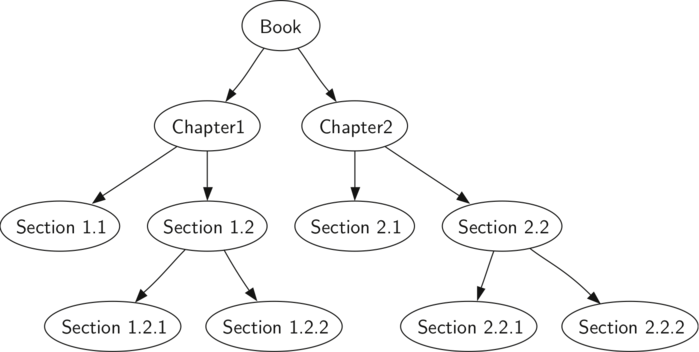

..  Copyright (C)  Brad Miller, David Ranum
    This work is licensed under the Creative Commons Attribution-NonCommercial-ShareAlike 4.0 International License. To view a copy of this license, visit http://creativecommons.org/licenses/by-nc-sa/4.0/.

Varredura em Árvores
~~~~~~~~~~~~~~~~~~~~

Agora que já examinamos a funcionalidade básica da nossa estrutura
em árvore, chegou a hora de conhecermos mais alguns padrões de
uso para árvores. Esses padrões podem ser divididos em três formas 
com as quais podemos acessar os nós de uma árvore. Isso porque
existem três padrões comumente usados para visitar todos os nós
de uma árvore. A diferença entre esses padrões está na ordem em
que cada nó é visitado. Chamamos essa visita aos nós de "varredura".
As três formas de varredura que iremos estudar são chamadas de
**prefixa**, **infixa** e **posfixa**. Vamos começar definindo
mais cuidadosamente o que são esses padrões e, a partir daí,
estudar alguns exemplos em que esses padrões podem ser úteis.

prefixa
    Em uma varredura prefixa, nós visitamos primeiro o nó
    raiz e então, recursivamente, fazemos uma varredura
    prefixa na subárvore esquerda, seguida por uma
    varredura prefixa recursiva na subárvore direita.

infixa
    Em uma varredura infixa, começamos a fazer recursivamente
    uma varredura infixa na subárvore esquerda, depois
    visitamos o nó raiz e finalmente fazemos uma 
    varredura infixa recursiva na subárvore direita.

posfixa
    Em uma varredura posfixa, começamos a fazer recursivamente
    uma varredura posfixa nas subárvores esquerda e direita,
    e só depois visitamos o nó raiz.

Vamos ver alguns exemplos que ilustram o funcionamento de cada um
desses três tipos de varredura. Primeiro, vamos olhar para a 
varredura prefixa. Como exemplo de árvore para percorrer,
vamos pegar este próprio livro. Podemos tomar o livro em si
como a raiz da árvore e cada capítulo como filho dessa raiz.
Cada seção dentro de um capítulo é um filho desse capítulo,
cada subseção é um filho de uma seção, e assim por diante.
A :ref:`Figura 5 <fig_booktree>` mostra uma versão limitada
de um livro com apenas dois capítulos. Observe que o algoritmo
de varredura funciona para árvores com qualquer número de filhos,
mas vamos considerar apenas árvores binárias por enquanto.
    

.. _fig_booktree:

   Figura 5: Representando um Livro como uma Árvore

Suponha que você queira ler este livro do começo ao fim. A varredura
prefixa segue exatamente essa ordem. Começando pela raiz da árvore
(o nó Livro), iremos realizar as instruções para a varredura prefixa.
Nós chamamos recursivamente ``preorder`` (prefixa) no filho esquerdo,
o Capítulo 1, nesse caso. Em seguida, chamamos novamente de modo
recursivo ``preorder`` no filho esquerdo para acessar a Seção 1.1.
Como a Seção 1.1 não possui filhos, não fazemos mais nenhuma chamada
recursiva. Quando terminamos com a Seção 1.1, subimos de volta na
árvore para o Capítulo 1. Nessa altura ainda resta visitar a subárvore
direita do Capítulo 1, que é a Seção 1.2. Como feito anteriormente,
nós visitamos então a subárvore esquerda, o que nos leva à Seção 1.2.1,
e depois visitamos o nó representando a Seção 1.2.2. Com a Seção 1.2
finalizada, retornamos para o Capítulo 1. Finalmente, retornamos para
o nó Livro e realizamos o mesmo procedimento para o Capítulo 2.

O código que descreve varredura em árvores é surpreendentemente
elegante, possivelmente porque as varreduras são escritas de forma
recursiva. O :ref:`Código 2 <lst_preorder1>` mostra o código em 
Python para uma varredura prefixa de uma árvore binária.

Você pode se perguntar qual seria a melhor maneira de escrever um
algoritmo como o da varredura prefixa. Ele deve ser uma função que
simplesmente usa uma árvore como estrutura de dados, ou um método
em si da estrutura de dados em árvore? O :ref:`Código 2 <lst_preorder1>`
mostra uma versão da varredura prefixa escrita como uma função
externa que recebe uma árvore binária como parâmetro.
A função externa é particularmente elegante porque nosso caso
base é simplesmente checar se a árvore existe. Se o parâmetro da
árvore for ``None``, então a função retorna sem realizar nenhuma ação.

.. _lst_preorder1:

**Código 2**

::

    def preorder(tree):
        if tree:
            print(tree.getRootVal())
            preorder(tree.getLeftChild())
            preorder(tree.getRightChild())  

Também podemos implementar ``preorder`` como um método da classe
``ArvoreBinaria``. O código para a implementação de ``preorder``
como um método interno é mostrado em :ref:`Código 3 <lst_preorder2>`.
Observe o que acontece quando nós mudamos o código de externo
para interno. Em geral, nós apenas substituímos ``tree``
por ``self``. Contudo, também precisamos modificar o caso base.
O método interno precisa checar se existem filhos esquerdo e direito
*antes* de fazer uma chamada recursiva com ``preorder``.

.. _lst_preorder2:

**Código 3**

::

    def preorder(self):
        print(self.key)
        if self.leftChild:
            self.leftChild.preorder()
        if self.rightChild:
            self.rightChild.preorder()

Qual dessas duas formas de implementar ``preorder`` é melhor? Nesse caso,
provavelmente seria melhor implementar ``preorder`` como uma função
externa. O motivo para isso é que você raramente quer somente fazer
uma varredura na árvore. Na maioria das vezes você irá realizar alguma
operação enquanto está processando um dos padrões de varredura. Na verdade,
iremos verificar no exemplo seguinte que o padrão de varredura ``postorder`` 
(posfixa) se aproxima bastante do código que escrevemos anteriormente
para avaliar uma varredura em árvore. Portanto, vamos escrever o
restante das varreduras como funções externas.

O algoritmo para a varredura ``postorder``, mostrado em
:ref:`Código 4 <lst_postorder1>`, é praticamente idêntico ao ``preorder``,
exceto pelo fato de que movemos a chamada para ``print`` para o 
final da função.

.. _lst_postorder1:

**Código 4**

::

    def postorder(tree):
        if tree != None:
            postorder(tree.getLeftChild())
            postorder(tree.getRightChild())
            print(tree.getRootVal())

Já vimos um caso de um recorrente para varreduras posfixas, isto é, 
avaliando uma árvore de varredura. Veja de novo o :ref:`Código 1<lst_eval>`.
O que nós estamos fazendo é avaliar a subárvore esquerda, avaliar a
subárvore direita e depois combinando-as na raiz por meio da chamada
de função para um operador. Assuma agora que nossa árvore binária irá
armazenar somente dados relativos a expressões em árvores. Vamos reescrever
a função de avaliação, mas modelá-la ainda mais próxima do código em
``postorder`` mostrado em :ref:`Código 4 <lst_postorder1>`
(veja o :ref:`Código 5 <lst_postordereval>`).

            
.. _lst_postordereval:

**Código 5**

::

    def postordereval(tree):
        opers = {'+':operator.add, '-':operator.sub, '*':operator.mul, '/':operator.truediv}
        res1 = None
        res2 = None
        if tree:
            res1 = postordereval(tree.getLeftChild())
            res2 = postordereval(tree.getRightChild())
            if res1 and res2:
                return opers[tree.getRootVal()](res1,res2)
            else:
                return tree.getRootVal()
                

.. highlight:: python
    :linenothreshold: 500

Note que a estrutura presente no :ref:`Código 4 <lst_postorder1>` é a mesma
daquela no :ref:`Código 5 <lst_postordereval>`, exceto que em vez de exibir
a chave no final da função, nós a retornamos. Isso nos permite armazenar os
valores retornados pelas chamadas recursivas nas linhas 6 e 7. Então nós
usamos esses valores salvos juntos com o operador na linha 9.
 
O último tipo de varredura que iremos estudar nesta seção é a varredura
infixa. Nessa varredura, visitamos a subárvore esquerda, depois a raiz e
por fim a subárvore direita. O :ref:`Código 6 <lst_inorder1>` mostra uma
implementação para varredura infixa. Observe que nas três funções de
varredura nós apenas estamos trocando a posição do ``print`` em
relação às duas chamadas recursivas.

.. _lst_inorder1:

**Código 6**

::

    def inorder(tree):
      if tree != None:
          inorder(tree.getLeftChild())
          print(tree.getRootVal())
          inorder(tree.getRightChild())

Se nós realizarmos uma simples varredura infixa em uma árvore, teremos
nossa expressão original de volta, sem os parênteses. Vamos modificar o
algoritmo infixo básico para nos permitir recuperar uma versão da
expressão com todos os parênteses. As únicas modificações que nós
temos que fazer nesse padrão são as seguintes: mostrar um
parêntesis esquerdo *antes* da chamada recursiva à subárvore esquerda,
e mostrar um parêntesis direito *depois* da chamada recursiva à
subárvore direita. A implementação modificada pode ser vista em
:ref:`Código 7 <lst_printexp>`.
          

.. _lst_printexp:

**Código 7**

::

    def printexp(tree):
      sVal = ""
      if tree:
          sVal = '(' + printexp(tree.getLeftChild())
          sVal = sVal + str(tree.getRootVal())
          sVal = sVal + printexp(tree.getRightChild())+')'
      return sVal

Note que a função ``printexp``, da forma que implementamos, coloca um par
de parênteses em torno de cada número. Embora isso não esteja incorreto,
esses parênteses claramente não são necessários. Nos exercícios ao fim deste
capítulo iremos pedir para que você altere a função ``printexp`` para remover
esse conjunto de parênteses.
