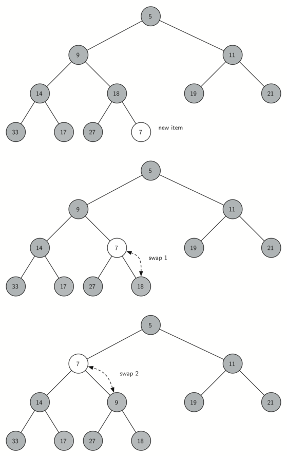
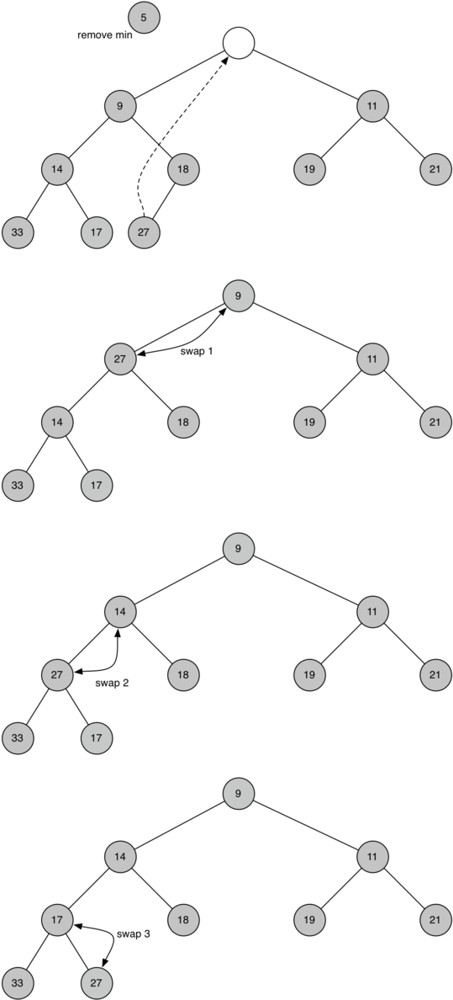

..  Copyright (C)  Brad Miller, David Ranum
    This work is licensed under the Creative Commons Attribution-NonCommercial-ShareAlike 4.0 International License. To view a copy of this license, visit http://creativecommons.org/licenses/by-nc-sa/4.0/.

Implementação de Heaps Binários
~~~~~~~~~~~~~~~~~~~~~~~~~~~~~~~
 
A Propriedade da Estrutura
^^^^^^^^^^^^^^^^^^^^^^^^^^

Para fazer com que o nosso heap trabalhe de forma eficiente, vamos tirar
vantagem da natureza logarítmica da árvore binária para representar
nosso heap. Para garantir o desempenho logarítmico, temos que manter
nossa árvore balanceada. Uma árvore binária balanceada tem aproximadamente
o mesmo número de nós nas subárvores esquerda e direita da raiz. Na nossa
implementação de heap, mantemos a árvore balanceada ao criar uma
**árvore binária completa**. Esse tipo de árvore é aquela em que cada
nĩvel apresenta todos os nós. A exceção é o nível mais baixo da árvore,
no qual os nós vão sendo preenchidos da esquerda para direita.
A :ref:`Figura 1 <fig_comptree>` mostra um exemplo de uma árvore binária
completa.

.. _fig_comptree:

.. figure:: Figures/compTree.png
   :align: center
   :alt: image

   Figura 1: Uma Árvore Binária Completa

Uma outra propriedade interessante de uma árvore completa é que podemos
representá-la usando apenas uma lista. Não precisamos recorrer a nós
e referências, ou mesmo listas de listas. Como a árvore é completa, o
filho esquerdo de um nó pai (na posição :math:`p`) é o nó que se encontra
na posição :math:`2p` da lista. Da mesma forma, o filho direito desse
nó pai está na posição :math:`2p + 1` da lista. Para encontrar o pai 
de qualquer nó na árvore, simplesmente fazemos a divisão por inteiro
do Python. Dado que um nó está na posição :math:`n` da lista, o pai 
se encontra na posição :math:`n/2`. A :ref:`Figura 2 <fig_heapOrder>`
mostra uma árvore binária completa e também exibe a lista representando
essa árvore. Observe como :math:`2p` e :math:`2p+1` definem uma relação
entre pais e filhos. A representação em lista da árvore, junto com
a propriedade da estrutura completa, permite-nos varrer eficientemente
uma árvore binária completa utilizando apenas algumas simples
operações matemáticas. Veremos que isso também leva a uma implementação
eficiente do nosso heap binário.
   

A Propriedade Heap
^^^^^^^^^^^^^^^^^^

O método que iremos usar para armazenar itens em um heap depende de
mantermos o que chamamos de **propriedade heap**. Essa propriedade
subentende uma ordenação e pode ser expressa da seguinte forma:
Em um heap, para cada nó :math:`x` com pai :math:`p`, a chave em :math:`p`
é menor ou igual à chave em :math:`x`. A :ref:`Figura 2 <fig_heapOrder>`
também ilustra uma árvore binária completa que mantém a propriedade heap.

.. _fig_heapOrder:

.. figure:: Figures/heapOrder.png
   :align: center
   :alt: image

   Figura 2: Uma Árvore Binária Completa, Junto com sua Representação em Lista

Operações Heap
^^^^^^^^^^^^^^

Iremos começar nossa implementação de um heap binário com o construtor.
Como o heap inteiro pode ser representado por uma única lista, tudo o que
o construtor irá fazer é inicializar a lista e um atributo ``currentSize``
para armazenar o tamanho atual do heap. O :ref:`Código 1 <lst_heap1a>`
mostra o código em Python para o construtor. Você irá notar que um
heap binário vazio tem um único zero como o primeiro elemento da
``heapList`` e que esse zero não é utilizado, mas está lá para que
a divisão por inteiros seja possível em outros métodos.

.. _lst_heap1a:

**Código 1**

::
    
    class BinHeap:
        def __init__(self):
            self.heapList = [0]
            self.currentSize = 0

O próximo método que iremos implementar é o ``insert``. O jeito mais fácil e
eficiente de adicionar um item à lista é simplesmente juntar o item ao final
da lista. A notícia boa sobre juntar itens é que essa prática garante que
iremos manter a propriedade da árvore completa. A notícia ruim é que muito
provavelmente iremos violar a propriedade heap. Contudo, é possível escrever
um método que nos permitirá manter a propriedade heap ao comparar o novo
item com o seu pai. Se o novo elemento adicionado for menor que o seu pai,
então podemos trocá-lo com a posição do pai. A :ref:`Figura 2 <fig_percUp>`
mostra uma série de trocas necessárias para percolar o novo item até sua
posição correta na árvore.

.. _fig_percUp:

   Figura 2: Percolação do Novo Nó até sua Posição Correta

Note que quando percolamos um item para cima na árvore, estamos mantendo
a propriedade heap entre o novo item e o seu pai. Também estamos
preservando a propriedade heap para qualquer irmão desse nó. Claro,
se o novo item for muito pequeno, podemos ainda ter que percolá-lo
para um nível superior. Na realidade, pode ser que tenhamos que
ficar fazendo trocas até chegar ao topo da árvore. O código
:ref:`Código 2 <lst_heap2>` mostra o método ``percUp``, que percola
um novo item para cima na árvore para que a propriedade heap seja
mantida. Agora vemos por que nosso elemento zero em ``heapList``
é importante. Observe que podemos computar o pai de qualquer nó
usando uma simples divisão por inteiro. O pai do nó atual pode
ser computado ao dividir o índice do nó atual por 2.

Agora estamos prontos para escrever o método ``insert`` (veja o
:ref:`Código 3 <lst_heap3>`). A maior parte do trabalho do método
``insert`` é de fato realizada por ``percUp``. Assim que um novo
item é adicionado à árvore, ``percUp`` assume e posiciona o 
novo item na posição correta.

.. _lst_heap2:

**Código 2**

::

    def percUp(self,i):
        while i // 2 > 0:
          if self.heapList[i] < self.heapList[i // 2]:
             tmp = self.heapList[i // 2]
             self.heapList[i // 2] = self.heapList[i]
             self.heapList[i] = tmp
          i = i // 2

.. _lst_heap3:

**Código 3**

::

    def insert(self,k):
        self.heapList.append(k)
        self.currentSize = self.currentSize + 1
        self.percUp(self.currentSize)
        
        
Com o método ``insert`` definido, podemos seguir agora para o método
``delMin``. Como a propriedade heap requer que a raiz da árvore seja
o elemento de menor valor na árvore (n.T.: nesse caso, um min-heap),
encontrar o mínimo é fácil. A parte difícil de ``delMin`` é fazer
com que a estrutura heap e a propriedade heap sejam restauradas depois 
que raiz é removida. Podemos restaurar nosso heap em dois passos.
Primeiro, iremos restaurar a raiz tomando o último elemento da lista e
movendo-o para a raiz. Essa operação garante manutenção de uma estrutura
heap. Contudo, ao fazer isso, provavelmente destruímos a propriedade
heap do nosso heap binário. Então, o segundo passo a ser feito é
percolar o novo nó raiz para baixo na árvore até que ele alcance
sua posição correta. A :ref:`Figura 3 <fig_percDown>` mostra uma
série de trocas necessárias para mover o novo nó raiz até sua posição
correta no heap.

.. _fig_percdown:

   Figura 3: Percolando o Nó Raiz para Baixo na Árvore

Para que a propriedade heap seja mantida, a única coisa que devemos
fazer é trocar a raiz com o seu menor filho (admitindo que ao menos um
deles seja menor que a raiz). Depois da troca inicial, podemos ter que 
repetir esse processo de trocas com o nó e seus filhos atuais até que 
ele seja posicionado em um lugar da árvore em que seus filhos são 
maiores do que ele. O código para percolar um nó para baixo na árvore
pode ser visto nos métodos ``percDown`` e ``minChild``, conforme
o :ref:`Código 4 <lst_heap4>`.
   
.. _lst_heap4:

**Código 4**

::

    def percDown(self,i):
        while (i * 2) <= self.currentSize:
            mc = self.minChild(i)
            if self.heapList[i] > self.heapList[mc]:
                tmp = self.heapList[i]
                self.heapList[i] = self.heapList[mc]
                self.heapList[mc] = tmp
            i = mc

    def minChild(self,i):
        if i * 2 + 1 > self.currentSize:
            return i * 2
        else:
            if self.heapList[i*2] < self.heapList[i*2+1]:
                return i * 2
            else:
                return i * 2 + 1

O código para a operação ``delmin`` está :ref:`Código 5 <lst_heap5>`.
Observe que, mais uma vez, o grosso do trabalho está na função
auxiliar. Neste caso, em ``percDown``.
                
.. _lst_heap5:

**Código 5**

::

    def delMin(self):
        retval = self.heapList[1]
        self.heapList[1] = self.heapList[self.currentSize]
        self.currentSize = self.currentSize - 1
        self.heapList.pop()
        self.percDown(1)
        return retval

Para terminar nossa discussão sobre heaps binários, iremos ver agora
um método para construir um heap inteiro a partir de uma lista de 
chaves. O primeiro método funciona mais ou menos da seguinte forma: 
Dado uma lista de chaves, você pode construir um heap inserindo uma
chave por vez. Como você está começando com uma lista de um único item,
a lista está ordenada e você pode usar a busca binária para encontrar
a posição correta em que a próxima chave deve ser inserida com um
custo aproximado de :math:`O(\log{n})` operações. Contudo, lembre-se
de que inserir um item no meio da lista pode requerer :math:`O(n)`
operações para transpor o restante da lista a fim de criar espaço
para a nova chave. Portanto, inserir :math:`n` chaves no heap irá
demandar um total de :math:`O(n \log{n})` operações. Porém se
começarmos com uma lista completa, podemos construir o heap todo
em :math:`O(n)` operações. O :ref:`Código 6 <lst_heap6>` mostra 
como o heap inteiro é construído.

.. _lst_heap6:

**Código 6**

::

    def buildHeap(self,alist):
        i = len(alist) // 2
        self.currentSize = len(alist)
        self.heapList = [0] + alist[:]
        while (i > 0):
            self.percDown(i)
            i = i - 1

.. _fig_buildheap:

.. figure:: Figures/buildheap.png
   :align: center
   :alt: image

   Figura 4: Construindo um Heap a partir da Lista [9, 6, 5, 2, 3]

A :ref:`Figura 4 <fig_buildheap>` mostra as trocas que o método ``buildHeap``
faz para mover os nós de suas posições iniciais na árvore [9, 6, 5, 2, 3]
para as posições corretas. Apesar de começarmos no meio da árvore e
trabalharmos para chegar até a raiz, o método ``percDown`` garante que
o filho de maior valor será sempre movido para a base. Como o heap é uma
árvore binária completa, qualquer nó acima do ponto médio virará uma folha
e, portanto, não terá filhos. Note que quando ``i=1``, estamos percolando
para baixo a partir da raiz da árvore, então isso pode demandar várias
trocas. Como você pode ver nas duas árvores mais à direita na 
:ref:`Figura 4 <fig_buildheap>`, primeiro o 9 é retirado da raiz, mas
assim que o 9 é movido um nível para baixo na árvore, ``percDown`` garante
a checagem do próximo conjunto de filhos imediatamente abaixo na árvore
a fim de que o nó seja empurrado o mais para baixo possível. Nesse caso,
isso implica uma segunda troca, com o 3. Agora o 9 foi movido para o 
nível mais baixo da árvore e não há mais filhos com os quais possa fazer
trocas. É interessante comparar a representação em lista dessas trocas
mostras na :ref:`Figura 4 <fig_buildheap>` com a representação em árvore.

::

          i = 2  [0, 9, 5, 6, 2, 3]
          i = 1  [0, 9, 2, 6, 5, 3]
          i = 0  [0, 2, 3, 6, 5, 9]
          

A implementação do heap binário completo pode ser visto no ActiveCode 1.

.. activecode:: completeheap
   :caption: Exemplo de um Heap Binário Completo
   :hidecode:
   
   class BinHeap:
       def __init__(self):
           self.heapList = [0]
           self.currentSize = 0

       def percUp(self,i):
           while i // 2 > 0:
             if self.heapList[i] < self.heapList[i // 2]:
                tmp = self.heapList[i // 2]
                self.heapList[i // 2] = self.heapList[i]
                self.heapList[i] = tmp
             i = i // 2

       def insert(self,k):
         self.heapList.append(k)
         self.currentSize = self.currentSize + 1
         self.percUp(self.currentSize)

       def percDown(self,i):
         while (i * 2) <= self.currentSize:
             mc = self.minChild(i)
             if self.heapList[i] > self.heapList[mc]:
                 tmp = self.heapList[i]
                 self.heapList[i] = self.heapList[mc]
                 self.heapList[mc] = tmp
             i = mc

       def minChild(self,i):
         if i * 2 + 1 > self.currentSize:
             return i * 2
         else:
             if self.heapList[i*2] < self.heapList[i*2+1]:
                 return i * 2
             else:
                 return i * 2 + 1

       def delMin(self):
         retval = self.heapList[1]
         self.heapList[1] = self.heapList[self.currentSize]
         self.currentSize = self.currentSize - 1
         self.heapList.pop()
         self.percDown(1)
         return retval

       def buildHeap(self,alist):
         i = len(alist) // 2
         self.currentSize = len(alist)
         self.heapList = [0] + alist[:]
         while (i > 0):
             self.percDown(i)
             i = i - 1

   bh = BinHeap()
   bh.buildHeap([9,5,6,2,3])

   print(bh.delMin())
   print(bh.delMin())
   print(bh.delMin())
   print(bh.delMin())
   print(bh.delMin())
   
   
   
A afirmação de que podemos construir o heap em tempo :math:`O(n)` pode
parecer um tanto nebulosa em princípio, e a prova está além do escopo
deste livro. Contudo, a chave para entender por que você pode construir
o heap em :math:`O(n)` é lembrar que o fator :math:`\log{n}` é derivado
da altura da árvore. Para a maior parte do trabalho em ``buildHeap``,
a árvore é menor que :math:`\log{n}`.

Usando o fato de que você consegue construir um heap a partir de uma
lista em tempo :math:`O(n)`, você irá construir um algoritmo de ordenação
que usa um heap e ordena uma lista em tempo :math:`O(n\log{n})` como
exercício ao fim deste capítulo.
