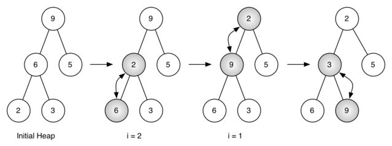

..  Copyright (C)  Brad Miller, David Ranum
    This work is licensed under the Creative Commons Attribution-NonCommercial-ShareAlike 4.0 International License. To view a copy of this license, visit http://creativecommons.org/licenses/by-nc-sa/4.0/.

Implementação de Heaps Binários
~~~~~~~~~~~~~~~~~~~~~~~~~~~~~~~
 
A Propriedade da Estrutura
^^^^^^^^^^^^^^^^^^^^^^^^^^

Para fazer com que o nosso heap trabalhe de forma eficiente, vamos tirar
vantagem da natureza logarítmica da árvore binária para representar
nosso heap. Para garantir o desempenho logarítmico, temos que manter
nossa árvore balanceada. Uma árvore binária balanceada tem aproximadamente
o mesmo número de nós nas subárvores esquerda e direita da raiz. Na nossa
implementação de heap, mantemos a árvore balanceada ao criar uma
**árvore binária completa**. Esse tipo de árvore é aquela em que cada
nĩvel apresenta todos os nós. A exceção é o nível mais baixo da árvore,
no qual os nós vão sendo preenchidos da esquerda para direita.
A :ref:`Figura 1 <fig_comptree>` mostra um exemplo de uma árvore binária
completa.

.. _fig_comptree:

.. figure:: Figures/compTree.png
   :align: center
   :alt: image

   Figura 1: Uma Árvore Binária Completa

Uma outra propriedade interessante de uma árvore completa é que podemos
representá-la usando apenas uma lista. Não precisamos recorrer a nós
e referências, ou mesmo listas de listas. Como a árvore é completa, o
filho esquerdo de um nó pai (na posição :math:`p`) é o nó que se encontra
na posição :math:`2p` da lista. Da mesma forma, o filho direito desse
nó pai está na posição :math:`2p + 1` da lista. Para encontrar o pai 
de qualquer nó na árvore, simplesmente fazemos a divisão por inteiro
do Python. Dado que um nó está na posição :math:`n` da lista, o pai 
se encontra na posição :math:`n/2`. A :ref:`Figura 2 <fig_heapOrder>`
mostra uma árvore binária completa e também exibe a lista representando
essa árvore. Observe como :math:`2p` e :math:`2p+1` definem uma relação
entre pais e filhos. A representação em lista da árvore, junto com
a propriedade da estrutura completa, permite-nos varrer eficientemente
uma árvore binária completa utilizando apenas algumas simples
operações matemáticas. Veremos que isso também leva a uma implementação
eficiente do nosso heap binário.
   

A Propriedade Heap
^^^^^^^^^^^^^^^^^^

O método que iremos usar para armazenar itens em um heap depende de
mantermos o que chamamos de **propriedade heap**. Essa propriedade
subentende uma ordenação e pode ser expressa da seguinte forma:
Em um heap, para cada nó :math:`x` com pai :math:`p`, a chave em :math:`p`
é menor ou igual à chave em :math:`x`. A :ref:`Figura 2 <fig_heapOrder>`
também ilustra uma árvore binária completa que mantém a propriedade heap.

.. _fig_heapOrder:

.. figure:: Figures/heapOrder.png
   :align: center
   :alt: image

   Figura 2: Uma Árvore Binária Completa, Junto com sua Representação em Lista

Operações Heap
^^^^^^^^^^^^^^

Iremos começar nossa implementação de um heap binário com o construtor.
Como o heap inteiro pode ser representado por uma única lista, tudo o que
o construtor irá fazer é inicializar a lista e um atributo ``currentSize``
para armazenar o tamanho atual do heap. O :ref:`Código 1 <lst_heap1a>`
mostra o código em Python para o construtor. Você irá notar que um
heap binário vazio tem um único zero como o primeiro elemento da
``heapList`` e que esse zero não é utilizado, mas está lá para que
a divisão por inteiros seja possível em outros métodos.

.. _lst_heap1a:

**Código 1**

::
    
    class BinHeap:
        def __init__(self):
            self.heapList = [0]
            self.currentSize = 0

O próximo método que iremos implementar é o ``insert``. O jeito mais fácil e
eficiente de adicionar um item à lista é simplesmente juntar o item ao final
da lista. A notícia boa sobre juntar itens é que essa prática garante que
iremos manter a propriedade da árvore completa. A notícia ruim é que muito
provavelmente iremos violar a propriedade heap. Contudo, é possível escrever
um método que nos permitirá manter a propriedade heap ao comparar o novo
item com o seu pai. Se o novo elemento adicionado for menor que o seu pai,
então podemos trocá-lo com a posição do pai. A :ref:`Figura 2 <fig_percUp>`
mostra uma série de trocas necessárias para percolar o novo item até sua
posição correta na árvore.

.. _fig_percUp:

.. figure:: Figures/percUp.png
   :align: center
   :alt: image

   Figura 2: Percolação do Novo Nó até sua Posição Correta

Note que quando percolamos um item para cima na árvore, estamos mantendo
a propriedade heap entre o novo item e o seu pai. Também estamos
preservando a propriedade heap para qualquer irmão desse nó. Claro,
se o novo item for muito pequeno, podemos ainda ter que percolá-lo
para um nível superior. Na realidade, pode ser que tenhamos que
ficar fazendo trocas até chegar ao topo da árvore. O código
:ref:`Código 2 <lst_heap2>` mostra o método ``percUp``, que percola
um novo item para cima na árvore para que a propriedade heap seja
mantida. Agora vemos por que nosso elemento zero em ``heapList``
é importante. Observe que podemos computar o pai de qualquer nó
usando uma simples divisão por inteiro. O pai do nó atual pode
ser computado ao dividir o índice do nó atual por 2.

Agora estamos prontos para escrever o método ``insert`` (veja o
:ref:`Código 3 <lst_heap3>`). A maior parte do trabalho do método
``insert`` é de fato realizada por ``percUp``. Assim que um novo
item é adicionado à árvore, ``percUp`` assume e posiciona o 
novo item na posição correta.

.. _lst_heap2:

**Código 2**

::

    def percUp(self,i):
        while i // 2 > 0:
          if self.heapList[i] < self.heapList[i // 2]:
             tmp = self.heapList[i // 2]
             self.heapList[i // 2] = self.heapList[i]
             self.heapList[i] = tmp
          i = i // 2

.. _lst_heap3:

**Código 3**

::

    def insert(self,k):
        self.heapList.append(k)
        self.currentSize = self.currentSize + 1
        self.percUp(self.currentSize)
        
        
Com o método ``insert`` definido, podemos seguir agora para o método
``delMin``. Como a propriedade heap requer que a raiz da árvore seja
o elemento de menor valor na árvore (n.T.: nesse caso, um min-heap),
encontrar o mínimo é fácil. A parte difícil de ``delMin`` é fazer
com que a estrutura heap e a propriedade heap sejam restauradas depois 
que raiz é removida. Podemos restaurar nosso heap em dois passos.
Primeiro, iremos restaurar a raiz tomando o último elemento da lista e
movendo-o para a raiz. Essa operação garante manutenção de uma estrutura
heap. Contudo, ao fazer isso, provavelmente destruímos a propriedade
heap do nosso heap binário. Então, o segundo passo a ser feito é
percolar o novo nó raiz para baixo na árvore até que ele alcance
sua posição correta. A :ref:`Figura 3 <fig_percDown>` mostra uma
série de trocas necessárias para mover o novo nó raiz até sua posição
correta no heap.

.. _fig_percdown:

.. figure:: Figures/percDown.png
   :align: center
   :alt: image

   Figura 3: Percolando o Nó Raiz para Baixo na Árvore

Para que a propriedade heap seja mantida, a única coisa que devemos
fazer é trocar a raiz com o seu menor filho (admitindo que ao menos um
deles seja menor que a raiz). Depois da troca inicial, podemos ter que 
repetir esse processo de trocas com o nó e seus filhos atuais até que 
ele seja posicionado em um lugar da árvore em que seus filhos são 
maiores do que ele. O código para percolar um nó para baixo na árvore
pode ser visto nos métodos ``percDown`` e ``minChild``, conforme
o :ref:`Código 4 <lst_heap4>`.
   
.. _lst_heap4:

**Código 4**

::

    def percDown(self,i):
        while (i * 2) <= self.currentSize:
            mc = self.minChild(i)
            if self.heapList[i] > self.heapList[mc]:
                tmp = self.heapList[i]
                self.heapList[i] = self.heapList[mc]
                self.heapList[mc] = tmp
            i = mc

    def minChild(self,i):
        if i * 2 + 1 > self.currentSize:
            return i * 2
        else:
            if self.heapList[i*2] < self.heapList[i*2+1]:
                return i * 2
            else:
                return i * 2 + 1

O código para a operação ``delmin`` está :ref:`Código 5 <lst_heap5>`.
Observe que, mais uma vez, o grosso do trabalho está na função
auxiliar. Neste caso, em ``percDown``.
                
.. _lst_heap5:

**Código 5**

::

    def delMin(self):
        retval = self.heapList[1]
        self.heapList[1] = self.heapList[self.currentSize]
        self.currentSize = self.currentSize - 1
        self.heapList.pop()
        self.percDown(1)
        return retval

Para terminar nossa discussão sobre heaps binários, iremos olhar agora
um método para construir um heap inteiro a partir de uma lista de chaves.
O primeiro método funciona mais ou menos da seguinte forma: Dado uma 
lista de chaves, você pode construir um h
       --------------------------------------- 
        To finish our discussion of binary heaps, we will look at a method to
build an entire heap from a list of keys. The first method you might
think of may be like the following. Given a list of keys, you could
easily build a heap by inserting each key one at a time. Since you are
starting with a list of one item, the list is sorted and you could use
binary search to find the right position to insert the next key at a
cost of approximately :math:`O(\log{n})` operations. However, remember
that inserting an item in the middle of the list may require
:math:`O(n)` operations to shift the rest of the list over to make
room for the new key. Therefore, to insert :math:`n` keys into the
heap would require a total of :math:`O(n \log{n})` operations.
However, if we start with an entire list then we can build the whole
heap in :math:`O(n)` operations. :ref:`Listing 6 <lst_heap6>` shows the code
to build the entire heap.

.. _lst_heap6:

**Listing 6**

::

    def buildHeap(self,alist):
        i = len(alist) // 2
        self.currentSize = len(alist)
        self.heapList = [0] + alist[:]
        while (i > 0):
            self.percDown(i)
            i = i - 1

.. _fig_buildheap:

   Figure 4: Building a Heap from the List [9, 6, 5, 2, 3]

:ref:`Figure 4 <fig_buildheap>` shows the swaps that the ``buildHeap`` method
makes as it moves the nodes in an initial tree of [9, 6, 5, 2, 3] into
their proper positions. Although we start out in the middle of the tree
and work our way back toward the root, the ``percDown`` method ensures
that the largest child is always moved down the tree. Because the heap is a
complete binary tree, any nodes past the halfway point will be leaves
and therefore have no children. Notice that when ``i=1``, we are
percolating down from the root of the tree, so this may require multiple
swaps. As you can see in the rightmost two trees of
:ref:`Figure 4 <fig_buildheap>`, first the 9 is moved out of the root position,
but after 9 is moved down one level in the tree, ``percDown`` ensures
that we check the next set of children farther down in the tree to
ensure that it is pushed as low as it can go. In this case it results in
a second swap with 3. Now that 9 has been moved to the lowest level of
the tree, no further swapping can be done. It is useful to compare the
list representation of this series of swaps as shown in
:ref:`Figure 4 <fig_buildheap>` with the tree representation.

::

          i = 2  [0, 9, 5, 6, 2, 3]
          i = 1  [0, 9, 2, 6, 5, 3]
          i = 0  [0, 2, 3, 6, 5, 9]
          

The complete binary heap implementation can be seen in ActiveCode 1.

.. activecode:: completeheap
   :caption: The Complete Binary Heap Example
   :hidecode:
   
   class BinHeap:
       def __init__(self):
           self.heapList = [0]
           self.currentSize = 0

       def percUp(self,i):
           while i // 2 > 0:
             if self.heapList[i] < self.heapList[i // 2]:
                tmp = self.heapList[i // 2]
                self.heapList[i // 2] = self.heapList[i]
                self.heapList[i] = tmp
             i = i // 2

       def insert(self,k):
         self.heapList.append(k)
         self.currentSize = self.currentSize + 1
         self.percUp(self.currentSize)

       def percDown(self,i):
         while (i * 2) <= self.currentSize:
             mc = self.minChild(i)
             if self.heapList[i] > self.heapList[mc]:
                 tmp = self.heapList[i]
                 self.heapList[i] = self.heapList[mc]
                 self.heapList[mc] = tmp
             i = mc

       def minChild(self,i):
         if i * 2 + 1 > self.currentSize:
             return i * 2
         else:
             if self.heapList[i*2] < self.heapList[i*2+1]:
                 return i * 2
             else:
                 return i * 2 + 1

       def delMin(self):
         retval = self.heapList[1]
         self.heapList[1] = self.heapList[self.currentSize]
         self.currentSize = self.currentSize - 1
         self.heapList.pop()
         self.percDown(1)
         return retval

       def buildHeap(self,alist):
         i = len(alist) // 2
         self.currentSize = len(alist)
         self.heapList = [0] + alist[:]
         while (i > 0):
             self.percDown(i)
             i = i - 1

   bh = BinHeap()
   bh.buildHeap([9,5,6,2,3])

   print(bh.delMin())
   print(bh.delMin())
   print(bh.delMin())
   print(bh.delMin())
   print(bh.delMin())
   
   
   

The assertion that we can build the heap in :math:`O(n)` may seem a
bit mysterious at first, and a proof is beyond the scope of this book.
However, the key to understanding that you can build the heap in
:math:`O(n)` is to remember that the :math:`\log{n}` factor is
derived from the height of the tree. For most of the work in
``buildHeap``, the tree is shorter than :math:`\log{n}`.

Using the fact that you can build a heap from a list in :math:`O(n)`
time, you will construct a sorting algorithm that uses a heap and sorts
a list in :math:`O(n\log{n}))` as an exercise at the end of this
chapter.
