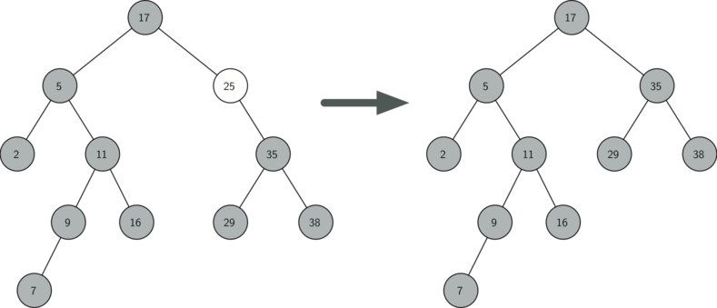

..  Copyright (C)  Brad Miller, David Ranum
    This work is licensed under the Creative Commons Attribution-NonCommercial-ShareAlike 4.0 International License. To view a copy of this license, visit http://creativecommons.org/licenses/by-nc-sa/4.0/.

Implementação de Árvores de Busca
~~~~~~~~~~~~~~~~~~~~~~~~~~~~~~~~~

Uma árvore de busca binária apresenta a propriedade de que as chaves
que são menores o seu nó pai estão na subárvore esquerda, enquanto que
as chaves maiores se encontram na subárvore direita. Nós iremos chamar
isso de **propriedade abb**. Quando estivermos implementando a interface
do mapeamento, já descrita anteriormente, a propriedade abb irá guiar
esse processo. A :ref:`Figura 1 <fig_simpleBST>` ilustra essa
propriedade de uma árvore de busca binária, exibindo as chaves sem
nenhum valor associado. Observe que a propriedade abb se mantém para
cada pai e filho. Todas as chaves na subárvore esquerda são menores
que a raiz. Todas as chaves na subárvore direita são maiores (n.T.: ou iguais)
que a raiz.

   
.. _fig_simpleBST:

.. figure:: Figures/simpleBST.png
   :align: center

   Figura 1: Uma Árvore Binária Simples
    

Agora que você sabe o que é uma árvore de busca binária, vamos ver como
uma árvore de busca binária é construída. A árvore de busca na
:ref:`Figura 1 <fig_simpleBST>` representa os nós que existem depois de
termos inserido as seguintes chaves nesta ordem:
:math:`70,31,93,94,14,23,73`. Como 70 foi a primeira chave inserida na
árvore, ele vai para a raiz. Em seguida, como 31 é menor que 70, ele
se torna filho esquerdo de 70. Depois, vem o 93, que é maior que 70,
então ele vira o filho direito de 70. Como agora já temos dois níveis da
árvore completos, a próxima chave só pode ser o filho esquerdo
ou direito de 31 ou 93. Como 94 é maior que 70 e 93, então ele se torna o
filho direito de 93. Do mesmo modo, como 14 é menor que 70 e 31, ele se
torna o filho esquerdo de 31. A chave 23 também é menor que 31, então
ela precisa estar na subárvore esquerda de 31, mas como 23 é maior que
14, 23 se torna filho direito de 14.

Para implementar a árvore de busca binária, iremos utilizar a abordagem
de nós e referências semelhante àquela usada para implementar listas
ligadas e árvores de expressões. Contudo, como temos que poder criar e
trabalhar com uma árvore de busca binária inicialmente vazia, nossa
implementação fará uso de duas classes. A primeira chamaremos de 
``BinarySearchTree``, enquanto a segunda será ``TreeNode``. A classe
``BinarySearchTree`` guarda uma referência para ``TreeNode``, que é a
raiz da árvore de busca binária. Na maioria dos casos, os métodos
externos definidos na classe mais externa apenas checa para ver se a
árvore está vazia. Se houver nós na árvore, a requisição é apenas
passada adiante para um método privado definido na classe
``BinarySearchTree`` que recebe a raiz como parâmetro. No caso de a
árvore estar vazia ou se quisermos remover a chave contida na raiz,
uma ação especial é necessária. O código para o construtor da classe
``BinarySearchTree``, junto com outras funções genéricas, pode ser
visto em :ref:`Código 1 <lst_bst1>`.

.. _lst_bst1:

**Código 1**

::

    class BinarySearchTree:

        def __init__(self):
    	    self.root = None
    	    self.size = 0
	
        def length(self):
    	    return self.size

        def __len__(self):
    	    return self.size

        def __iter__(self):
    	    return self.root.__iter__()
	    

A classe ``TreeNode`` fornece várias funções auxiliares que tornam o
trabalho realizado pela classe ``BinarySearchTree`` muito mais fácil.
O construtor para um objeto ``TreeNode``, junto com essas funções
auxiliares, é exibido em :ref:`Código 2 <lst_bst2>`. Como você pode ver
no código, muitas dessas funções auxiliares ajudam a classificar um nó
de acordo com sua própria posição como filho (esquerdo ou direito) e
de acordo com os filhos que o nó possui. A classe ``TreeNode`` também
manterá explicitamente uma referência para o pai como um atributo de
cada nó. Você verá por que isso é importante quando discutirmos a
implementação do operador ``del``.

Um outro aspecto interessante da implementação de ``TreeNode`` no
:ref:`Código 2 <lst_bst2>` é que usamos parâmetros opcionais do Python.
O uso desse recurso permite que criemos mais facilmente um objeto do 
tipo ``TreeNode`` sob as mais diferentes circunstâncias. Algumas vezes
iremos querer construir um ``TreeNode`` que tem tanto um ``pai`` quanto
um ``filho``. Com o pai e filho existentes, podemos passá-los como 
parâmetros. Em outros momentos não iremos passar parâmetro algum, seja
para o ``pai`` ou para o ``filho``. Nesse caso são usados os valores
padrões dos parâmetros opcionais.
            
.. _lst_bst2:

**Código 2**

::

    class TreeNode:
       def __init__(self,key,val,left=None,right=None,
					   parent=None):
	    self.key = key
	    self.payload = val
	    self.leftChild = left
	    self.rightChild = right
	    self.parent = parent

	def hasLeftChild(self):
	    return self.leftChild

	def hasRightChild(self):
	    return self.rightChild
	
	def isLeftChild(self):
	    return self.parent and self.parent.leftChild == self

	def isRightChild(self):
	    return self.parent and self.parent.rightChild == self

	def isRoot(self):
	    return not self.parent

	def isLeaf(self):
	    return not (self.rightChild or self.leftChild)

	def hasAnyChildren(self):
	    return self.rightChild or self.leftChild

	def hasBothChildren(self):
	    return self.rightChild and self.leftChild
	
	def replaceNodeData(self,key,value,lc,rc):
	    self.key = key
	    self.payload = value
	    self.leftChild = lc
	    self.rightChild = rc
	    if self.hasLeftChild():
		self.leftChild.parent = self
	    if self.hasRightChild():
		self.rightChild.parent = self
		

Agora que temos o esqueleto de ``BinarySearchTree`` e ``TreeNode``, está
na hora de escrever o método ``put`` que nos permitirá construir nossa
árvore de busca binária. O método ``put`` é um método da classe
``BinarySearchTree``. Esse método irá verificar se a árvore já possui
uma raiz. Se não houver uma raiz, então ``put`` irá criar um novo
objeto do tipo ``TreeNode`` e colocá-lo na raiz da árvore. Se já houver
uma raiz, então ``put`` faz uma chamada para a função auxiliar privada
e recursiva ``_put``, a fim de fazer uma busca na árvore de acordo com
o seguinte algoritmo:

-  Começando pela raiz da árvore, faça uma busca na árvore binária
   comparando a nova chave com a chave do nó atual. Se a nova chave for
   menor que o nó atual, continue a busca na subárvore esquerda. Se a 
   nova chave for maior (n.T.: ou igual) que o nó atual, continue
   a busca na subárvore direita.

-  Quando não houver mais filhos à esquerda (ou à direita) para
   seguir na busca, significa que encontramos a posição na árvore
   em que o novo nó deve ser colocado.

-  Para adicionar um nó à árvore, cre um novo objeto do tipo
   ``TreeNode`` e insira-o no ponto descoberto no passo anterior.

O código :ref:`Código 3 <lst_bst3>` mostra a implementação em Python
para inserir um novo nó na árvore. A função ``_put`` é escrita
recursivamente tendo por base os passos mostrados acima. Note que
quando um novo filho é inserido na árvore, o ``currentNode`` é
passado para a nova árvore como pai.

Um problema importante com nossa implementação de inserção é que chaves
duplicadas não são tratadas apropriadamente. Da forma como nossa árvore
está implementada, uma chave duplicada irá criar um novo nó com o mesmo
valor na subárvore direita do nó com a chave original. O resultado disso
é que o nó com a nova chave nunca será encontrado em uma busca. Uma
forma melhor de lidar com a inserção de uma chave duplicada é
substituir o valor antigo pelo valor associado à nova chave. Vamos
deixar o conserto desse *bug* como um exercício para você.

.. _lst_bst3:

**Código 3**

::

    def put(self,key,val):
    	if self.root:
    	    self._put(key,val,self.root)
    	else:
    	    self.root = TreeNode(key,val)
    	self.size = self.size + 1

    def _put(self,key,val,currentNode):
    	if key < currentNode.key:
    	    if currentNode.hasLeftChild():
    		   self._put(key,val,currentNode.leftChild)
    	    else:
    		   currentNode.leftChild = TreeNode(key,val,parent=currentNode)
    	else:
    	    if currentNode.hasRightChild():
    		   self._put(key,val,currentNode.rightChild)
    	    else:
    		   currentNode.rightChild = TreeNode(key,val,parent=currentNode)

Com o método ``put`` definido, podemos facilmente sobrescrever o
operador ``[]`` fazendo com que o método ``__setitem__`` (veja 
:ref:`Código 4 <lst_bst4>`) chave o método ``put``. Isso nos
permitirá escrever declarações em Python da forma
``myZipTree['Plymouth'] = 55446``, ou seja, como um dicionário do Python.
                   
.. _lst_bst4:

**Código 4**

::

	def __setitem__(self,k,v):
	    self.put(k,v)
	    
A :ref:`Figura 2 <fig_bstput>` ilustra o processo de inserir um novo nó
em uma árvore de busca binária. Os nós levemente sombreados indicam os
nós que foram visitados durante o processo de inserção.

.. _fig_bstput:

.. figure:: Figures/bstput.png
   :align: center

   Figura 2: Inserindo um Nó com Chave = 19

.. admonition:: Auto-Avaliação

    .. mchoice:: bst_1
       :correct: b
       :answer_a: 
       :feedback_a: Lembre-se que, começando pelo topo, as chaves menores que a raiz têm que estar na subárvore esquerda, enquanto as maiores na direita.
       :answer_b: 
       :feedback_b: bom trabalho.
       :answer_c:        
       :feedback_c: Isso parece uma árvore binária que satisfaz a propriedade da árvore completa para um heap.

       Qual das árvores é uma árvore de busca binária, dado que as chaves foram
       inseridas na seguinte ordem: 5, 30, 2, 40, 25, 4.

Uma vez construída a árvore, a próxima tarefa é implementar a recuperação
de um valor, dado uma determinada chave. O método ``get`` é ainda mais
fácil que o ``put`` porque ele simplesmente faz uma busca recursiva na
árvore até chegar em uma folha não correspondente ou em uma chave
correspondente. Quando a chave desejada é encontrada, o valor armazenado
no nó é retornado.
       
O :ref:`Código 5 <lst_bst5>` mostra o a implementação de ``get``, ``_get``
e ``__getitem__``. O código para a busca no método ``_get`` usa a mesma
lógica do método ``_put`` para a escolha do filho esquerdo ou direito. 
Observe que o método ``_get_`` retorna um objeto ``TreeNode`` para ``get``.
Isso permite que ``_get`` seja usado como um flexível método auxiliar
para outros métodos de ``BinarySearchTree`` que podem precisar fazer
uso de outros dados de um objeto ``TreeNode``, além do valor armazenado
em si.

Implementando o método ``__getitem__``, podemos escrever uma declaração
em Python muito semelhante àquela usada para acessar um dicionário,
embora estejamos utilizando na prática uma árvore de busca binária.
Por exemplo, podemos fazer ``z = myZipTree['Fargo']``. Como você
pode ver, tudo o que o método ``__getitem__`` faz é chamar ``get``.

.. _lst_bst5:

**Código 5**

::

    def get(self,key):
    	if self.root:
    	    res = self._get(key,self.root)
    	    if res:
    		   return res.payload
    	    else:
    		   return None
    	else:
    	    return None

    def _get(self,key,currentNode):
    	if not currentNode:
    	    return None
    	elif currentNode.key == key:
    	    return currentNode
    	elif key < currentNode.key:
    	    return self._get(key,currentNode.leftChild)
    	else:
    	    return self._get(key,currentNode.rightChild)

    def __getitem__(self,key):
    	return self.get(key) 

Usando ``get``, podemos implementar a operação ``in`` escrevendo
um método ``__contains__`` para ``BinarySearchTree``. O método
``__contains__`` simplesmente irá chamar ``get`` e retornar
``True`` se ``get`` retornar um valor, ou ``False`` se retornar
``None``. O código para ``__contains__`` pode ser visto em
:ref:`Código 6 <lst_bst6>`.
        
.. _lst_bst6:

**Código 6**

::

    def __contains__(self,key):
    	if self._get(key,self.root):
    	    return True
    	else:
    	    return False

Lembre-se que ``__contains__`` sobrescreve o operador ``in`` e permite
escrevamos declarações como:

::

	if 'Northfield' in myZipTree:
	    print("oom ya ya")

Finalmente, voltamos nossa atenção para o método mais desafiador na árvore
de busca binária: a remoção de uma chave (veja :ref:`Código 7 <lst_bst7>`).
O primeiro passo é encontrar o nó a ser removido por meio de uma busca na
árvore. Se a árvore tiver mais de um nó, realizamos a busca usando o
método ``_get`` para encontrar o ``TreeNode`` que precisa ser apagado.
Se a árvore tiver um único nó, significa que estamos removendo a raiz
da árvore, mas ainda assim precisamos verificar se a chave da raiz bate
com a chave que deve ser apagada. De todo modo, se a chave não for
encontrada, o operador ``del`` emite um erro.

.. _lst_bst7:

**Código 7**

::

    def delete(self,key):
       if self.size > 1:
          nodeToRemove = self._get(key,self.root)
    	  if nodeToRemove:
    	      self.remove(nodeToRemove)
    	      self.size = self.size-1
    	  else:
    	      raise KeyError('Error, key not in tree')
       elif self.size == 1 and self.root.key == key:
    	  self.root = None
    	  self.size = self.size - 1
       else:
    	  raise KeyError('Error, key not in tree')

    def __delitem__(self,key):
    	self.delete(key)

Uma vez encontrado o nó contendo a chave que queremos remover, existem
três casos que devemos considerar:
        
#. O nó a ser removido não possui filhos (veja :ref:`Figura 3 <fig_bstdel1>`).

#. O nó a ser removido tem apenas um filho (veja :ref:`Figura 4 <fig_bstdel2>`).

#. O nó a ser removido tem dois filhos (veja :ref:`Figura 5 <fig_bstdel3>`).

O primeiro caso é bastante simples (veja :ref:`Código 8 <lst_bst8>`). Se o nó
atual não possui filhos, tudo o que temos de fazer é apagar o nó e remover
a referência para ele no nó pai. O código para esse caso é mostrado a seguir.
   
.. _lst_bst8:

**Código 8**

::

    if currentNode.isLeaf():
    	if currentNode == currentNode.parent.leftChild:
    	    currentNode.parent.leftChild = None
    	else:
    	    currentNode.parent.rightChild = None

.. _fig_bstdel1:

.. figure:: Figures/bstdel1.png
   :align: center

   Figura 3: Apagando o Nó 16, um Nó sem Filhos

O segundo caso é somente um pouquinho mais complicado
(veja o :ref:`Código 9 <lst_bst9>`). Se um nó possui apenas um filho,
então podemos simplesmente colocar o filho no lugar do pai. O código
para esse caso é mostrado abaixo. Olhando para o código, você irá 
perceber que há seis casos a serem considerados. Como os casos são
simétricos com relação a ter um filho esquerdo ou direito, iremos
discutir apenas os casos em que o nó atual tem um filho esquerdo.
O processo de decisão é o seguinte:

#. Se o nó atual for um filho esquerdo, então precisamos apenas atualizar
   a referência para o pai no filho esquerdo, de modo a apontá-la agora 
   para o pai do nó atual, e depois atualizar a referência para o filho
   esquerdo no pai, de modo a apontá-la agora para o filho esquerdo
   do nó atual.

#. Se o nó atual for um filho direito, então precisamos apenas atualizar
   a referência para o pai no filho esquerdo, de modo a apontá-la agora
   para o pai do nó atual, e depois atualizar a referência para o filho
   direito no pai, de modo a apontá-la agoara para o filho esquerdo
   do nó atual.

#. Se o nó atual não tiver pai, então ele é uma raiz. Nesse caso, 
   precisamos somente substituir os valores de ``key``, ``payload``,
   ``leftChild`` e ``rightChild`` chamando o método ``replaceNodeData``
   na raiz.

.. _lst_bst9:

**Código 9**

::

    else: # this node has one child
       if currentNode.hasLeftChild():
    	  if currentNode.isLeftChild():
    	      currentNode.leftChild.parent = currentNode.parent
    	      currentNode.parent.leftChild = currentNode.leftChild
    	  elif currentNode.isRightChild():
    	      currentNode.leftChild.parent = currentNode.parent
    	      currentNode.parent.rightChild = currentNode.leftChild
    	  else:
    	      currentNode.replaceNodeData(currentNode.leftChild.key,
    				 currentNode.leftChild.payload,
    				 currentNode.leftChild.leftChild,
    				 currentNode.leftChild.rightChild)
       else:
    	  if currentNode.isLeftChild():
    	      currentNode.rightChild.parent = currentNode.parent
    	      currentNode.parent.leftChild = currentNode.rightChild
    	  elif currentNode.isRightChild():
    	      currentNode.rightChild.parent = currentNode.parent
    	      currentNode.parent.rightChild = currentNode.rightChild
    	  else:
    	      currentNode.replaceNodeData(currentNode.rightChild.key,
    				 currentNode.rightChild.payload,
    				 currentNode.rightChild.leftChild,
    				 currentNode.rightChild.rightChild)

.. _fig_bstdel2:

   Figura 4: Removendo o Nó 25, um Nó com um Único Filho

O terceiro caso é o mais difícil de lidar (veja o
:ref:`Código 10 <lst_bst10>`). Se um nó tiver dois filhos, então é
improvável que possamos simplesmente promover um deles para o lugar
do nó em questão. O que podemos fazer, no entanto, é realizar uma busca
na árvore por um nó que pode ser usado para substituir aquele planejado
para remoção. Precisamos, portanto, de um nó que irá preservar as
relações dentro da árvore de busca binária para ambas as subárvores
esquerda e direita. O nó que irá fazer isso é aquele com a segunda
maior chave na árvore. Iremos chamar esse nó de **sucessor** e iremos
ver uma forma de encontrar o sucessor em breve. Uma coisa interessante
do sucessor é que ele não pode ter mais do que um filho, então nós
sabemos como removê-lo usando os dois casos de remoção que já 
implementamos. Uma vez apagado o sucessor, simplesmente o colocamos
na árvore no lugar do nó a ser removido.
   
.. _fig_bstdel3:

.. figure:: Figures/bstdel3.png
    :align: center

    Figura 5: Removendo o Nó 5, um Nó com Dois Filhos

O código para lidar com o terceiro caso é mostrado abaixo. Note que
podemos fazer uso dos métodos auxiliares ``findSucessor`` e ``findMin``
para encontrar o sucessor. Para remover o sucessor, podemos utilizar
o método ``spliceOut``. O motivo pelo qual usamos ``spliceOut`` é que
ele vai diretamente para o nó que queremos emendar e faz os ajustes
adequados. Nós poderíamos chamar ``delete`` recursivamente, mas
perderíamos tempo refazendo a busca pelo nó chave.
    
.. _lst_bst10:

**Código 10**

::

   elif currentNode.hasBothChildren(): #interior
	   succ = currentNode.findSuccessor()
	   succ.spliceOut()
	   currentNode.key = succ.key
	   currentNode.payload = succ.payload

O código para encontrar o sucessor pode ser visto abaixo (veja o 
:ref:`Código 11 <lst_bst11>`) e como você poderá notar, trata-se de um
método da classe ``TreeNode``. Esse código faz uso das mesmas propriedades
de árvores de busca binárias que fazem com que uma varredura infixa
imprima os nós da árvore do menor para o maior. Há três casos a 
considerar quando procuramos pelo sucessor:

#. Se o nó tiver um filho direito, então o sucessor é a menor chave
   na subárvore direita.

#. Se o nó não tiver filho direito e for o filho esquerdo do seu nó
   pai, então o pai é o sucessor.

#. Se o nó for o filho direito do seu nó pai e não tiver ele próprio
   um filho direito, então o sucessor desse nó é o sucessor do seu
   pai, excluindo tal nó.
           
A primeira condição é única que verdadeiramente importa para nós quando
estamos removendo um nó de uma árvore de busca binária. Contudo, o método
``findSucessor`` possui outros usos que iremos explorar nos exercícios
ao fim deste capítulo.

O método ``findMin`` é chamado para encontrar a chave mínima em uma 
subárvore. A esta altura, você deve se convencer de que a chave de menor
valor em qualquer árvore de busca binária é sempre o filho mais à esquerda
contido na árvore. Portanto, o método ``findMin`` simplesmente varre
por referências ``leftChild`` em cada nó da subárvore até chegar a um
nó que não possui filho esquerdo.

.. _lst_bst11:

**Código 11**

::

    def findSuccessor(self):
    	succ = None
    	if self.hasRightChild():
    	    succ = self.rightChild.findMin()
    	else:
    	    if self.parent:
    		   if self.isLeftChild():
    		       succ = self.parent
    		   else:
    		       self.parent.rightChild = None
    		       succ = self.parent.findSuccessor()
    		       self.parent.rightChild = self
    	return succ

    def findMin(self):
    	current = self
    	while current.hasLeftChild():
    	    current = current.leftChild
    	return current

    def spliceOut(self):
    	if self.isLeaf():
    	    if self.isLeftChild():
    		   self.parent.leftChild = None
    	    else:
    		   self.parent.rightChild = None
    	elif self.hasAnyChildren():
    	    if self.hasLeftChild():
    		   if self.isLeftChild():
    		      self.parent.leftChild = self.leftChild
    		   else:
    		      self.parent.rightChild = self.leftChild
    		   self.leftChild.parent = self.parent
    	    else:
    		   if self.isLeftChild():
    		      self.parent.leftChild = self.rightChild
    		   else:
    		      self.parent.rightChild = self.rightChild
    		   self.rightChild.parent = self.parent

Precisamos ainda olhar um último método da interface da árvore de busca
binária. Suponha que queiramos tão somente iterar sobre todas as chaves 
de forma ordenada. Isso é algo que definitivamente fizemos com dicionários,
então por que não com árvores? Você já sabe como varrer uma árvore binária
ordenadamente, usando o algoritmo de varredura ``infixa``. Contudo,
escrever um iterador requer um pouco mais de trabalho, uma vez que um
iterador deve retornar somente um nó a cada vez que o iterador for chamado.

O Python nos fornece uma função muito poderosa para quando queremos
criar um iterador. A função é chamada ``yield``. Essa função é semelhante
ao ``return`` no sentido de que retorna um valor para quem chamou. No
entanto, o ``yield`` também realiza o passo adicional de congelar o estado
da função, de modo que na próxima vez em que a função for chamada, ela
continue a executar exatamente a partir desse último ponto. Funções que
criam objetos que podemos ser iterados são chamadas de geradoras.

O código para um iterador ``infixo`` de uma árvore binária é mostrado
a seguir. Observe esse código com cuidado. À primeira vista, você poderá
pensar que o código não é recursivo. Porém lembre-se que ``__iter__``
sobrescreve a operação ``for x in`` na iteração, então ela é de fato
recursiva! Como ela é recursiva sobre instâncias de ``TreeNode``, então
o método ``__iter__`` é definido dentro da classe ``TreeNode``.

::

    def __iter__(self):
       if self:
    	  if self.hasLeftChild():
    	  	 for elem in self.leftChiLd:
    		    yield elem
          yield self.key
    	  if self.hasRightChild():
    		 for elem in self.rightChild:
    		    yield elem

Neste ponto pode ser uma boa ideia você baixar o arquivo contendo a
versão completa das classes ``BinarySearchTree`` e ``TreeNode``.

.. activecode:: completebstcode

    class TreeNode:
        def __init__(self,key,val,left=None,right=None,parent=None):
            self.key = key
            self.payload = val
            self.leftChild = left
            self.rightChild = right
            self.parent = parent

        def hasLeftChild(self):
            return self.leftChild

        def hasRightChild(self):
            return self.rightChild

        def isLeftChild(self):
            return self.parent and self.parent.leftChild == self

        def isRightChild(self):
            return self.parent and self.parent.rightChild == self

        def isRoot(self):
            return not self.parent

        def isLeaf(self):
            return not (self.rightChild or self.leftChild)

        def hasAnyChildren(self):
            return self.rightChild or self.leftChild

        def hasBothChildren(self):
            return self.rightChild and self.leftChild

        def replaceNodeData(self,key,value,lc,rc):
            self.key = key
            self.payload = value
            self.leftChild = lc
            self.rightChild = rc
            if self.hasLeftChild():
                self.leftChild.parent = self
            if self.hasRightChild():
                self.rightChild.parent = self
            

    class BinarySearchTree:

        def __init__(self):
            self.root = None
            self.size = 0

        def length(self):
            return self.size

        def __len__(self):
            return self.size

        def put(self,key,val):
            if self.root:
                self._put(key,val,self.root)
            else:
                self.root = TreeNode(key,val)
            self.size = self.size + 1

        def _put(self,key,val,currentNode):
            if key < currentNode.key:
                if currentNode.hasLeftChild():
                       self._put(key,val,currentNode.leftChild)
                else:
                       currentNode.leftChild = TreeNode(key,val,parent=currentNode)
            else:
                if currentNode.hasRightChild():
                       self._put(key,val,currentNode.rightChild)
                else:
                       currentNode.rightChild = TreeNode(key,val,parent=currentNode)

        def __setitem__(self,k,v):
           self.put(k,v)

        def get(self,key):
           if self.root:
               res = self._get(key,self.root)
               if res:
                      return res.payload
               else:
                      return None
           else:
               return None

        def _get(self,key,currentNode):
           if not currentNode:
               return None
           elif currentNode.key == key:
               return currentNode
           elif key < currentNode.key:
               return self._get(key,currentNode.leftChild)
           else:
               return self._get(key,currentNode.rightChild)

        def __getitem__(self,key):
           return self.get(key)

        def __contains__(self,key):
           if self._get(key,self.root):
               return True
           else:
               return False

        def delete(self,key):
          if self.size > 1:
             nodeToRemove = self._get(key,self.root)
             if nodeToRemove:
                 self.remove(nodeToRemove)
                 self.size = self.size-1
             else:
                 raise KeyError('Error, key not in tree')
          elif self.size == 1 and self.root.key == key:
             self.root = None
             self.size = self.size - 1
          else:
             raise KeyError('Error, key not in tree')

        def __delitem__(self,key):
           self.delete(key)

        def spliceOut(self):
           if self.isLeaf():
               if self.isLeftChild():
                      self.parent.leftChild = None
               else:
                      self.parent.rightChild = None
           elif self.hasAnyChildren():
               if self.hasLeftChild():
                      if self.isLeftChild():
                         self.parent.leftChild = self.leftChild
                      else:
                         self.parent.rightChild = self.leftChild
                      self.leftChild.parent = self.parent
               else:
                      if self.isLeftChild():
                         self.parent.leftChild = self.rightChild
                      else:
                         self.parent.rightChild = self.rightChild
                      self.rightChild.parent = self.parent

        def findSuccessor(self):
          succ = None
          if self.hasRightChild():
              succ = self.rightChild.findMin()
          else:
              if self.parent:
                     if self.isLeftChild():
                         succ = self.parent
                     else:
                         self.parent.rightChild = None
                         succ = self.parent.findSuccessor()
                         self.parent.rightChild = self
          return succ

        def findMin(self):
          current = self
          while current.hasLeftChild():
              current = current.leftChild
          return current

        def remove(self,currentNode):
             if currentNode.isLeaf(): #leaf
               if currentNode == currentNode.parent.leftChild:
                   currentNode.parent.leftChild = None
               else:
                   currentNode.parent.rightChild = None
             elif currentNode.hasBothChildren(): #interior
               succ = currentNode.findSuccessor()
               succ.spliceOut()
               currentNode.key = succ.key
               currentNode.payload = succ.payload

             else: # this node has one child
               if currentNode.hasLeftChild():
                 if currentNode.isLeftChild():
                     currentNode.leftChild.parent = currentNode.parent
                     currentNode.parent.leftChild = currentNode.leftChild
                 elif currentNode.isRightChild():
                     currentNode.leftChild.parent = currentNode.parent
                     currentNode.parent.rightChild = currentNode.leftChild
                 else:
                     currentNode.replaceNodeData(currentNode.leftChild.key,
                                        currentNode.leftChild.payload,
                                        currentNode.leftChild.leftChild,
                                        currentNode.leftChild.rightChild)
               else:
                 if currentNode.isLeftChild():
                     currentNode.rightChild.parent = currentNode.parent
                     currentNode.parent.leftChild = currentNode.rightChild
                 elif currentNode.isRightChild():
                     currentNode.rightChild.parent = currentNode.parent
                     currentNode.parent.rightChild = currentNode.rightChild
                 else:
                     currentNode.replaceNodeData(currentNode.rightChild.key,
                                        currentNode.rightChild.payload,
                                        currentNode.rightChild.leftChild,
                                        currentNode.rightChild.rightChild)

    mytree = BinarySearchTree()
    mytree[3]="red"
    mytree[4]="blue"
    mytree[6]="yellow"
    mytree[2]="at"

    print(mytree[6])
    print(mytree[2])

