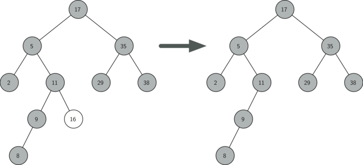

..  Copyright (C)  Brad Miller, David Ranum
    This work is licensed under the Creative Commons Attribution-NonCommercial-ShareAlike 4.0 International License. To view a copy of this license, visit http://creativecommons.org/licenses/by-nc-sa/4.0/.

Implementação de Árvores de Busca
~~~~~~~~~~~~~~~~~~~~~~~~~~~~~~~~~

Uma árvore de busca binária apresenta a propriedade de que as chaves
que são menores o seu nó pai estão na subárvore esquerda, enquanto que
as chaves maiores se encontram na subárvore direita. Nós iremos chamar
isso de **propriedade abb**. Quando estivermos implementando a interface
do mapeamento, já descrita anteriormente, a propriedade abb irá guiar
esse processo. A :ref:`Figura 1 <fig_simpleBST>` ilustra essa
propriedade de uma árvore de busca binária, exibindo as chaves sem
nenhum valor associado. Observe que a propriedade abb se mantém para
cada pai e filho. Todas as chaves na subárvore esquerda são menores
que a raiz. Todas as chaves na subárvore direita são maiores (n.T.: ou iguais)
que a raiz.

   
.. _fig_simpleBST:

.. figure:: Figures/simpleBST.png
   :align: center

   Figura 1: Uma Árvore Binária Simples
    

Agora que você sabe o que é uma árvore de busca binária, vamos ver como
uma árvore de busca binária é construída. A árvore de busca na
:ref:`Figura 1 <fig_simpleBST>` representa os nós que existem depois de
termos inserido as seguintes chaves nesta ordem:
:math:`70,31,93,94,14,23,73`. Como 70 foi a primeira chave inserida na
árvore, ele vai para a raiz. Em seguida, como 31 é menor que 70, ele
se torna filho esquerdo de 70. Depois, vem o 93, que é maior que 70,
então ele vira o filho direito de 70. Como agora já temos dois níveis da
árvore completos, a próxima chave só pode ser o filho esquerdo
ou direito de 31 ou 93. Como 94 é maior que 70 e 93, então ele se torna o
filho direito de 93. Do mesmo modo, como 14 é menor que 70 e 31, ele se
torna o filho esquerdo de 31. A chave 23 também é menor que 31, então
ela precisa estar na subárvore esquerda de 31, mas como 23 é maior que
14, 23 se torna filho direito de 14.

Para implementar a árvore de busca binária, iremos utilizar a abordagem
de nós e referências semelhante àquela usada para implementar listas
ligadas e árvores de expressões. Contudo, como temos que poder criar e
trabalhar com uma árvore de busca binária inicialmente vazia, nossa
implementação fará uso de duas classes. A primeira chamaremos de 
``BinarySearchTree``, enquanto a segunda será ``TreeNode``. A classe
``BinarySearchTree`` guarda uma referência para ``TreeNode``, que é a
raiz da árvore de busca binária. Na maioria dos casos, os métodos
externos definidos na classe mais externa apenas checa para ver se a
árvore está vazia. Se houver nós na árvore, a requisição é apenas
passada adiante para um método privado definido na classe
``BinarySearchTree`` que recebe a raiz como parâmetro. No caso de a
árvore estar vazia ou se quisermos remover a chave contida na raiz,
uma ação especial é necessária. O código para o construtor da classe
``BinarySearchTree``, junto com outras funções genéricas, pode ser
visto em :ref:`Código 1 <lst_bst1>`.

.. _lst_bst1:

**Código 1**

::

    class BinarySearchTree:

        def __init__(self):
    	    self.root = None
    	    self.size = 0
	
        def length(self):
    	    return self.size

        def __len__(self):
    	    return self.size

        def __iter__(self):
    	    return self.root.__iter__()
	    

A classe ``TreeNode`` fornece várias funções auxiliares que tornam o
trabalho realizado pela classe ``BinarySearchTree`` muito mais fácil.
O construtor para um objeto ``TreeNode``, junto com essas funções
auxiliares, é exibido em :ref:`Código 2 <lst_bst2>`. Como você pode ver
no código, muitas dessas funções auxiliares ajudam a classificar um nó
de acordo com sua própria posição como filho (esquerdo ou direito) e
de acordo com os filhos que o nó possui. A classe ``TreeNode`` também
manterá explicitamente uma referência para o pai como um atributo de
cada nó. Você verá por que isso é importante quando discutirmos a
implementação do operador ``del``.

Um outro aspecto interessante da implementação de ``TreeNode`` no
:ref:`Código 2 <lst_bst2>` é que usamos parâmetros opcionais do Python.
O uso desse recurso permite que criemos mais facilmente um objeto do 
tipo ``TreeNode`` sob as mais diferentes circunstâncias. Algumas vezes
iremos querer construir um ``TreeNode`` que tem tanto um ``pai`` quanto
um ``filho``. Com o pai e filho existentes, podemos passá-los como 
parâmetros. Em outros momentos não iremos passar parâmetro algum, seja
para o ``pai`` ou para o ``filho``. Nesse caso são usados os valores
padrões dos parâmetros opcionais.
            
.. _lst_bst2:

**Código 2**

::

    class TreeNode:
       def __init__(self,key,val,left=None,right=None,
					   parent=None):
	    self.key = key
	    self.payload = val
	    self.leftChild = left
	    self.rightChild = right
	    self.parent = parent

	def hasLeftChild(self):
	    return self.leftChild

	def hasRightChild(self):
	    return self.rightChild
	
	def isLeftChild(self):
	    return self.parent and self.parent.leftChild == self

	def isRightChild(self):
	    return self.parent and self.parent.rightChild == self

	def isRoot(self):
	    return not self.parent

	def isLeaf(self):
	    return not (self.rightChild or self.leftChild)

	def hasAnyChildren(self):
	    return self.rightChild or self.leftChild

	def hasBothChildren(self):
	    return self.rightChild and self.leftChild
	
	def replaceNodeData(self,key,value,lc,rc):
	    self.key = key
	    self.payload = value
	    self.leftChild = lc
	    self.rightChild = rc
	    if self.hasLeftChild():
		self.leftChild.parent = self
	    if self.hasRightChild():
		self.rightChild.parent = self
		

Agora que temos o esqueleto de ``BinarySearchTree`` e ``TreeNode``, está
na hora de escrever o método ``put`` que nos permitirá construir nossa
árvore de busca binária. O método ``put`` é um método da classe
``BinarySearchTree``. Esse método irá verificar se a árvore já possui
uma raiz. Se não houver uma raiz, então ``put`` irá criar um novo
objeto do tipo ``TreeNode`` e colocá-lo na raiz da árvore. Se já houver
uma raiz, então ``put`` faz uma chamada para a função auxiliar privada
e recursiva ``_put``, a fim de fazer uma busca na árvore de acordo com
o seguinte algoritmo:

-  Começando pela raiz da árvore, faça uma busca na árvore binária
   comparando a nova chave com a chave do nó atual. Se a nova chave for
   menor que o nó atual, continue a busca na subárvore esquerda. Se a 
   nova chave for maior (n.T.: ou igual) que o nó atual, continue
   a busca na subárvore direita.

-  Quando não houver mais filhos à esquerda (ou à direita) para
   seguir na busca, significa que encontramos a posição na árvore
   em que o novo nó deve ser colocado.

-  Para adicionar um nó à árvore, cre um novo objeto do tipo
   ``TreeNode`` e insira-o no ponto descoberto no passo anterior.

O código :ref:`Código 3 <lst_bst3>` mostra a implementação em Python
para inserir um novo nó na árvore. A função ``_put`` é escrita
recursivamente tendo por base os passos mostrados acima. Note que
quando um novo filho é inserido na árvore, o ``currentNode`` é
passado para a nova árvore como pai.

Um problema importante com nossa implementação de inserção é que chaves
duplicadas não são tratadas apropriadamente. Da forma como nossa árvore
está implementada, uma chave duplicada irá criar um novo nó com o mesmo
valor na subárvore direita do nó com a chave original. O resultado disso
é que o nó com a nova chave nunca será encontrado em uma busca. Uma
forma melhor de lidar com a inserção de uma chave duplicada é
substituir o valor antigo pelo valor associado à nova chave. Vamos
deixar o conserto desse *bug* como um exercício para você.

.. _lst_bst3:

**Código 3**

::

    def put(self,key,val):
    	if self.root:
    	    self._put(key,val,self.root)
    	else:
    	    self.root = TreeNode(key,val)
    	self.size = self.size + 1

    def _put(self,key,val,currentNode):
    	if key < currentNode.key:
    	    if currentNode.hasLeftChild():
    		   self._put(key,val,currentNode.leftChild)
    	    else:
    		   currentNode.leftChild = TreeNode(key,val,parent=currentNode)
    	else:
    	    if currentNode.hasRightChild():
    		   self._put(key,val,currentNode.rightChild)
    	    else:
    		   currentNode.rightChild = TreeNode(key,val,parent=currentNode)

Com o método ``put`` definido, podemos facilmente sobrescrever o
operador ``[]`` fazendo com que o método ``__setitem__`` (veja 
:ref:`Código 4 <lst_bst4>`) chave o método ``put``. Isso nos
permitirá escrever declarações em Python da forma
``myZipTree['Plymouth'] = 55446``, ou seja, como um dicionário do Python.
                   
.. _lst_bst4:

**Código 4**

::

	def __setitem__(self,k,v):
	    self.put(k,v)
	    
A :ref:`Figura 2 <fig_bstput>` ilustra o processo de inserir um novo nó
em uma árvore de busca binária. Os nós levemente sombreados indicam os
nós que foram visitados durante o processo de inserção.

.. _fig_bstput:

.. figure:: Figures/bstput.png
   :align: center

   Figura 2: Inserindo um Nó com Chave = 19

.. admonition:: Auto-Avaliação

    .. mchoice:: bst_1
       :correct: b
       :answer_a: 
       :feedback_a: Lembre-se que, começando pelo topo, as chaves menores que a raiz têm que estar na subárvore esquerda, enquanto as maiores na direita.
       :answer_b: 
       :feedback_b: bom trabalho.
       :answer_c:        
       :feedback_c: Isso parece uma árvore binária que satisfaz a propriedade da árvore completa para um heap.

       Qual das árvores é uma árvore de busca binária, dado que as chaves foram
       inseridas na seguinte ordem: 5, 30, 2, 40, 25, 4.

Uma vez construída a árvore, a próxima tarefa é implementar a recuperação
de um valor, dado uma determinada chave. O método ``get`` é ainda mais
fácil que o ``put`` porque ele simplesmente faz uma busca recursiva na
árvore até chegar em uma folha não correspondente ou em uma chave
correspondente. Quando a chave desejada é encontrada, o valor armazenado
no nó é retornado.
       
O :ref:`Código 5 <lst_bst5>` mostra o a implementação de ``get``, ``_get``
e ``__getitem__``. O código para a busca no método ``_get`` usa a mesma
lógica do método ``_put`` para a escolha do filho esquerdo ou direito. 
Observe que o método ``_get_`` retorna um objeto ``TreeNode`` para ``get``.
Isso permite que ``_get`` seja usado como um flexível método auxiliar
para outros métodos de ``BinarySearchTree`` que podem precisar fazer
uso de outros dados de um objeto ``TreeNode``, além do valor armazenado
em si.

Implementando o método ``__getitem__``, podemos escrever uma declaração
em Python muito semelhante àquela usada para acessar um dicionário,
embora estejamos utilizando na prática uma árvore de busca binária.
Por exemplo, podemos fazer ``z = myZipTree['Fargo']``. Como você
pode ver, tudo o que o método ``__getitem__`` faz é chamar ``get``.

.. _lst_bst5:

**Código 5**

::

    def get(self,key):
    	if self.root:
    	    res = self._get(key,self.root)
    	    if res:
    		   return res.payload
    	    else:
    		   return None
    	else:
    	    return None

    def _get(self,key,currentNode):
    	if not currentNode:
    	    return None
    	elif currentNode.key == key:
    	    return currentNode
    	elif key < currentNode.key:
    	    return self._get(key,currentNode.leftChild)
    	else:
    	    return self._get(key,currentNode.rightChild)

    def __getitem__(self,key):
    	return self.get(key) 

Using ``get``, we can implement the ``in`` operation by writing a
``__contains__`` method for the ``BinarySearchTree``. The
``__contains__`` method will simply call ``get`` and return ``True``
if ``get`` returns a value, or ``False`` if it returns ``None``. The
code for ``__contains__`` is shown in :ref:`Listing 6 <lst_bst6>`.

.. _lst_bst6:

**Listing 6**

::

    def __contains__(self,key):
    	if self._get(key,self.root):
    	    return True
    	else:
    	    return False

Recall that ``__contains__`` overloads the ``in`` operator and allows us
to write statements such as:

::

	if 'Northfield' in myZipTree:
	    print("oom ya ya")

Finally, we turn our attention to the most challenging method in the
binary search tree, the deletion of a key (see :ref:`Listing 7 <lst_bst7>`). The first task is to find the
node to delete by searching the tree. If the tree has more than one node
we search using the ``_get`` method to find the ``TreeNode`` that needs
to be removed. If the tree only has a single node, that means we are
removing the root of the tree, but we still must check to make sure the
key of the root matches the key that is to be deleted. In either case if
the key is not found the ``del`` operator raises an error.

.. _lst_bst7:

**Listing 7**

::

    def delete(self,key):
       if self.size > 1:
          nodeToRemove = self._get(key,self.root)
    	  if nodeToRemove:
    	      self.remove(nodeToRemove)
    	      self.size = self.size-1
    	  else:
    	      raise KeyError('Error, key not in tree')
       elif self.size == 1 and self.root.key == key:
    	  self.root = None
    	  self.size = self.size - 1
       else:
    	  raise KeyError('Error, key not in tree')

    def __delitem__(self,key):
    	self.delete(key)

Once we’ve found the node containing the key we want to delete, there
are three cases that we must consider:

#. The node to be deleted has no children (see :ref:`Figure 3 <fig_bstdel1>`).

#. The node to be deleted has only one child (see :ref:`Figure 4 <fig_bstdel2>`).

#. The node to be deleted has two children (see :ref:`Figure 5 <fig_bstdel3>`).

The first case is straightforward (see :ref:`Listing 8 <lst_bst8>`). If the current node has no children
all we need to do is delete the node and remove the reference to this
node in the parent. The code for this case is shown in here.

.. _lst_bst8:

**Listing 8**

::

    if currentNode.isLeaf():
    	if currentNode == currentNode.parent.leftChild:
    	    currentNode.parent.leftChild = None
    	else:
    	    currentNode.parent.rightChild = None

.. _fig_bstdel1:

   Figure 3: Deleting Node 16, a Node without Children

The second case is only slightly more complicated (see :ref:`Listing 9 <lst_bst9>`). If a node has only a
single child, then we can simply promote the child to take the place of
its parent. The code for this case is shown in the next listing. As
you look at this code you will see that there are six cases to consider.
Since the cases are symmetric with respect to either having a left or
right child we will just discuss the case where the current node has a
left child. The decision proceeds as follows:

#. If the current node is a left child then we only need to update the
   parent reference of the left child to point to the parent of the
   current node, and then update the left child reference of the parent
   to point to the current node’s left child.

#. If the current node is a right child then we only need to update the
   parent reference of the left child to point to the parent of the
   current node, and then update the right child reference of the parent
   to point to the current node’s left child.

#. If the current node has no parent, it must be the root. In this case
   we will just replace the ``key``, ``payload``, ``leftChild``, and
   ``rightChild`` data by calling the ``replaceNodeData`` method on the
   root.

.. _lst_bst9:

**Listing 9**

::

    else: # this node has one child
       if currentNode.hasLeftChild():
    	  if currentNode.isLeftChild():
    	      currentNode.leftChild.parent = currentNode.parent
    	      currentNode.parent.leftChild = currentNode.leftChild
    	  elif currentNode.isRightChild():
    	      currentNode.leftChild.parent = currentNode.parent
    	      currentNode.parent.rightChild = currentNode.leftChild
    	  else:
    	      currentNode.replaceNodeData(currentNode.leftChild.key,
    				 currentNode.leftChild.payload,
    				 currentNode.leftChild.leftChild,
    				 currentNode.leftChild.rightChild)
       else:
    	  if currentNode.isLeftChild():
    	      currentNode.rightChild.parent = currentNode.parent
    	      currentNode.parent.leftChild = currentNode.rightChild
    	  elif currentNode.isRightChild():
    	      currentNode.rightChild.parent = currentNode.parent
    	      currentNode.parent.rightChild = currentNode.rightChild
    	  else:
    	      currentNode.replaceNodeData(currentNode.rightChild.key,
    				 currentNode.rightChild.payload,
    				 currentNode.rightChild.leftChild,
    				 currentNode.rightChild.rightChild)

.. _fig_bstdel2:

.. figure:: Figures/bstdel2.png
   :align: center

   Figure 4: Deleting Node 25, a Node That Has a Single Child

The third case is the most difficult case to handle (see :ref:`Listing 10 <lst_bst10>`). If a node has two
children, then it is unlikely that we can simply promote one of them to
take the node’s place. We can, however, search the tree for a node that
can be used to replace the one scheduled for deletion. What we need is a
node that will preserve the binary search tree relationships for both of
the existing left and right subtrees. The node that will do this is the
node that has the next-largest key in the tree. We call this node the
**successor**, and we will look at a way to find the successor shortly.
The successor is guaranteed to have no more than one child, so we know
how to remove it using the two cases for deletion that we have already
implemented. Once the successor has been removed, we simply put it in
the tree in place of the node to be deleted.

.. _fig_bstdel3:

.. figure:: Figures/bstdel3.png
    :align: center

    Figure 5: Deleting Node 5, a Node with Two Children

The code to handle the third case is shown in the next listing.
Notice that we make use of the helper methods ``findSuccessor`` and
``findMin`` to find the successor. To remove the successor, we make use
of the method ``spliceOut``. The reason we use ``spliceOut`` is that it
goes directly to the node we want to splice out and makes the right
changes. We could call ``delete`` recursively, but then we would waste
time re-searching for the key node.

.. _lst_bst10:

**Listing 10**

::

   elif currentNode.hasBothChildren(): #interior
	   succ = currentNode.findSuccessor()
	   succ.spliceOut()
	   currentNode.key = succ.key
	   currentNode.payload = succ.payload

The code to find the successor is shown below (see :ref:`Listing 11 <lst_bst11>`) and as
you can see is a method of the ``TreeNode`` class. This code makes use
of the same properties of binary search trees that cause an inorder
traversal to print out the nodes in the tree from smallest to largest.
There are three cases to consider when looking for the successor:

#. If the node has a right child, then the successor is the smallest key
   in the right subtree.

#. If the node has no right child and is the left child of its parent,
   then the parent is the successor.

#. If the node is the right child of its parent, and itself has no right
   child, then the successor to this node is the successor of its
   parent, excluding this node.

The first condition is the only one that matters for us when deleting a
node from a binary search tree. However, the ``findSuccessor`` method
has other uses that we will explore in the exercises at the end of this
chapter.

The ``findMin`` method is called to find the minimum key in a subtree.
You should convince yourself that the minimum valued key in any binary
search tree is the leftmost child of the tree. Therefore the ``findMin``
method simply follows the ``leftChild`` references in each node of the
subtree until it reaches a node that does not have a left child.

.. _lst_bst11:

**Listing 11**

::

    def findSuccessor(self):
    	succ = None
    	if self.hasRightChild():
    	    succ = self.rightChild.findMin()
    	else:
    	    if self.parent:
    		   if self.isLeftChild():
    		       succ = self.parent
    		   else:
    		       self.parent.rightChild = None
    		       succ = self.parent.findSuccessor()
    		       self.parent.rightChild = self
    	return succ

    def findMin(self):
    	current = self
    	while current.hasLeftChild():
    	    current = current.leftChild
    	return current

    def spliceOut(self):
    	if self.isLeaf():
    	    if self.isLeftChild():
    		   self.parent.leftChild = None
    	    else:
    		   self.parent.rightChild = None
    	elif self.hasAnyChildren():
    	    if self.hasLeftChild():
    		   if self.isLeftChild():
    		      self.parent.leftChild = self.leftChild
    		   else:
    		      self.parent.rightChild = self.leftChild
    		   self.leftChild.parent = self.parent
    	    else:
    		   if self.isLeftChild():
    		      self.parent.leftChild = self.rightChild
    		   else:
    		      self.parent.rightChild = self.rightChild
    		   self.rightChild.parent = self.parent

We need to look at one last interface method for the binary search tree.
Suppose that we would like to simply iterate over all the keys in the
tree in order. This is definitely something we have done with
dictionaries, so why not trees? You already know how to traverse a
binary tree in order, using the ``inorder`` traversal algorithm.
However, writing an iterator requires a bit more work, since an iterator
should return only one node each time the iterator is called.

Python provides us with a very powerful function to use when creating an
iterator. The function is called ``yield``. ``yield`` is similar to
``return`` in that it returns a value to the caller. However, ``yield``
also takes the additional step of freezing the state of the function so
that the next time the function is called it continues executing from
the exact point it left off earlier. Functions that create objects that
can be iterated are called generator functions.

The code for an ``inorder`` iterator of a binary tree is shown in the next
listing. Look at this code carefully; at first glance you
might think that the code is not recursive. However, remember that
``__iter__`` overrides the ``for x in`` operation for iteration, so it
really is recursive! Because it is recursive over ``TreeNode`` instances
the ``__iter__`` method is defined in the ``TreeNode`` class.

::

    def __iter__(self):
       if self:
    	  if self.hasLeftChild():
    	  	 for elem in self.leftChiLd:
    		    yield elem
          yield self.key
    	  if self.hasRightChild():
    		 for elem in self.rightChild:
    		    yield elem

At this point you may want to download the entire file containing the
full version of the ``BinarySearchTree`` and ``TreeNode`` classes.

.. activecode:: completebstcode

    class TreeNode:
        def __init__(self,key,val,left=None,right=None,parent=None):
            self.key = key
            self.payload = val
            self.leftChild = left
            self.rightChild = right
            self.parent = parent

        def hasLeftChild(self):
            return self.leftChild

        def hasRightChild(self):
            return self.rightChild

        def isLeftChild(self):
            return self.parent and self.parent.leftChild == self

        def isRightChild(self):
            return self.parent and self.parent.rightChild == self

        def isRoot(self):
            return not self.parent

        def isLeaf(self):
            return not (self.rightChild or self.leftChild)

        def hasAnyChildren(self):
            return self.rightChild or self.leftChild

        def hasBothChildren(self):
            return self.rightChild and self.leftChild

        def replaceNodeData(self,key,value,lc,rc):
            self.key = key
            self.payload = value
            self.leftChild = lc
            self.rightChild = rc
            if self.hasLeftChild():
                self.leftChild.parent = self
            if self.hasRightChild():
                self.rightChild.parent = self
            

    class BinarySearchTree:

        def __init__(self):
            self.root = None
            self.size = 0

        def length(self):
            return self.size

        def __len__(self):
            return self.size

        def put(self,key,val):
            if self.root:
                self._put(key,val,self.root)
            else:
                self.root = TreeNode(key,val)
            self.size = self.size + 1

        def _put(self,key,val,currentNode):
            if key < currentNode.key:
                if currentNode.hasLeftChild():
                       self._put(key,val,currentNode.leftChild)
                else:
                       currentNode.leftChild = TreeNode(key,val,parent=currentNode)
            else:
                if currentNode.hasRightChild():
                       self._put(key,val,currentNode.rightChild)
                else:
                       currentNode.rightChild = TreeNode(key,val,parent=currentNode)

        def __setitem__(self,k,v):
           self.put(k,v)

        def get(self,key):
           if self.root:
               res = self._get(key,self.root)
               if res:
                      return res.payload
               else:
                      return None
           else:
               return None

        def _get(self,key,currentNode):
           if not currentNode:
               return None
           elif currentNode.key == key:
               return currentNode
           elif key < currentNode.key:
               return self._get(key,currentNode.leftChild)
           else:
               return self._get(key,currentNode.rightChild)

        def __getitem__(self,key):
           return self.get(key)

        def __contains__(self,key):
           if self._get(key,self.root):
               return True
           else:
               return False

        def delete(self,key):
          if self.size > 1:
             nodeToRemove = self._get(key,self.root)
             if nodeToRemove:
                 self.remove(nodeToRemove)
                 self.size = self.size-1
             else:
                 raise KeyError('Error, key not in tree')
          elif self.size == 1 and self.root.key == key:
             self.root = None
             self.size = self.size - 1
          else:
             raise KeyError('Error, key not in tree')

        def __delitem__(self,key):
           self.delete(key)

        def spliceOut(self):
           if self.isLeaf():
               if self.isLeftChild():
                      self.parent.leftChild = None
               else:
                      self.parent.rightChild = None
           elif self.hasAnyChildren():
               if self.hasLeftChild():
                      if self.isLeftChild():
                         self.parent.leftChild = self.leftChild
                      else:
                         self.parent.rightChild = self.leftChild
                      self.leftChild.parent = self.parent
               else:
                      if self.isLeftChild():
                         self.parent.leftChild = self.rightChild
                      else:
                         self.parent.rightChild = self.rightChild
                      self.rightChild.parent = self.parent

        def findSuccessor(self):
          succ = None
          if self.hasRightChild():
              succ = self.rightChild.findMin()
          else:
              if self.parent:
                     if self.isLeftChild():
                         succ = self.parent
                     else:
                         self.parent.rightChild = None
                         succ = self.parent.findSuccessor()
                         self.parent.rightChild = self
          return succ

        def findMin(self):
          current = self
          while current.hasLeftChild():
              current = current.leftChild
          return current

        def remove(self,currentNode):
             if currentNode.isLeaf(): #leaf
               if currentNode == currentNode.parent.leftChild:
                   currentNode.parent.leftChild = None
               else:
                   currentNode.parent.rightChild = None
             elif currentNode.hasBothChildren(): #interior
               succ = currentNode.findSuccessor()
               succ.spliceOut()
               currentNode.key = succ.key
               currentNode.payload = succ.payload

             else: # this node has one child
               if currentNode.hasLeftChild():
                 if currentNode.isLeftChild():
                     currentNode.leftChild.parent = currentNode.parent
                     currentNode.parent.leftChild = currentNode.leftChild
                 elif currentNode.isRightChild():
                     currentNode.leftChild.parent = currentNode.parent
                     currentNode.parent.rightChild = currentNode.leftChild
                 else:
                     currentNode.replaceNodeData(currentNode.leftChild.key,
                                        currentNode.leftChild.payload,
                                        currentNode.leftChild.leftChild,
                                        currentNode.leftChild.rightChild)
               else:
                 if currentNode.isLeftChild():
                     currentNode.rightChild.parent = currentNode.parent
                     currentNode.parent.leftChild = currentNode.rightChild
                 elif currentNode.isRightChild():
                     currentNode.rightChild.parent = currentNode.parent
                     currentNode.parent.rightChild = currentNode.rightChild
                 else:
                     currentNode.replaceNodeData(currentNode.rightChild.key,
                                        currentNode.rightChild.payload,
                                        currentNode.rightChild.leftChild,
                                        currentNode.rightChild.rightChild)

    mytree = BinarySearchTree()
    mytree[3]="red"
    mytree[4]="blue"
    mytree[6]="yellow"
    mytree[2]="at"

    print(mytree[6])
    print(mytree[2])

