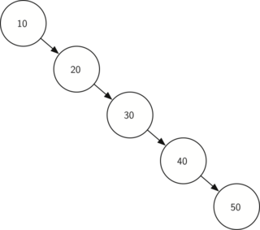

..  Copyright (C)  Brad Miller, David Ranum
    This work is licensed under the Creative Commons Attribution-NonCommercial-ShareAlike 4.0 International License. To view a copy of this license, visit http://creativecommons.org/licenses/by-nc-sa/4.0/.

Análise de Árvores de Busca
~~~~~~~~~~~~~~~~~~~~~~~~~~~

Com a implementação agora completa de uma árvore de busca binária,
iremos realizar agora uma análise rápida dos métodos que implementamos.
Vamos olhar primeiro para o método ``put``. O fator limitante em seu
desempenho é a altura da árvore binária. Lembre-se que pela definição
na seção de vocabulário, a altura de uma árvore é o número de arestas
entre a raiz e o nó folha mais profundo. A altura é o fator limitante
porque quando estamos buscando por lugar apropriado para inserir um nó
na árvore, precisaremos realizar no máximo uma comparação em cada
nível da árvore.

Qual é a altura provável de uma árvore binária? A resposta para essa
questão depende de como as chaves são adicionadas à árvore. Se as
chaves forem adicionadas de forma aleatória, a altura da árvore será
de aproximadamente :math:`\log_2{n}`, onde :math:`n` é o número de nós
na árvore. Isso porque se as chaves forem distribuídas aleatoriamente,
cerca de metade delas serão menores que a raiz e a outra metade será
maior. Lembre-se que em uma árvore binária há um nó na raiz, dois nós
no próximo nível e quatro no seguinte. O número de nós em qualquer
nível sempre será :math:`2^d`, onde :math:`d` é a profundidade do
nível. O número total de nós em uma árvore binária perfeitamente
balanceada será :math:`2^{h+1}-1`, onde :math:`h` representa a altura
da árvore.

Uma árvore perfeitamente balanceada apresenta o mesmo número de nós
tanto na subárvore esquerda quanto direita. Em uma árvore binária
balanceada, o pior caso de ``put`` é :math:`O(\log_2{n})`, onde 
:math:`n` é o número de nós na árvore. Observe que essa é a relação
inversa para o cálculo no parágrafo anterior. Então :math:`\log_2{n}`
nos fornece a altura da árvore e representa o número máximo de 
comparação que ``put`` terá que fazer na busca pelo local adequado
de inserção de um novo nó.

Infelizmente é possível construir uma árvore de busca que tem altura
:math:`n` simplesmente inserindo as chaves ordenadas! Um exemplo de
uma árvore assim é mostrado na :ref:`Figura 6 <fig_skewedtree_analysis>`.
Nesse caso, o desempenho do método ``put`` é :math:`O(n)`.

.. _fig_skewedtree_analysis:

   Figura 6: Uma árvore de busca binária totalmente desbalanceada proporcionará baixo desempenho

Agora que você entende que o desempenho do método ``put`` está limitado à
altura da árvore, você provavelmente pode imaginar que outros métodos, como
``get``, ``in`` e ``del``, também estão. Como ``get`` faz a busca na
árvore para encontrar uma chave, no pior caso a busca é feita até a base
da árvore e nenhuma chave é encontrada. À primeira vista, o ``del`` pode
parecer mais complicado, já que ele precisa encontrar o sucessor antes que
a operação de remoção possa ser feita. Mas lembre-se que o pior caso para
encontrar o sucesso também é apenas a altura da árvore, o que significa que
você simplesmente tem que multiplicar o trabalho por dois. Como essa
multiplicação é um fator constante, ela não mudar o cenário de pior caso.
