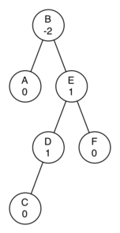

..  Copyright (C)  Brad Miller, David Ranum
    This work is licensed under the Creative Commons Attribution-NonCommercial-ShareAlike 4.0 International License. To view a copy of this license, visit http://creativecommons.org/licenses/by-nc-sa/4.0/.

Questões para Discussão
-----------------------

#. Desenhe a estrutura da árvore resultante do seguinte conjunto de chamadas de
   função:

   ::

       >>> r = BinaryTree(3)
       >>> insertLeft(r,4)
       [3, [4, [], []], []]
       >>> insertLeft(r,5)
       [3, [5, [4, [], []], []], []]
       >>> insertRight(r,6)
       [3, [5, [4, [], []], []], [6, [], []]]
       >>> insertRight(r,7)
       [3, [5, [4, [], []], []], [7, [], [6, [], []]]]
       >>> setRootVal(r,9)
       >>> insertLeft(r,11)
       [9, [11, [5, [4, [], []], []], []], [7, [], [6, [], []]]]
	      

#. Simule o algoritmo para criar uma árvore de expressão para a
   seguinte expressão :math:`(4 * 8) / 6 - 3`.

#. Considere a seguinte lista de inteiros: [1,2,3,4,5,6,7,8,9,10]. Mostre
   a árvore de busca binária resultante da inserção desses inteiros na lista.

#. Considere a seguinte lista de inteiros: [10,9,8,7,6,5,4,3,2,1]. Mostre
   a árvore de busca binária resultante da inserção desses inteiros na lista.

#. Gere uma lista inteiros aleatórios. Mostre o heap binário resultante
   da inserção de inteiros na lista um por vez.

#. Usando a lista da questão anterior, mostre o heap binário resultante
   do usso dessa lista como parâmetro para o método ``buildHeap``.
   Mostre tanto em forma de árvore quanto lista.

#. Desenhe a árvore de busca binária que resulta da inserção das seguintes
   chaves nesta ordem: 68,88,61,89,94,50,4,76,66 e 82.

#. Gere uma lista de inteiros aleatórios. Desenhe a árvore de busca
   binária resultante da inserção desses inteiros na lista.

#. Considere o seguinte lista de inteiros: [1,2,3,4,5,6,7,8,9,10]. Mostre
   o heap binário resultante da inserção desses inteiros, um por vez.

#. Considere a seguinte lista de inteiros: [10,9,8,7,6,5,4,3,2,1]. Mostre
   o heap binário resultante da inserção desses inteiros, um por vez.

#. Considere as duas diferentes técnicas que usamos para implementar
   a varredura de uma árvore binária. Por que temos que fazer a checagem
   antes da chamada de ``preorder`` quando o implementamos como um método,
   enquanto a checagem pode ser feita dentro da chamada quando o implementamos
   como uma função?

12. Mostre as chamadas de funções necessárias para construir a seguinte árvore binária.

.. figure:: Figures/exerTree.png
        :align: center

13. Dada a seguinte árvore, faça as rotações apropriadas para balanceá-la novamente. 
   
   

14. Usando o seguinte como ponto de partida, derive a equação que fornece o fator 
    de balanceamento atualizado para o nó D.
   
.. figure:: Figures/bfderive.png
         :align: center

